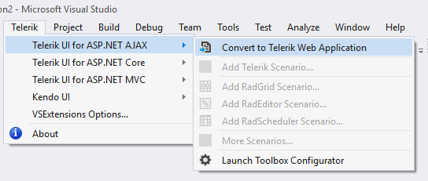
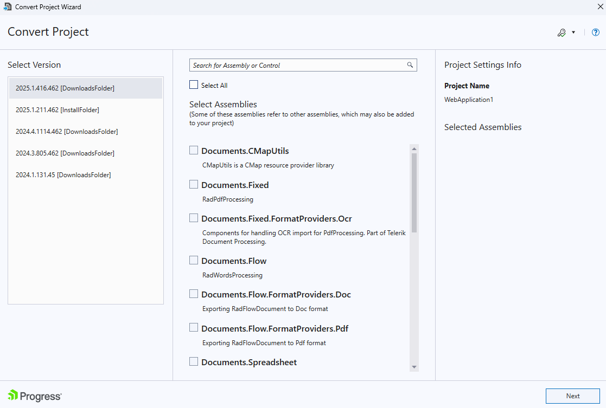
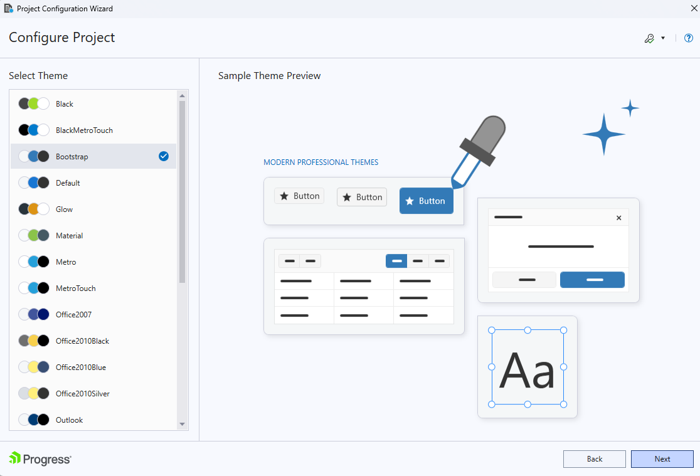

# Convert Project

The Project management functionality of the Visual Studio Extensions handles project assembly reference updates, web.config entry management and updates of the supporting resources.

This functionality is handled by three wizards - the Project Convert Wizard, [Project Configuration Wizard]() and [Upgrade Wizard]().

Telerik Convert Project wizard could be accessed through the Telerik > Telerik® UI for ASP.NET AJAX menu:

The Convert Project Wizard’s first page lets you define settings related to Telerik controls:

* **Version** - Select the Telerik controls version which to be used in your project. The product versions which could be selected are detected from an installation folder (marked with [InstallFolder]) or from the default folder for downloads (the hotfix files which are downloaded through the [New Version Downloader]() are marked with [Download] tag).

* **Telerik Assemblies** - Select Telerik DPL assemblies which will be added to or removed from your project.

>note If you prefer the Telerik assemblies to be copied into your solution folder, the **Copy referenced assemblies to solution and source control** option could be selected *only* into the [Visual Studio Extensions Options]() but it is not applicable for Visual Studio web site projects.

The second page of the Convert Project Wizard gives you the ability to select which theme will be added to your project. Check the content of each theme or see the preview of it when select it into the Convert Project wizard and select the one you want to be included in the project:

 

On the third page the wizard suggests more site settings and several resource options:

 

* **Use ScriptManger CDN** - Define if the site will utilize [RadScriptManager CDN Support]().

* **Use StyleSheetManager CDN** - Define if the site will utilize [RadStyleSheetManager CDN Support]().

* **Copy RadSpell Dictionaries** - Select whether you wish the project wizard to copy the dictionary files required for [RadSpell]() to your project.

* **Copy RadCaptcha Audio Files** - Select whether you wish the project wizard to copy the audio files required for [RadCaptcha]() audio code functionality.

* **Copy TypeScript definitions** – Select whether you with the project wizard to copy the	[TypeScript definitions we provide for the UI for ASP.NET AJAX controls]().

* **Use jQuery Support** - Define if the pages that will be created via the Scenario Wizard will use jQuery support by default.

* **Use Ajaxified Templates** - Define if the pages that will be created via the Scenario Wizard will use [RadAjaxManager]() by default.

* **General Web Project settings** - [RadUpload]()-related configuration - the [Maximum Request Length and Execution Timeout]() settings of the site.

When a web project gets converted to Telerik one, Visual Studio Extensions perform the following changes:

* Telerik assembly references get added or are changed in the project.

* [The user gets notified]() through the Project Configuration wizard if the wizard cannot find a correct Telerik.Web.Design assembly in the GAC.

* The wizard copies the RadSpell dictionaries and RadCaptcha audio files shipped with the distribution so that they are up to date with the assemblies.

The web.config file gets updated as per the choices in the wizard:

* The global skin registration is updated.

* A registration for the "telerik" tag prefix is added, so that it is not needed to have the `<%@ Register %>` directive in each page.

* RadScriptManager and RadStyleSheetManager default CDN settings are persisted.
