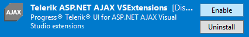
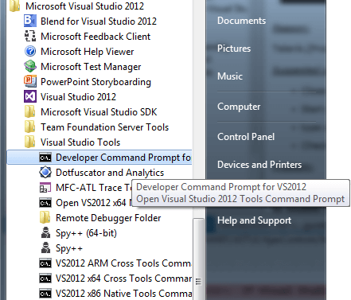
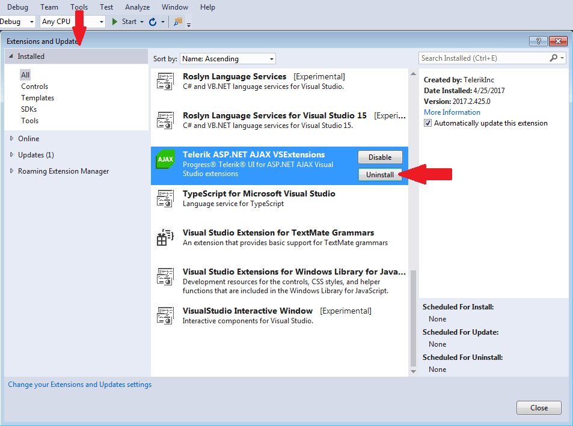

# Troubleshooting

**Troubleshooting**

*Problem:*

**Missing Telerik menu in Visual Studio**

*Reason:*

Telerik Visual Studio Extensions are disabled or not installed correctly.

*Suggested solution 1(Extension is Disabled):*

* Open Visual Studio;

* Go to menu Tools - > Extensions and Updates...(for Visual Studio 2019 Extensions - > Manage Extensions)

* Open the Installed tab on the left​

* Search for Telerik ASP.NET AJAX VSExtensions and make sure they are Enabled

*Suggested solution 2(Extension is not installed):*

* Open Visual Studio;

* Go to menu Tools - > Extensions and Updates...(for Visual Studio 2019 Extensions - > Manage Extensions)

* Open the Online tab on the left​

* Search for Telerik ASP.NET AJAX VSExtensions

* Download and install the extensions

*Suggested solution 3(for Visual Studio 2013 and older):*

* Close all instances of Visual Studio;

* Start a Visual Studio Command Prompt (*Start menu -> Microsoft Visual Studio 20xx -> Visual Studio Tools -> Visual Studio 20xx Command Prompt*);

!

* type *devenv.exe /resetskippkgs* and hit Enter;

* Check the Telerik menu, or try to create new Telerik project (they should work properly);

*Problem:*

**An error occurs when attempting to create a new Telerik project (“Error: this template attempted to load assembly ‘Telerik.[Product].VSPackage, Version=[Version], Culture=neutral, PublicKeyToken=[PublicKeyToken]. For more information on this problem and how to enable this template, please see documentation and Customizing Project Templates.”)**

*Reason:*

Missing Telerik.[Product].VSPackage.dll file from *[TelerikControlsInstallDir]\VSExtensions\VS20xx* for VS2005 and VS2008 and *[VisualStudio2010InstallDir]\Common7\IDE\Extensions\Telerik\Telerik [Product] VSExtensions\[Version]* for VS2010 and later.

*Suggested solution:*

If Visual Studio 2012 is used

* Launch Visual Studio 2012

* Go toTools | Extensions and Updates (Visual Studio 2010: Tools | Extension Manager)

* Select Telerik [Product] VSExtensions and press Uninstall button

* Go to the Online Gallery and search for Telerik [Product] VSExtensions. Download the extensions and install them

* Restart VS2012 and check the Telerik menu, or try to create new Telerik project (the wizards should work properly)

>important If the article does not help solving your problem, please follow these steps to generate Visual Studio [ActivityLog](https://docs.microsoft.com/en-us/visualstudio/ide/reference/log-devenv-exe?view=vs-2019) file before contacting our support:
>* Open [Developer Command prompt](https://docs.microsoft.com/en-us/dotnet/framework/tools/developer-command-prompt-for-vs) for Visual Studio 20xx under **Administrative rights**.
>* Execute the command - devenv /log %userprofile%\desktop\ActivityLog.xml . This will start Visual Studio and create logs on your Desktop.
>* Reproduce the problem
>* Attach the **Activitylog** files when you contact our support.
