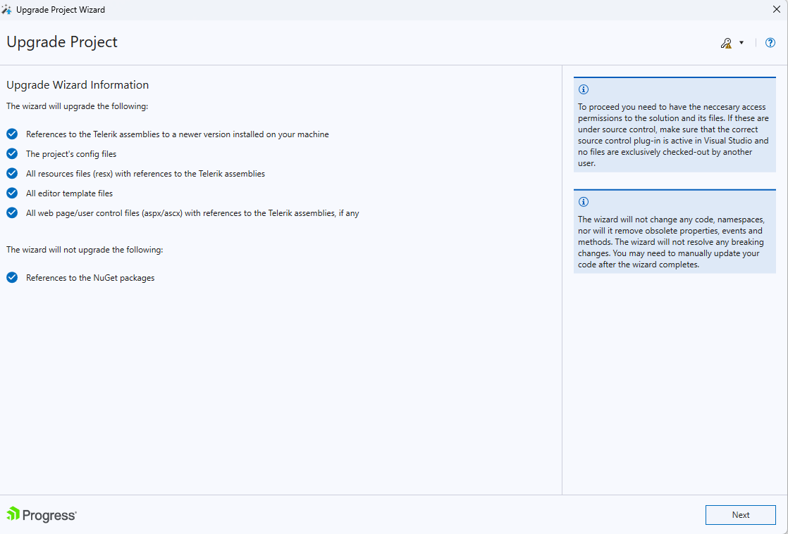
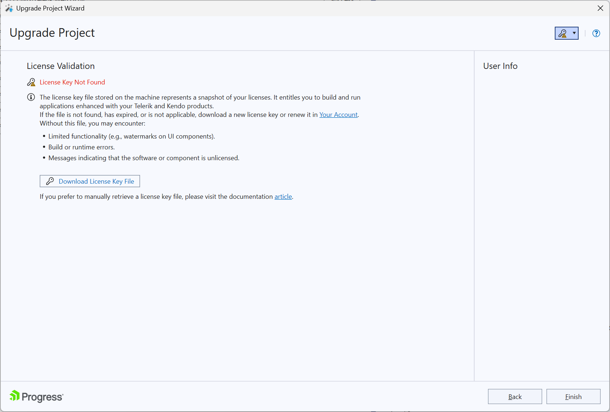
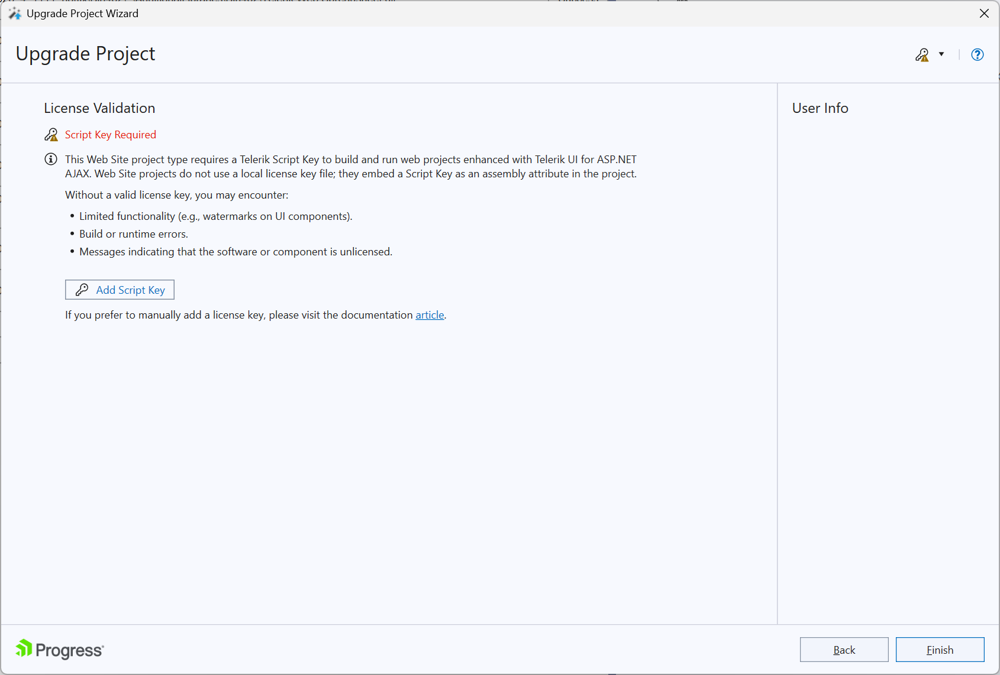
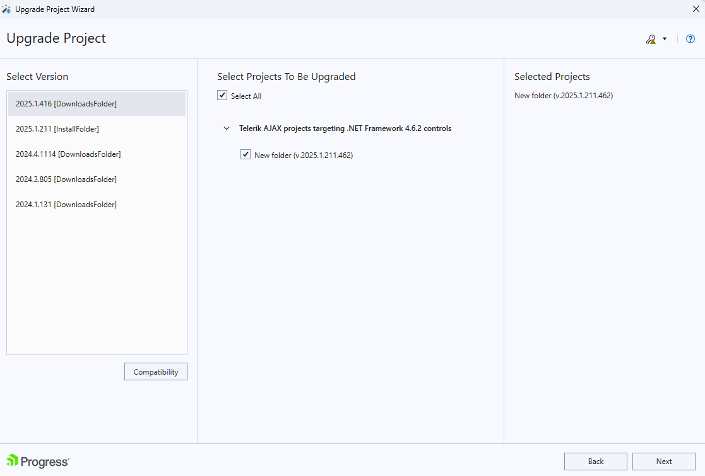
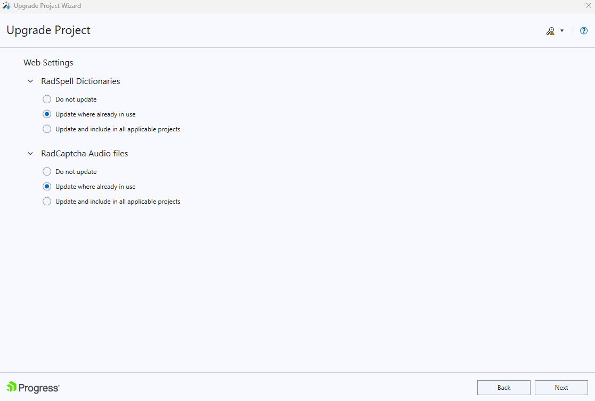
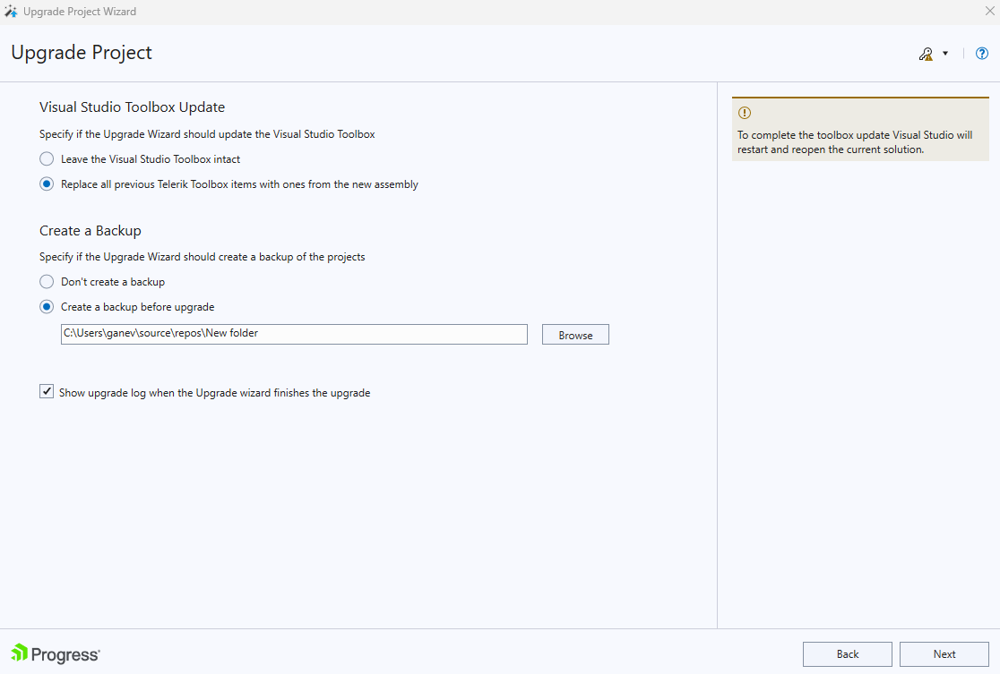

# Upgrade Project

An important feature in the Telerik Visual Studio Extensions is the **Upgrade Project Wizard**. It can facilitate the process of upgrading the Telerik® UI for ASP.NET AJAX to the latest version in your project.

>note Starting with **2025 Q1**, the Upgrade Wizard validates your license during the upgrade process. If the `telerik-license.txt` file is not found, the wizard will display an indicator in the top-right corner and provide options to download and install it. Additionally, Web Site projects require a Script Key in the `App_Code` folder. For more information, see the [License Validation](#license-validation) section below.

To start the Upgrade Wizard go to **Telerik** > **Telerik UI for ASP.NET AJAX** > **Upgrade Wizard** in the Visual Studio menu.

On the first screen of the wizard is described what will be upgraded:
>caption Figure 1: The first screen of the Upgrade Wizard

## License Validation

Starting with **2025 Q1**, the Upgrade Wizard performs license validation to ensure you have the necessary permissions to use the Telerik UI for ASP.NET AJAX controls.

### Identifying Your Project Type

Before proceeding with license validation, it's important to know whether you have a **Web Application** or a **Web Site** project, as the licensing requirements differ:

**Web Application projects** have:
* A `.csproj` or `.vbproj` file in the project root
* A `Properties` folder (C#) or `My Project` folder (VB.NET) containing an `AssemblyInfo` file
* Projects are compiled into a single assembly

**Web Site projects** have:
* No `.csproj` or `.vbproj` file
* An `App_Code` folder for code files
* Files are compiled dynamically at runtime

> For more information about the differences, see:
> - [Microsoft: Web Application Projects versus Web Site Projects](https://learn.microsoft.com/en-us/previous-versions/aspnet/dd547590(v=vs.110))
> - [ASP.NET Web Forms Web Site vs Web Application - Key Differences](https://www.youtube.com/watch?v=9gI6t57cDAc)

### License Key File Validation (All Project Types)

The wizard checks for a `telerik-license.txt` file to verify that you have an active license. This file should be located in one of the following locations:

* Your user profile directory: `%AppData%\Roaming\Telerik\telerik-license.txt`
* The project or solution root folder

If the license key file is not found, you will see a **License Key File Required** or **License Key File Not Found** message in the wizard, as shown in the screenshots. You can:

* Click **Download License Key File** to download it directly from your Telerik account
* Click **Open License Key Location** to navigate to the appropriate folder
* Manually download the license file from the [License Keys](https://www.telerik.com/account/your-licenses/license-keys) page

>caption Figure 2: License validation screen when license file is not found

### Script Key Validation (Web Site Projects Only)

In addition to the license file validation, **Web Site projects** require a Script Key in the `App_Code` directory. If you're upgrading a Web Site project and the wizard detects that a Script Key is missing from the `App_Code` folder, you will see a **Script Key Required** or **Script Key Not Found** warning.

>caption Figure 3: Script Key validation screen for Web Site projects

When you click the **Add Script Key** button, the wizard automatically handles the Script Key setup:

1. Retrieves your Script Key from your Telerik account
2. Creates a `TelerikLicense.cs` (or `.vb`) file in your `App_Code` directory with the Script Key
3. Displays a **Script Key Retrieved and Added to Project** confirmation.

>note The Script Key is automatically downloaded from your account and added to `App_Code\TelerikLicense.cs`. You can review or modify it later in your project's source.

> **Why Web Site projects need a Script Key**
>
> Unlike Web Applications, Web Site projects cannot embed license information at build time. The Script Key file must exist in the `App_Code` folder and will be evaluated at runtime, so it must be deployed to the production server.

For more information about licensing, see the [Setting Up Your License Key]() article.

## Upgrade Wizard Features

In addition to the pure assembly reference change, the Upgrade Wizard provides several important features:

* Check and retrieve the latest available **Telerik® UI for ASP.NET AJAX** release;

* Change the version of **Telerik® UI for ASP.NET AJAX** the project uses;

On the next step the wizard lists all projects from the solution, which use Telerik® UI for ASP.NET AJAX. You can choose which projects will be updated (it is recommended to upgrade all projects to the chosen version) and the version which they will be upgraded to. The Compatibility button will invoke the [Upgrade API Analyzer tool]():

>caption Figure 2: Choose the projects the Upgrade Wizard will work on

>note The listed projects target all of the supported .NET Framework versions. When you complete the wizard all selected projects will be updated.

The following page of the upgrade wizard suggests you three options for the project resources:

>note In case *non-embedded*  **Skins** and/or **Scripts** folders are detected in the root of a project selected for upgrade they will be automatically updated in accordance with the selected controls version.

>caption Figure 3: Choose which files to upgrade

In case you select **Do not update** option, nor the existing resources will be updated, neither the new ones will be added. If the **Update where already in use** option is checked, the existing resources will be updated but no new files will be added. And in case the last option is chosen - **Update and include in all applicable projects** - all existing files will be updated and if there are some new resources - they will be added.

The next screen allows you to update the Visual Studio ToolBox with the newly selected controls, so that you avoid accidental reference change during a control drag and drop. It also gives you the ability to choose whether to create a backup of the project or not:

>caption Figure 4: The Upgrade Wizard can update the toolbox and create a backup of the project(s)

After choosing the preferred options and pressing the Finish button, the Upgrade Wizard will replace the existing assemblies in the selected project(s) with the ones from the selected distribution. The wizard will update only assemblies that are currently referenced, e.g. it won't add references to newly introduced assemblies.

>important The Upgrade Wizard will add a reference to Telerik.Web.UI.Skins if the following conditions are met:
* The source project references Telerik assemblies with version lower than Q3 2011
* The target distribution version is greater than Q3 2011
* Telerik.Web.UI.Skins is not referenced

The reason for the described exception is the displacement of the embedded skins from Telerik.Web.UI to Telerik.Web.UI.Skins, introduced with the Q3 2011 release.

>note
* The Telerik® UI for ASP.NET AJAX distribution selection screen lists all the versions that can be detected automatically. These are versions, installed by using the Windows Installer MSI package (marked with **[Install Folder]** ) and versions, downloaded earlier by the Upgrade Wizard (marked with **[Download]** ). Hotfixes, downloaded manually cannot be detected.
* The Telerik® UI for ASP.NET AJAX version signature is defined by the year, number of Q, month, day and .NET Framework version of the release. For example version 2012.1.215 means Q1 2012, which is released on February 15, 2012. In addition to this signature, you will find an indication whether the release is a trial ( **Trial** ) or purchased ( **Dev** ) version.
* The distribution, downloaded by the Upgrade Wizard contains only the "hotfix" files, e.g. the barebone files, needed for a project to run correctly. It does not contain the documentation or the Live Examples.
* A Visual Studio restart will be required in order to update your toolbox. If the automatic restart fails, a restart should be initiated manually in order to complete the toolbox upgrade.

## See Also

* [Setting Up Your License Key]()
* [License Activation Errors and Warnings]()
* [Adding the License Key to CI Services]()
* [Upgrade API Analyzer]()
