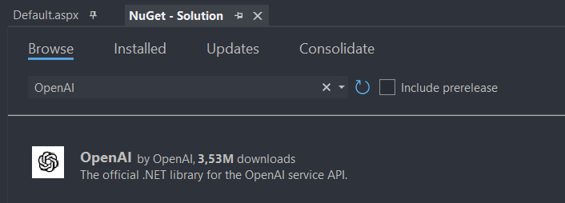
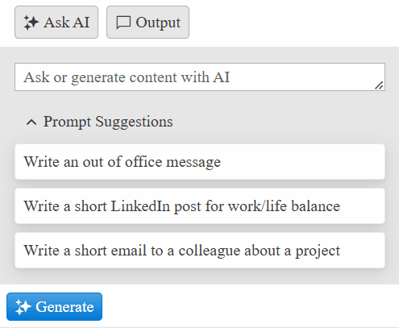

# OpenAI Integration

The WebForms AIPrompt allows you to easily integrate it with a Chat API service such as ChatGPT. This is thanks to the [OnPromptRequest]() event that returns the input text (prompt), and sets the output.

### Using with an OpenAI key

If you have an OpenAI subscription, you can directly use it with the AIPrompt component.

>note IMPORTANT: Never share your API key with anyone or push it to GitHub/GitLab! The key will automatically be disabled by OpenAI and you will need to create a new one.

### Installing Required Dependencies

Since we got the API key, now we need to install the **OpenAI** Nuget package, in order to use their services. Go to the Nuget Package Manager, search for OpenAI and install the package. For more information on the library itself, you can check [The official .NET library for the OpenAI API](https://github.com/openai/openai-dotnet).



### Integration

Now let's start the actual integration. For it, we will use the [Dependency injection](https://en.wikipedia.org/wiki/Dependency_injection) tehnique, to make code scalable for the future.

1. Use the AIPrompt's [`OnPromptRequest`]() event and chose/write a prompt.

````ASP.NET
<telerik:RadAIPrompt runat="server" ID="AIPrompt1" Width="400px">
    <Views>
        <telerik:AIPromptView Name="PromptView" Type="Prompt" />
        <telerik:AIPromptView Name="OutputView" Type="Output" />
    </Views>
    <ClientEvents OnPromptRequest="onPromptRequest" />
</telerik:RadAIPrompt>
````

````C#
protected void Page_Load(object sender, EventArgs e)
{
    if (!IsPostBack)
    {
        List<string> promptSuggestions = new List<string>
        {
            "Write an out of office message",
            "Write a short LinkedIn post for work/life balance.",
            "Write a short email to a colleague about a project",
        };

        string[] sentencesArray = promptSuggestions.ToArray();
        AIPrompt1.PromptSuggestions = sentencesArray;
    }
}
````
````VB
Protected Sub Page_Load(ByVal sender As Object, ByVal e As EventArgs)
    If Not IsPostBack Then
        Dim promptSuggestions As List(Of String) = New List(Of String) From {
            "Write an out of office message",
            "Write a short LinkedIn post for work/life balance.",
            "Write a short email to a colleague about a project"
        }

        Dim sentencesArray As String() = promptSuggestions.ToArray()
        AIPrompt1.PromptSuggestions = sentencesArray
    End If
End Sub
````

2. After finishing the prompt, click the **Generate** button. This will trigger the event and in the event handler make an AJAX request to the server.

````JavaScript
let $ = $telerik.$ || $;

function onPromptRequest(sender, args) {
    let prompt = args.get_prompt();

    if (!prompt) {
        return;
    }

    $.ajax({
        url: 'Default.aspx/AskChatGPT',
        type: 'POST',
        contentType: 'application/json; charset=utf-8',
        dataType: 'json',
        data: JSON.stringify({ prompt: prompt }),
        success: function (response) {
            let promptOutput = {
                prompt: prompt,
                output: response.d
            }

            sender.set_activeView(1);
            sender.set_promptOutput(promptOutput);
        },
        error: function (error) {
            console.error('Error in AJAX call:', error);
        }
    });
}
````

3. On the server, give some additional information how you want the response to be formatted, create a new instance of the GPTService class and use its `Ask` method.

````C#
using OpenAI.Chat;

[WebMethod]
public static string AskChatGPT(string prompt)
{
    string apiKey = "API-KEY";
    string model = "gpt-4o";

    string textTweaks = "Respond in short, plain text (maximum of 3-4 sentences), without any formatting, such as bold text, dashes, slashes, numbering, ordered/unordered list, or special characters.";
    string promptWithTweaks = string.Join("", prompt, textTweaks);

    ChatClient chatClient = new ChatClient(model, apiKey);
    ClientResult<ChatCompletion> completion = chatClient.CompleteChat(promptWithTweaks);
    string response = completion.Value.Content[0].Text;

    return response;
}
````
````VB
Imports OpenAI.Chat

<WebMethod>
Public Shared Function AskChatGPT(ByVal prompt As String) As String
    Dim apiKey As String = "API-KEY"
    Dim model As String = "gpt-4o"

    Dim textTweaks As String = "Respond in short, plain text (maximum of 3-4 sentences), without any formatting, such as bold text, dashes, slashes, numbering, ordered/unordered list, or special characters."
    Dim promptWithTweaks As String = String.Join("", prompt, textTweaks)

    Dim chatClient As ChatClient = New ChatClient(model, apiKey)
    Dim completion As ClientResult(Of ChatCompletion) = chatClient.CompleteChat(promptWithTweaks)

    Dim response As String = completion.Value.Content(0).Text

    Return response
End Function
````

Now the integration is complete. Below you can see the result.



