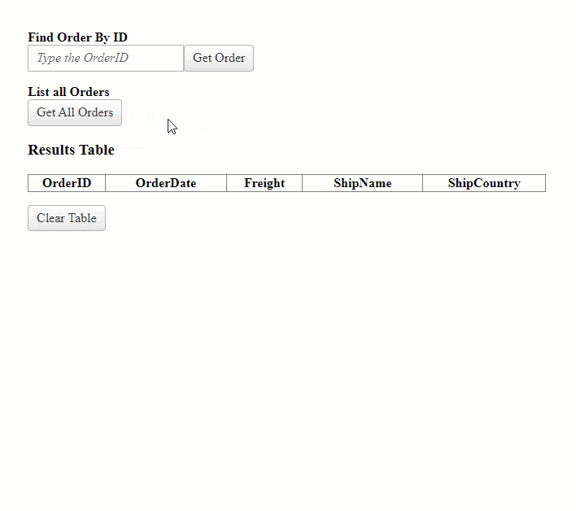

## Description

Learn how to send and receive AJAX requests with the [Telerik WebForms AjaxManager]() component by combining its Client-side and Server-side APIs.

Unlike [`jQuery.ajax()`](http://api.jquery.com/jquery.ajax/) the [Microsoft ASP.NET AJAX](https://learn.microsoft.com/en-us/previous-versions/aspnet/bb398874(v=vs.100)) embedded in the ASP.NET Framework works slightly differently, thus it can maintain the ViewState information. Instead of a pure AJAX request, it submits the entire Form, yet only updates a specific container and this is called Partial PostBack. To cut a long story short, [Telerik WebForms AjaxManager]() provides the necessary Client and Server APIs to send/receive AJAX requests in ASP.NET Web Forms and this article will teach out how.

>caption DEMO



## Solution

Telerik WebForms AjaxManager exposes the `ajaxRequest()` client-side method which can be used to send AJAX requests to the server.

To begin, you will need create a `telerik:RadAjaxManager` component on the page and subscribe it to its [AjaxRequest]() Server-side event.

````ASP.NET
<telerik:RadAjaxManager ID="RadAjaxManager1" runat="server" OnAjaxRequest="RadAjaxManager1_AjaxRequest">
</telerik:RadAjaxManager>
````

### Send AJAX request to Server

To send an AJAX request to server, call the `ajaxRequest()` method of the `Telerik.Web.UI.RadAjaxManager` Client-side Object instance. As this function takes one parameter as a `string`, you can pass along some data to be sent to server.

>caption Example

````JavaScript
function OnClientClicked(sender, args) {
    var ajaxMgr = $find("<%= RadAjaxManager1.ClientID %>");

    ajaxMgr.ajaxRequest("Hello World!");
}
````

Upon the AJAX request, the `AjaxManager` triggers a server-side event called [AjaxRequest](), where the `e.Argument` will contain the information that was passed to `ajaxRequest()` method.

>caption Example

````C#
protected void RadAjaxManager1_AjaxRequest(object sender, Telerik.Web.UI.AjaxRequestEventArgs e)
{
    RadAjaxManager ajaxManager = (RadAjaxManager)sender;

    string myArgument = e.Argument; // Hello World!
}
````
````VB
Protected Sub RadAjaxManager1_AjaxRequest(ByVal sender As Object, ByVal e As Telerik.Web.UI.AjaxRequestEventArgs)
    Dim ajaxManager As RadAjaxManager = CType(sender, RadAjaxManager)
    
    Dim myArgument As String = e.Argument 'Hello World!
End Sub
````

### Return the response to Client

To send a response back to the Client, you can tell AjaxManager to call a JavaScript function and pass along some parameters containing the data you would like to send back. Register the JavaScript function name by adding it to the `ResponseScripts` collection of the `RadAjaxManager` instance (e.g `RadAjaxManager1.ResponseScripts.Add("functionName();")`)

First, create a JavaScript function called `helloWorld()`

````JavaScript
function helloWorld() {
    alert('Hello World!');
}
````

Next, add this JavaScript function to the `ResponseScripts` collection.

````C#
protected void RadAjaxManager1_AjaxRequest(object sender, Telerik.Web.UI.AjaxRequestEventArgs e)
{
    RadAjaxManager ajaxManager = (RadAjaxManager)sender;
    string myArgument = e.Argument;

    ajaxManager.ResponseScripts.Add("helloWorld();");
}
````
````VB
Protected Sub RadAjaxManager1_AjaxRequest(ByVal sender As Object, ByVal e As Telerik.Web.UI.AjaxRequestEventArgs)
    Dim ajaxManager As RadAjaxManager = CType(sender, RadAjaxManager)
    Dim myArgument As String = e.Argument
    
    ajaxManager.ResponseScripts.Add("helloWorld();")
End Sub
````

The `AjaxManager` will respond by calling the `helloWorld()` function which then shows an `alert()` with the text `Hello World!`.

You can also return data by passing it to the registered function as parameters.

First, create a JavaScript function called `displayAlert(myParameter)` that takes one parameter and displays an alert for it. This parameter will contain a `string` data coming from the server.

````JavaScript
function displayAlert(myParameter) {
    alert(myParameter);
}
````

Now, add this JavaScript function to the `ResponseScripts` collection and pass the information from the `e.Argument` to it.

````C#
protected void RadAjaxManager1_AjaxRequest(object sender, Telerik.Web.UI.AjaxRequestEventArgs e)
{
    RadAjaxManager ajaxManager = (RadAjaxManager)sender;

    string myArgument = e.Argument;

    string formattedScript = string.Format("displayAlert('{0}');", myArgument);

    ajaxManager.ResponseScripts.Add(formattedScript);
}
````
````VB
Protected Sub RadAjaxManager1_AjaxRequest(ByVal sender As Object, ByVal e As Telerik.Web.UI.AjaxRequestEventArgs)
    Dim ajaxManager As RadAjaxManager = CType(sender, RadAjaxManager)
    
    Dim myArgument As String = e.Argument
    
    Dim formattedScript As String = String.Format("displayAlert('{0}');", myArgument)
    
    ajaxManager.ResponseScripts.Add(formattedScript)
End Sub
````

If you sent a request using the example from the [Send AJAX request to server](#send-ajax-request-to-server) section, you will see an alert with the text `Hello World!`.

### Sending and Receiving JSON string

The following example demonstrates sending and receiving JSON string via AJAX requests to display a `List<Order>` / `List(Of Order)` in an HTML `<table>`.

>caption DEMO


>caption HTML Layout and elements

````ASP.NET
<style>
    .flex {
        display: flex;
        margin-bottom: 1rem;
        align-items: center;
    }

    #resultsTable {
        border-collapse: collapse;
    }

    #resultsTable th, #resultsTable td {
        border: 1px solid #808080;
    }

    #resultsTable td {
        padding: 4px 10px;
    }
</style>


<telerik:RadAjaxManager ID="RadAjaxManager1" runat="server" OnAjaxRequest="RadAjaxManager1_AjaxRequest">
</telerik:RadAjaxManager>

<div>
    <strong>Find Order By ID</strong>
    <div class="flex">
        <telerik:RadNumericTextBox ID="RadNumericTextBox1" runat="server" NumberFormat-DecimalDigits="0" EmptyMessage="Type the OrderID"></telerik:RadNumericTextBox>
        <telerik:RadButton runat="server" ID="RadButton2" Text="Get Order" AutoPostBack="false" OnClientClicked="findOrderById" />
    </div>

    <strong>List all Orders</strong>
    <div class="flex">
        <telerik:RadButton runat="server" ID="RadButton1" Text="Get All Orders" AutoPostBack="false" OnClientClicked="listOrders" />
    </div>
</div>

<h3>Results Table</h3>
<table id="resultsTable">
    <colgroup>
        <col style="width: 100px" />
        <col style="width: 160px" />
        <col style="width: 100px" />
        <col style="width: 160px" />
        <col style="width: 160px" />
    </colgroup>
    <tr>
        <th>OrderID</th>
        <th>OrderDate</th>
        <th>Freight</th>
        <th>ShipName</th>
        <th>ShipCountry</th>
    </tr>
</table>

<p>
    <telerik:RadButton runat="server" ID="RadButton3" Text="Clear Table" AutoPostBack="false" OnClientClicked="clearTable" />
</p>
````

>caption JavaScript functions for sending and receiving the requests

````JavaScript
function processResponse(response) {

    if (!response) return;

    if (response.hasException === true) {
        alert('Error: ' + response.Message + '\n\nPlease ensure the JSON string sent to server corresponds with format of the Deserialized Object Type');
        return;
    }

    var $resultsTableElement = $('#resultsTable');

    $resultsTableElement.find('td').remove();

    for (var i = 0; i < response.length; i++) {
        var order = response[i];

        var $rowElement = $('<tr></tr>').appendTo($resultsTableElement);

        Object.keys(order).forEach(key => {
            $('<td></td>').text(order[key]).appendTo($rowElement);
        });
    }
}

function listOrders(sender, args) {

    var ajaxMgr = $find("<%= RadAjaxManager1.ClientID %>");

    var requestData = { CommandName: 'GetOrders' };

    var jsonString = JSON.stringify(requestData);

    ajaxMgr.ajaxRequest(jsonString);
}

function findOrderById(sender, args) {
    var numericTextBox = $find("<%= RadNumericTextBox1.ClientID %>");

    var txtValue = numericTextBox.get_value();

    var orderId = isNaN(txtValue) ? -1 : parseInt(txtValue);

    var ajaxMgr = $find("<%= RadAjaxManager1.ClientID %>");

    var requestData = { CommandName: 'GetOrderById', Value: orderId };

    var jsonString = JSON.stringify(requestData);

    ajaxMgr.ajaxRequest(jsonString);
}

function clearTable(sender, args) {
    var $resultsTableElement = $('#resultsTable');

    $resultsTableElement.find('td').remove();
}
````

>caption Backend code to send information from server to client

````C#
protected void RadAjaxManager1_AjaxRequest(object sender, Telerik.Web.UI.AjaxRequestEventArgs e)
{
    RadAjaxManager ajaxManager = (RadAjaxManager)sender;

    string myArgument = e.Argument;

    if (string.IsNullOrEmpty(myArgument)) return;

    string responseScript = string.Empty;

    var serializer = new AdvancedJavaScriptSerializer();
    string javaScriptFunction = "processResponse({0})";
    string jsonString = string.Empty;

    try
    {
        RequestData requestData = serializer.Deserialize<RequestData>(e.Argument) as RequestData;

        if (requestData.CommandName == "GetOrders")
        {
            jsonString = serializer.Serialize(OrdersDatabase());
        }
        else if (requestData.CommandName == "GetOrderById")
        {
            if (requestData.Value != null)
            {
                Order orderToFind = OrdersDatabase().Where(order => order.OrderID == (int)requestData.Value).FirstOrDefault();

                jsonString = serializer.Serialize(new List<Order> { orderToFind });
            }
        }

    }
    catch (Exception ex)
    {
        jsonString = serializer.Serialize(new ResponseException() { hasException = true, Message = ex.Message });
    }

    responseScript = string.Format(javaScriptFunction, jsonString);

    ajaxManager.ResponseScripts.Add(responseScript);
}

private List<Order> OrdersDatabase()
{
    return Enumerable.Range(1, 10).Select(x => new Order()
    {
        OrderID = x,
        OrderDate = DateTime.Now.Date.AddDays(x),
        Freight = x * .1m,
        ShipName = "Name " + x,
        ShipCountry = "Country " + x
    }).ToList();
}

class ResponseException
{
    public bool hasException { get; set; }
    public string Message { get; set; }
}

class RequestData
{
    public string CommandName { get; set; }
    public object Value { get; set; }
}

class Order
{
    public int OrderID { get; set; }
    public DateTime OrderDate { get; set; }
    public decimal Freight { get; set; }
    public string ShipName { get; set; }
    public string ShipCountry { get; set; }
}
````
````VB
 Protected Sub RadAjaxManager1_AjaxRequest(ByVal sender As Object, ByVal e As Telerik.Web.UI.AjaxRequestEventArgs)
    Dim ajaxManager As RadAjaxManager = CType(sender, RadAjaxManager)
    Dim myArgument As String = e.Argument
    
    If String.IsNullOrEmpty(myArgument) Then Return

    Dim responseScript As String = String.Empty
    Dim serializer = New AdvancedJavaScriptSerializer()
    Dim javaScriptFunction As String = "processResponse({0})"
    Dim jsonString As String = String.Empty

    Try
        Dim requestData As RequestData = TryCast(serializer.Deserialize(Of RequestData)(e.Argument), RequestData)

        If requestData.CommandName = "GetOrders" Then
            jsonString = serializer.Serialize(OrdersDatabase())
        ElseIf requestData.CommandName = "GetOrderById" Then

            If requestData.Value IsNot Nothing Then
                Dim orderToFind As Order = OrdersDatabase().Where(Function(order) order.OrderID = CInt(requestData.Value)).FirstOrDefault()
                jsonString = serializer.Serialize(New List(Of Order) From {
                    orderToFind
                })
            End If
        End If

    Catch ex As Exception
        jsonString = serializer.Serialize(New ResponseException() With {
            .hasException = True,
            .Message = ex.Message
        })
    End Try

    responseScript = String.Format(javaScriptFunction, jsonString)
    ajaxManager.ResponseScripts.Add(responseScript)
End Sub

Private Function OrdersDatabase() As List(Of Order)
    Return Enumerable.Range(1, 10).Select(Function(x) New Order() With {
        .OrderID = x,
        .OrderDate = DateTime.Now.Date.AddDays(x),
        .Freight = x * .1D,
        .ShipName = "Name " & x,
        .ShipCountry = "Country " & x
    }).ToList()
End Function

Class ResponseException
    Public Property hasException As Boolean
    Public Property Message As String
End Class

Class RequestData
    Public Property CommandName As String
    Public Property Value As Object
End Class

Class Order
    Public Property OrderID As Integer
    Public Property OrderDate As DateTime
    Public Property Freight As Decimal
    Public Property ShipName As String
    Public Property ShipCountry As String
End Class
````


## See Also

- [Client-Side APIs - AjaxManager]()
- [Client-Side Object - AjaxManager]()
- [AjaxRequest Server Event - AjaxManager]()
 
