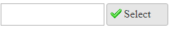

## How to

Add an image to the AsyncUpload button  
  

  
## Solution

You can insert your own image inside the Select Button of RadAsyncUpload using the CSS class below:  

````CSS
.ruButton.ruBrowse
{
    background-image: url("Images/Apply.png") !important;
    background-repeat: no-repeat;
    background-position: 5px 5px;
}
````  

The background-position property allows to control the top and left coordinates of the image inside the button.  
  

Note that the solution is applicable for the Lightweight rendering of the control - RenderMode="Lightweight".

