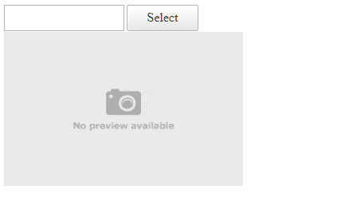

## Description

Preview the image file selected for upload with RadAsyncUpload.   


## Solution

To get access to the file that will be uploaded, we can get the file from the file input in the [OnClientFileSelected]() event of the RadAsyncUpload. In order to be able to access the file when it is dropped on the AsyncUpload control, we need to apply the workaround suggested in [Access selected file in the arguments of OnClientFileSelected event of AsyncUpload]() KB article.

Once we accessed the file, we can use a `FileReader` to read the file as a `DataURL` as suggested in the following StackOverflow forum: [Preview an image before it is uploaded](https://stackoverflow.com/a/4459419).

Then, in the load event of the FileReader, we can assign the `DataURL` as the value of the `src` attribute of our `` preview element. 

As a final touch, we can assign an initial "No preview available image" for the `` preview element and reset it when the file is removed from the AsyncUpload in the [OnClientFileUploadRemoved]() event.


````CSS
<style>
    /* the preview image element should not exceed the following size */
    #preview-image {
        max-height: 300px;
        max-width: 300px;
    }
</style>
````

````ASP.NET
<telerik:RadAsyncUpload runat="server" ID="RadAsyncUpload1" AllowedFileExtensions=".jpg,.jpeg,.png,.gif" OnClientFileUploadRemoved="OnClientFileUploadRemoved" OnClientFileSelected="OnClientFileSelected"></telerik:RadAsyncUpload>


````

````JavaScript
<script>
    function OnClientFileUploadRemoved(sender, args) {
        $telerik.$("#preview-image").attr('src', "http://ctt.trains.com/sitefiles/images/no-preview-available.png");
    }
 
    function OnClientFileSelected(sender, args) {
        var file = args.get_file();
        if (file) {
            // https://stackoverflow.com/a/4459419
            var reader = new FileReader();
 
            reader.onload = function (e) {
                $telerik.$("#preview-image").attr('src', e.target.result);
            }
 
            reader.readAsDataURL(file);
        }
    }

    // https://www.telerik.com/support/kb/aspnet-ajax/upload-(async)/details/access-selected-file-in-the-arguments-of-onclientfileselected-event-of-asyncupload
    Telerik.Web.UI.RadAsyncUpload.prototype._onFileSelected = function (row, fileInput, fileName, shouldAddNewInput, file) {
        var args = {
            row: row,
            fileInputField: fileInput,
            file: file
        };
        args.rowIndex = $telerik.$(row).index();
        args.fileName = fileName;
        this._selectedFilesCount++;
        shouldAddNewInput = shouldAddNewInput &&
            (this.get_maxFileCount() == 0 || this._selectedFilesCount < this.get_maxFileCount());
        this._marshalUpload(row, fileName, shouldAddNewInput);
        var labels = $telerik.$("label", row);
        if (labels.length > 0)
            labels.remove();
        $telerik.$.raiseControlEvent(this, "fileSelected", args);
    }
</script>
````

