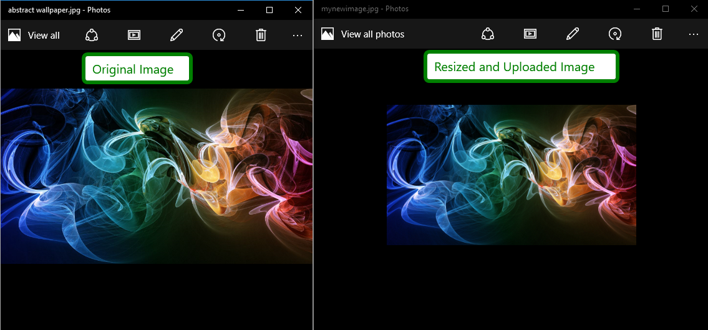

## How to

Resize images on client-side before uploading them with the RadAsyncUpload control.  



## Solution

Being able to intercept the uploading process and modifying the file, we would need to override the private *\_uploadFile* method of the AsyncUpload's upload module.

Then, for the HTML5 resize, we would use a Canvas as demonstrated below:

````JavaScript
//https://stackoverflow.com/questions/10333971/html5-pre-resize-images-before-uploading
//https://developer.mozilla.org/en-US/docs/Web/API/Canvas_API/Tutorial/Using_images
//https://developer.mozilla.org/en-US/docs/Web/API/HTMLCanvasElement/toBlob
//https://stackoverflow.com/questions/27159179/how-to-convert-blob-to-file-in-javascript
function pageLoadHandler() {
    var asyncupload = $find("<%=   RadAsyncUpload1.ClientID %>");
    var old_uploadFile = asyncupload._uploadModule._uploadFile;
    asyncupload._uploadModule._uploadFile = function (pair) {
        var uploadFile = pair.file;
                    
        var img = document.createElement("img");
        var canvas = document.createElement("canvas");
        var reader = new FileReader();
        reader.onload = function (e) {
            img.src = e.target.result
            img.onload = function () {
                var ctx = canvas.getContext("2d");
                ctx.drawImage(img, 0, 0);

                var MAX_WIDTH = 400;
                var MAX_HEIGHT = 100;
                var width = img.width;
                var height = img.height;

                if (width > height) {
                    if (width > MAX_WIDTH) {
                        height *= MAX_WIDTH / width;
                        width = MAX_WIDTH;
                    }
                } else {
                    if (height > MAX_HEIGHT) {
                        width *= MAX_HEIGHT / height;
                        height = MAX_HEIGHT;
                    }
                }
                canvas.width = width;
                canvas.height = height;

                var ctx = canvas.getContext("2d");
                ctx.drawImage(img, 0, 0, width, height);


                canvas.toBlob(function (blob) {
                    blob.lastModifiedDate = new Date();
                    blob.name = "mynewimage.jpg";
                    pair.file = blob;

                    old_uploadFile.call(this, pair)

                }, 'image/jpeg', 1);
            }
        }
        reader.readAsDataURL(uploadFile);

    }
    // Sys.Application.remove_load(pageLoadHandler); 
}
Sys.Application.add_load(pageLoadHandler);
````

````ASPX
<telerik:RadAsyncUpload runat="server" ID="RadAsyncUpload1" ></telerik:RadAsyncUpload>
````

>caution **Disclaimers**
> - This approach is not extensively tested and might lead to unexpected behavior of the upload process.
> - This approach might not be compatible with all browsers and upload modules.
> - The provided example is a Proof of Concept and assumes that the uploaded file is with .jpeg extension. Additional modifications might be needed to support other image extensions. The output size is controlled by the *MAX\_WIDTH* and *MAX\_HEIGHT* variables.


## See Also 

- [HTML5 Pre-resize images before uploading](https://stackoverflow.com/questions/10333971/html5-pre-resize-images-before-uploading)
- [Canvas API tutorial - Using images](https://developer.mozilla.org/en-US/docs/Web/API/Canvas_API/Tutorial/Using_images)
- [Creating a Blob with HTMLCanvasElement.toBlob()](https://developer.mozilla.org/en-US/docs/Web/API/HTMLCanvasElement/toBlob)
- [How to convert Blob to File in JavaScript](https://stackoverflow.com/questions/27159179/how-to-convert-blob-to-file-in-javascript)

 