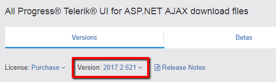
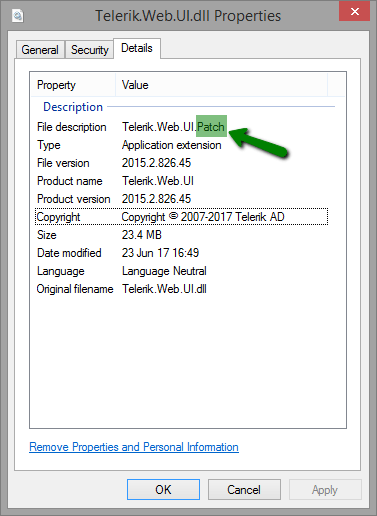

## Problem

Security vulnerabilities [CVE-2014-2217](https://cve.mitre.org/cgi-bin/cvename.cgi?name=2014-2217) and [CVE-2017-11317](https://cve.mitre.org/cgi-bin/cvename.cgi?name=CVE-2017-11317): weak encryption has been used in old versions of Telerik.Web.UI to encrypt data used by RadAsyncUpload.

## Description

An exploit can result in arbitrary file uploads and/or remote code execution.

## Solutions

>caption Update from Jan 5, 2021

Due to the .NET JavaScriptSerializer Deserialization ([CVE-2019-18935](https://cve.mitre.org/cgi-bin/cvename.cgi?name=CVE-2019-18935)) vulnerability, we strongly recommend upgrading to R1 2020 (version 2020.1.114) or later since the patches provided for [CVE-2014-2217](https://cve.mitre.org/cgi-bin/cvename.cgi?name=2014-2217) and [CVE-2017-11317](https://cve.mitre.org/cgi-bin/cvename.cgi?name=CVE-2017-11317) do not prevent it.   
  
Only the upgrade to R1 2020 (2020.1.114) or later can prevent the known vulnerabilities at the time of writing.  
  
You can find more details and instructions at [Allows JavaScriptSerializer Deserialization](https://www.telerik.com/support/kb/aspnet-ajax/details/allows-javascriptserializer-deserialization?_ga=2.47010279.1514756545.1609746144-426342040.1588420200) and [Blue Mockingbird Vulnerability Picks up Steam—Telerik Guidance](https://www.telerik.com/blogs/blue-mockingbird-vulnerability-telerik-guidance).  
  
Also check the FAQ section at the end of the [Security article](https://docs.telerik.com/devtools/aspnet-ajax/controls/asyncupload/security?&amp;_ga=2.240996419.1514756545.1609746144-426342040.1588420200#frequently-asked-questions).
 
## Deprecated solutions

>caption
>
>**Start of the deprecated solutions section:**

>Below is a Table of Contents that will help you to follow the correct instructions for your version.
>
>1. [Introduction](#introduction)
>2. Mitigation paths for all versions:
>   1. [Instructions for versions between Q1 2011 (2011.1.315) and R3 2016 SP2 (2016.3.1027)](#versions-between-q1-2011-20111315and-r3-2016-sp2-201631027)
>   2. [Instructions for versions between R1 2017 (2017.1.118) and R2 2017 SP1 (2017.2.621)](#versions-between-r1-2017-20171118-and-r2-2017-sp1-20172621)
>   3. [Instructions for versions between R2 2017 SP2 (2017.2.711) and R3 2019 (2019.3.917)](#versions-between-r2-2017-sp2-20172711-and-r3-2019-20193917)
>   4. [Instructions for versions R3 2019 SP1 (2019.3.1023) and later](#versions-r3-2019-sp1-201931023-and-later)
>3. [What is the patch](#what-is-the-patch)
>4. [How to obtain and apply the patch](#how-to-obtain-and-apply-the-patch)
>5. [How to spot a patched version of Telerik.Web.UI.dll](#how-to-spot-a-patched-version-of-telerikwebuidll)
>6. [Notes](#notes)
>7. [External References](#external-references)
>8. [See Also](#see-also)
>
>---
>
>### Introduction
>
>**Update from 8 Sep 2017**: You *should* follow one of these options even if you are not using RadAsyncUpload in your application.
>
>**Update from 23 Oct 2019**: Information on avoiding the issue through general web.config networking settings was removed because it is not sufficiently safe. General readability and information structure improvements were made as well.
>
>To ensure your application is not exposed to risk, there are several mitigation paths that ensure different levels of security. The recommended approach with the highest level of security is using the Latest version of the controls and following the >recommendations of the [RadAsyncUpload Security article](https://docs.telerik.com/devtools/aspnet-ajax/controls/asyncupload/security).
>
>---
>
>### Versions between Q1 2011 (2011.1.315) and R3 2016 SP2 (2016.3.1027)
>
>**NOTE**: Due to technical feasibility, the following versions do *not* have patches for this issue and need to be upgraded and the steps for the new version to be followed:
>
>- Q1 2011 SP2 (2011.1.519)
>- Q2 2011 SP1 (2011.2.915)
>- Q3 2011 SP1 (2011.3.1305)
>- Q1 2012 SP1 (2012.1.411)
>- Q2 2012 SP2 (2012.2.912)
>
>#### Required steps:
>
>**Step 1:** Follow the [RadAsyncUpload Security article](https://docs.telerik.com/devtools/aspnet-ajax/controls/asyncupload/security) and set all encryption keys.
>
>**Step 2:** Depending on project requirements and active maintenance licenses, there are a few options to pursue:
>
>- **Option 1:** Upgrade to R2 2017 SP2 (2017.2.911) or later and follow the steps for the chosen version.
>- **Option 2:** Apply a patch and [disable the built-in RadAsyncUpload handler](https://docs.telerik.com/devtools/aspnet-ajax/controls/asyncupload/security#disableasyncuploadhandler).
>
>#### Recommended steps for improved security:
>
>Important encryption improvements were implemented in R2 2017 SP2 (2017.2.711) that improve the security of the control and we strongly recommend using that version or a newer one.
>
>- **Tip 1:** Upgrade to R3 2019 SP1 or later because it contains [custom metadata whitelisting feature](https://docs.telerik.com/devtools/aspnet-ajax/controls/asyncupload/security#allowedcustommetadatatypes).
>- **Tip 2:** Follow the [RadAsyncUpload Security article](https://docs.telerik.com/devtools/aspnet-ajax/controls/asyncupload/security) and set all encryption keys.
>
>---
>
>### Versions between R1 2017 (2017.1.118) and R2 2017 SP1 (2017.2.621)
>
>The official versions between R1 2017 (2017.1.118) and R2 2017 SP1 (2017.2.621) have the [Insecure Direct Object Reference](https://www.telerik.com/support/kb/aspnet-ajax/upload-%28async%29/details/insecure-direct-object-reference) vulnerability if the [Custom >Encryption keys](https://docs.telerik.com/devtools/aspnet-ajax/controls/asyncupload/security#configuration-keys-details) are not set.
>
>#### Required steps:
>
>- **Option 1:** Apply a patch and [disable the built-in RadAsyncUpload handler](https://docs.telerik.com/devtools/aspnet-ajax/controls/asyncupload/security#disableasyncuploadhandler).
>- **Option 2:** Upgrade to R2 2017 SP2 or later and follow the steps for the chosen version.
>
>#### Recommendations for improved security:
>
>- **Tip 1:** Upgrade to R3 2019 SP1 or later because it contains [custom metadata whitelisting feature](https://docs.telerik.com/devtools/aspnet-ajax/controls/asyncupload/security#allowedcustommetadatatypes).
>
>---
>
>### Versions between R2 2017 SP2 (2017.2.711) and R3 2019 (2019.3.917)
>
>#### Required steps:
>
>**Step 1:** Follow the [RadAsyncUpload Security article](https://docs.telerik.com/devtools/aspnet-ajax/controls/asyncupload/security) and set all encryption keys.
>
>#### Recommendations for improved security:
>
>- **Tip 1:** Upgrade to R3 2019 SP1 or later because it contains [custom metadata whitelisting feature](https://docs.telerik.com/devtools/aspnet-ajax/controls/asyncupload/security#allowedcustommetadatatypes).
>
>---
>
>### Versions R3 2019 SP1 (2019.3.1023) and later
>
>#### Required steps:
>
>**Step 1:** Follow the [RadAsyncUpload Security article](https://docs.telerik.com/devtools/aspnet-ajax/controls/asyncupload/security) and set all encryption keys.
>
>---
>
>### What is the Patch
>
>This is a Telerik.Web.UI.dll assembly, available for most versions between Q1 2011 and R2 2017 SP1. It provides the following abilities for older versions that are available built-in for versions R2 2017 SP2 or later:
>
>1. The temporary files in the TemporaryFolder are now saved with **.tmp** extension;
>2. The built-in RadAsyncUpload handler can be disabled.
>
>You can follow the instruction in [How to Obtain and Apply the Patch](#how-to-obtain-and-apply-the-patch) section to get and apply the patch for your version.
>
>#### Recommendations for improved security:
>
>- **Tip 1:** Upgrade to R3 2019 SP1 or later because it contains [custom metadata whitelisting feature](https://docs.telerik.com/devtools/aspnet-ajax/controls/asyncupload/security#allowedcustommetadatatypes).
>- **Tip 2:** Upgrade at least to R2 2017 SP2 because it contains significant security enhancements that fully fix the relevant security issues.
>
>---
>
>### How to Obtain and Apply the Patch
>
>Before proceeding with the patching procedure, please review the following notes:
>
>- **Note 1:** If you are targeting .NET 3.5, review the [FIPS Compatibility article](http://docs.telerik.com/devtools/aspnet-ajax/controls/fips-compatibility), because the encryption issue it describes also pertains to these patches.
>- **Note 2:** The patches are **not** available on the Telerik NuGet feed.
>- **Note 3:** If you downloaded the patch before **the 15th of August 2017**, download and apply it again, because the file was updated since its [original creation](https://www.telerik.com/support/kb/aspnet-ajax/details/cryptographic-weakness).
>- **Note 4:** Due to technical feasibility, the following versions do *not* have patches for this issue and need to be upgraded and the steps for the new version to be followed:
>
>  - Q1 2011 SP2 (2011.1.519)
>  - Q2 2011 SP1 (2011.2.915)
>  - Q3 2011 SP1 (2011.3.1305)
>  - Q1 2012 SP1 (2012.1.411)
>  - Q2 2012 SP2 (2012.2.912)
>
>#### Here are the steps for obtaining and applying the patch:
>
>1. Go to your [telerik.com account](https://www.telerik.com/account).

>2. From the Version dropdown, select your release:
>
>   
>
>3. Download the **SecurityPatch_\<your_version\>.zip** file (e.g. **SecurityPatch_2017.2.621.zip**);
>
>4. [Replace the Telerik.Web.UI assembly in your application](http://docs.telerik.com/devtools/aspnet-ajax/installation/upgrading-instructions/upgrading-a-trial-to-a-developer-license-or-to-a-newer-version#manual-upgrade) with the one of the same version that you >just downloaded.
>
>5. Disable the handler as explained in the [RadAsyncUpload Security article](https://docs.telerik.com/devtools/aspnet-ajax/controls/asyncupload/security#disableasyncuploadhandler).
>
>6. Follow the [RadAsyncUpload Security article](https://docs.telerik.com/devtools/aspnet-ajax/controls/asyncupload/security) and set all encryption keys.
>
>7. Verify the patch is applied.
>
>Once the built-in handler of RadAsyncUpload is disabled, the control *cannot be used* unless a [Custom Handler](https://docs.telerik.com/devtools/aspnet-ajax/controls/asyncupload/how-to/how-to-extend-the-radasyncupload-handler) with the desired level of security >is defined.
>
>The custom metadata configuration whitelisting functionality further improves security. It is available as of R3 2019 SP1.
>
>Source code for building a patched version and [protecting the Telerik.Web.UI assembly](http://docs.telerik.com/devtools/aspnet-ajax/deployment/protecting-the-telerik-asp.net-ajax-assembly) is available as well.
>
>### How to Spot a Patched Version of Telerik.Web.UI.dll
>
>The patched version shows "Telerik.Web.UI.Patch" in the File Description under Properties in Windows Explorer:
>
>
>
>
>**End of the deprecated solutions section**

## Notes

We would like to thank Paul Taylor / Foregenix Ltd and Markus Wulftange of Code White GmbH for assisting with making the information public.

## External References

 - [CVE-2014-2217](https://cve.mitre.org/cgi-bin/cvename.cgi?name=2014-2217)

 - [CVE-2017-11317](https://cve.mitre.org/cgi-bin/cvename.cgi?name=CVE-2017-11317)

## See Also

 - [Security]()

 - [Cryptographic Weakness](https://www.telerik.com/support/kb/aspnet-ajax/details/cryptographic-weakness)

 - [Insecure Direct Object Reference](https://www.telerik.com/support/kb/aspnet-ajax/upload-%28async%29/details/insecure-direct-object-reference)

 - [Allows JavaScriptSerializer Deserialization](https://www.telerik.com/support/kb/aspnet-ajax/upload-%28async%29/details/allows-javascriptserializer-deserialization)

 - [Blue Mockingbird Vulnerability Picks up Steam—Telerik Guidance](https://www.telerik.com/blogs/blue-mockingbird-vulnerability-telerik-guidance)

 - [UploadedFiles.SaveAs Throws FileNotFound Error with Custom Handler](https://www.telerik.com/support/kb/aspnet-ajax/upload-%28async%29/details/uploadedfiles.saveas-throws-filenotfound-error-with-custom-handler)

 - [Implications for Sitefinity websites](http://knowledgebase.progress.com/articles/Article/resolving-security-vulnerability-cve-2017-9248)

