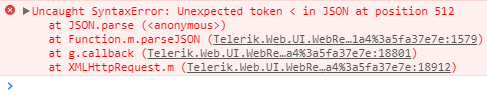

### PROBLEM

AsyncUpload not working with WebSeal SSO.

After we select the file to upload, the control shows the file name with a yellow flashing icon next to it and never completes the load of the file. In our browser's developer tools we see an error "Invalid character" (IE) or "Unexpected token &lt;" (Chrome) related to the webresource.axd access which is thrown by JSON.parse().

  


### DESCRIPTION

WebSeal adds a cookie script to responses with Content-Type like text/html, something like:


````JavaScript
<SCRIPT>
    document.cookie = "IV_JCT=%2Fjunction_name";
</SCRIPT>
````


More information on the matter: [https://www.ibm.com/developerworks/tivoli/library/t-ajaxtam/index.html](https://www.ibm.com/developerworks/tivoli/library/t-ajaxtam/index.html).

RadAsyncUpload uses Content-Type set to text/html for reponses while uploading files. File chunks that are not the last piece of the file receive only "next" in the response, and the last chunk (it can be the only chunk if the file is small enough or chunk upload is disabled), expects a JSON literal, something like:

````ASP.NET
{
    "fileInfo": {
        "FileName": "some-test-image.png",
        "ContentType": "image/png",
        "ContentLength": 11240,
        "DateJson": "2018-07-13T12:55:44.557Z",
        "Index": 0
    },
    "metaData": "SoQuRNxAJed6BfWBG2v2TC9XHjKMx5hJuUNuwZB1aASVjuURvzRTdlA4h6z4P90TjxNBcY5658uLqD4gpSoHy+tm8nJfI2OvbSl41zhewiHlUbyXc5WkgPbIdCOoWmJu5fZaC1pxO1LOZG0YKLpeJfmXrknUIfTtJrFUp6QqQo5oeFRHwNBNF0jAMHFn9KskwCtdznWjCzmx0IraZ9uOtfJqnLlDgQigEgYFLR09+YIg8B7X5nsZ51Ys+1rU1uVVrJy0On2QqMbNmE3ybh6lPc+fn+iJCo/L+syYDQl0jM3VoaDH1laThCGFz/q8aWaCC6SGVHjVjIeWp0Cc0TU7tu+GQFqRQXT9b2K3pnn46Qd8cxrPSWqWqsu1P+WXhVeVqaG0ezaqtI1Q7ktVJeHlt6wLowshXa4PNd18UnlPBoR2Vk3IswkPZA/vIM7CirOBOaSAvcenWnOGRz030d9qWOxzvH9I6WA48OMlc8cupiAIWINeEFGpeWESm5rd8eaZ6JQPozKUhNe8EpLBHfg2OXlNvwl8ru9euSM8XiDDcBU="
}
````


So, after WebSeal adds the script, you will get something like the following which will cause an exception when fed to **JSON.parse()**:

````ASP.NET
{
    "fileInfo": {
        "FileName": "some-test-image.png",
        "ContentType": "image/png",
        "ContentLength": 11240,
        "DateJson": "2018-07-13T12:55:44.557Z",
        "Index": 0
    },
    "metaData": "SoQuRNxAJed6BfWBG2v2TC9XHjKMx5hJuUNuwZB1aASVjuURvzRTdlA4h6z4P90TjxNBcY5658uLqD4gpSoHy+tm8nJfI2OvbSl41zhewiHlUbyXc5WkgPbIdCOoWmJu5fZaC1pxO1LOZG0YKLpeJfmXrknUIfTtJrFUp6QqQo5oeFRHwNBNF0jAMHFn9KskwCtdznWjCzmx0IraZ9uOtfJqnLlDgQigEgYFLR09+YIg8B7X5nsZ51Ys+1rU1uVVrJy0On2QqMbNmE3ybh6lPc+fn+iJCo/L+syYDQl0jM3VoaDH1laThCGFz/q8aWaCC6SGVHjVjIeWp0Cc0TU7tu+GQFqRQXT9b2K3pnn46Qd8cxrPSWqWqsu1P+WXhVeVqaG0ezaqtI1Q7ktVJeHlt6wLowshXa4PNd18UnlPBoR2Vk3IswkPZA/vIM7CirOBOaSAvcenWnOGRz030d9qWOxzvH9I6WA48OMlc8cupiAIWINeEFGpeWESm5rd8eaZ6JQPozKUhNe8EpLBHfg2OXlNvwl8ru9euSM8XiDDcBU="
}
<SCRIPT type="text/javascript">
/*<![CDATA[*/
document.cookie = "IV_JCT=%2Fjunction_name";
/*]]>*/
</SCRIPT>
````

  

### SOLUTION

The general solution is to **make sure that the response of the Telerik.Web.UI.WebResource.axd handler is not modified by WebSeal** as such tampering can break other controls and features as well.

If this is not possible with WebSeal, there are two other options that you can look into:

- creating a [custom handler](https://docs.telerik.com/devtools/aspnet-ajax/controls/asyncupload/how-to/how-to-extend-the-radasyncupload-handler) that will have the desired content type (e..g, text/plain) that will satisfy WebSeal.
- downloading the Telerik UI for ASP.NET AJAX source code from your account and building your custom version of the assemblies that has the "text/plain" content type set. You can find this in the WriteToResponse method in the Telerik.Web.UI\AsyncUpload\Handler\ResponseWriter.cs file. You would need to do this again every time you upgrade.


Note that both of these solutions and issues arising from them are not supported by Telerik UI for ASP.NET AJAX.


