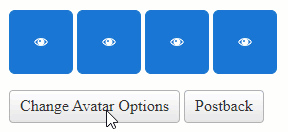

## Description

Save and Restore Avatar options



While RadAvatar provides the necessary Client-Side APIs to change its appearance, due to performance reasons, it does not store the Client-State and those will be lost upon PostBack. 

## Solution

To work around this, you can use a HiddenField, then write a JavaScript code to:
- After making changes, access the underlying Kendo UI Avatar widget
- Store the options in the HiddenField
- In the `Sys.Application.Load` event, restore the options 

Example

````ASP.NET
<telerik:RadAjaxLoadingPanel ID="RadAjaxLoadingPanel1" runat="server" Skin="Silk" MinDisplayTime="600"></telerik:RadAjaxLoadingPanel>

<telerik:RadAjaxPanel ID="RadAjaxPanel1" runat="server" Height="200px" Width="400px" LoadingPanelID="RadAjaxLoadingPanel1">
    <p>
        <telerik:RadAvatar ID="RadAvatar4" runat="server" Type="Icon" Icon="eye" Size="Large" Rounded="Large" Border="true" FillMode="Solid" />
        <telerik:RadAvatar ID="RadAvatar5" runat="server" Type="Icon" Icon="eye" Size="Large" Rounded="Large" Border="true" FillMode="Solid" />
        <telerik:RadAvatar ID="RadAvatar6" runat="server" Type="Icon" Icon="eye" Size="Large" Rounded="Large" Border="true" FillMode="Solid" />
        <telerik:RadAvatar ID="RadAvatar7" runat="server" Type="Icon" Icon="eye" Size="Large" Rounded="Large" Border="true" FillMode="Solid" />
    </p>
    <telerik:RadButton runat="server" ID="RadButton1" Text="Change Avatar Options" AutoPostBack="false" Primary="false" OnClientClicked="OnClientClicked" />
    <telerik:RadButton runat="server" ID="RadButton2" Text="Postback" AutoPostBack="true" />
    <asp:HiddenField ID="HiddenField1" runat="server" />
</telerik:RadAjaxPanel>
````

````JavaScript
<telerik:RadScriptBlock ID="RadScriptBlock1" runat="server">
    <script>
        // Change the Avatar options and Save those
        function OnClientClicked(sender, args) {
            $telerik.$('.RadAvatar').each(function (index, elem) {
                if (elem && elem.control) {
                    var avatar = elem.control;

                    if (index == 0) {
                        avatar.set_text("1st");
                        avatar.set_themeColor(AvatarOptions.ThemeColor.Success);
                    } else if (index == 1) {
                        avatar.set_text("2nd");
                        avatar.set_themeColor(AvatarOptions.ThemeColor.Info);
                    } else if (index == 2) {

                        avatar.set_text("3rd");
                        avatar.set_themeColor(AvatarOptions.ThemeColor.Warning);
                    } else {
                        avatar.set_text("4th");
                        avatar.set_themeColor(AvatarOptions.ThemeColor.Error);
                    }
                    avatar.set_type(AvatarOptions.Type.Text);
                    avatar.set_fillMode(AvatarOptions.FillMode.Outline);
                    avatar.set_rounded(AvatarOptions.Rounded.Full);

                    saveAvatarState(avatar);
                }
            })
        }
        // Restore the options on Page Load
        function pageLoadHandler() {
            $telerik.$('.RadAvatar').each(function (index, elem) {
                if (elem && elem.control) {
                    var avatar = elem.control;

                    restoreAvatarState(avatar);
                }
            })
        }
        Sys.Application.add_load(pageLoadHandler);

        // Function to Save the Options
        function saveAvatarState(avatar) {
            var hiddenField = getHiddenField();

            if (hiddenField) {

                if (hiddenField.value.length < 2) {
                    hiddenField.value = '[]';
                }

                var data = JSON.parse(hiddenField.value);

                var avatarId = avatar.get_id();
                var avatarOptions = avatar.get_kendoWidget().options;

                var existingAvatarStateIndex = data.findIndex((a) => a.id == avatarId);

                if (existingAvatarStateIndex < 0) {
                    data.push({
                        id: avatarId,
                        options: avatarOptions
                    })
                } else {
                    data[existingAvatarStateIndex].options = avatarOptions;
                }

                hiddenField.value = JSON.stringify(data);
            }
        }

        // Function to Restore the options
        function restoreAvatarState(avatar) {
            var hiddenField = getHiddenField();

            if (hiddenField && hiddenField.value.length > 2) {
                var data = JSON.parse(hiddenField.value);

                for (var i = 0; i < data.length; i++) {
                    var avatarState = data[i];

                    var avatarId = avatarState.id;
                    var avatarOptions = avatarState.options;

                    var avatar = $telerik.findControl(document, avatarId);

                    avatar.get_kendoWidget().setOptions(avatarOptions);
                }
            }
        }

        // Function to reference the HiddenField
        function getHiddenField() {
            return $telerik.findElement(document, "HiddenField1");
        }

        // The Object referencing all the Avatar Enums (for easier access)
        var AvatarOptions = (function () {
            try {
                return {
                    FillMode: Telerik.Web.UI.RadAvatarFillMode,
                    Size: Telerik.Web.UI.RadAvatarSize,
                    Type: Telerik.Web.UI.RadAvatarType,
                    Rounded: Telerik.Web.UI.RadAvatarRounded,
                    ThemeColor: Telerik.Web.UI.RadAvatarThemeColor
                }
            } catch (e) {
                // Oops, Telerik.Web.UI is not defined
            }
        })();
    </script>
</telerik:RadScriptBlock>
````
 
