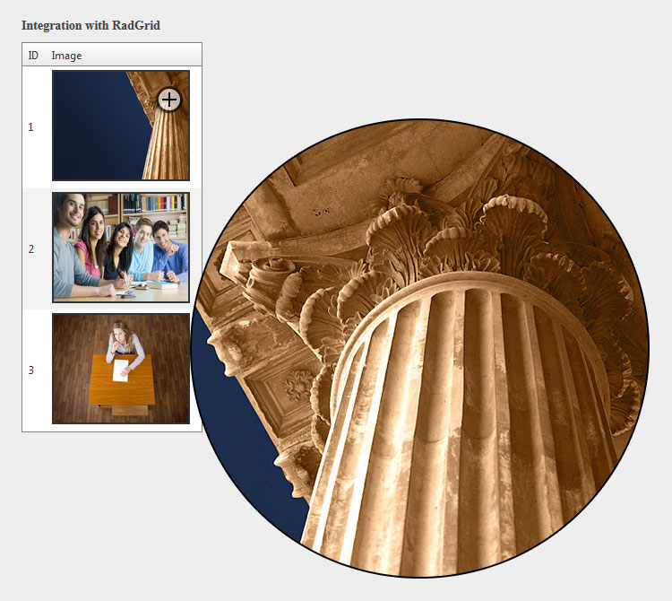

## Environment

<table>
	<tbody>
		<tr>
			<td>Product</td>
			<td>Telerik WebForms BinaryImage for ASP.NET AJAX</td>
		</tr>
	</tbody>
</table>


## Description

This Code example demonstrates several options for displaying full sized image on click or hover:



## Solution

In order to attach zoom handler for any image on your page, you only need to include the imageZoom.js file in your project, get reference to the target image and call the `ZoomManager.applyZoom(imageElement, zoomType)` method.

There are 3 different zoom types that could be used:

* Toggle
* ToolTip
* Telescope

In the context of **RadBinaryImage** you can handle the client-side pageLoad event and use the following:

````ASP.NET
<div class="customImages leftDiv">
    <h2>RadBinaryImage</h2>
    <h3>Toggle size on click</h3>
    <telerik:RadBinaryImage runat="server" Style="cursor: pointer;" ID="RadBinaryImage1" ImageUrl="~/sampleImage_small.jpg" Height="70px" Width="100px" />

    <br />
    <h3>Full size on mouseover</h3>
    <telerik:RadBinaryImage runat="server" ID="RadBinaryImage2" ImageUrl="~/sampleImage_small.jpg" Height="70px" Width="100px"></telerik:RadBinaryImage>

    <br />
    <h3>Show zoomed image on mouseover</h3>
    <telerik:RadBinaryImage runat="server" Style="cursor: crosshair;" ID="RadBinaryImage3" ImageUrl="~/sampleImage.jpg" Height="70px" Width="100px"></telerik:RadBinaryImage>

    <br />
    <h2>Simple IMG tag</h2>
    <h3>Show zoomed image on mouseover</h3>
    
</div>

<div class="customImages rightDiv">
    <h2>Standard Image control</h2>
    <h3>Integration with RadGrid</h3>
    <telerik:RadGrid runat="server" ID="RadGrid1" OnNeedDataSource="RadGrid1_NeedDataSource" OnItemCreated="RadGrid1_ItemCreated" Width="200px">
        <MasterTableView AutoGenerateColumns="false">
            <Columns>
                <telerik:GridBoundColumn DataField="ID" HeaderText="ID"></telerik:GridBoundColumn>
                <telerik:GridImageColumn UniqueName="ImageColumn" DataImageUrlFields="ImageUrl" ImageWidth="150px" ImageHeight="120px" HeaderText="Image"></telerik:GridImageColumn>
            </Columns>
        </MasterTableView>
    </telerik:RadGrid>
</div>
````

````C#
public void RadGrid1_NeedDataSource(object sender, GridNeedDataSourceEventArgs e)
{
    DataTable table = new DataTable();

    table.Columns.Add("ID", typeof(int));
    table.Columns.Add("ImageUrl", typeof(string));

    table.Rows.Add(1, "Images/image1.jpg");
    table.Rows.Add(2, "Images/image2.jpg");
    table.Rows.Add(3, "Images/image3.jpg");

    (sender as RadGrid).DataSource = table;
}

protected void RadGrid1_ItemCreated(object sender, GridItemEventArgs e)
{
    if (e.Item is GridDataItem)
    {
        GridDataItem item = e.Item as GridDataItem;
        Image image = item["ImageColumn"].Controls[0] as Image;
        image.Attributes.Add("onload", "applyZoom(this);");
    }
}
````

````JavaScript
function pageLoad() {
    ZoomManager.applyZoom(document.getElementById("<%=RadBinaryImage1.ClientID%>"), "toggle");
    ZoomManager.applyZoom(document.getElementById("<%=RadBinaryImage2.ClientID%>"), "toolTip");
    ZoomManager.applyZoom(document.getElementById("<%=RadBinaryImage3.ClientID%>"), "telescope");
    ZoomManager.applyZoom(document.getElementById("simpleIMG"), "telescope");
}

// Handle Grid images
function applyZoom(sender) {
    ZoomManager.applyZoom(sender, "telescope");
}
````

````JavaScript
var ZoomManager = {};

; (function () {
	var imagesSize = [];
	
	ZoomManager.toggleImage = function (image) {
		toggleSize(image);
	}

	ZoomManager.applyZoom = function (image, type) {
		if (!type) return false;
		switch (type.toLowerCase()) {
			case "toggle":
				image.onmousedown = function (e) { toggleSize(this); };
				break;
			case "tooltip":
				image.onmouseover = function (e) { showFullSizeImage(this, e); };
				image.onmousemove = function (e) { updateFullSizeImage(this, e); };
				image.onmouseout = function (e) { hideFullSizeImage(this); };
				break;
			case "telescope":
				image.onmouseover = function (e) { showZoomImage(this, e); };
				image.onmousemove = function (e) { updateZoomImage(this, e); };
				image.onmouseout = function (e) { hideZoomImage(this); };
				break;
			default:

		}
	}
	//Toggle Size methods
	/////////////////////
	function toggleSize(image) {
		if (image.style.width != "") {
			imagesSize[image.id] = [image.style.width, image.style.height];
			image.style.width = "";
			image.style.height = "";
		}
		else {
			image.style.width = imagesSize[image.id][0];
			image.style.height = imagesSize[image.id][1];
		}
	}

	//Full Size image methods
	/////////////////////////
	function showFullSizeImage(sender, evt) {
		evt = evt || window.event;
		var div = document.createElement("DIV");
		div.id = "fullSizeImage";
		div.style.position = "fixed";
		div.style.top = evt.clientY + 15 + "px";
		div.style.left = evt.clientX + 15 + "px";
		div.className = "fullSizeImageWrapper";
		var image = document.createElement("IMG");
		image.src = sender.src;
		image.alt = sender.alt;
		image.className = "fullSizeImage";
		div.appendChild(image);
		document.forms[0].appendChild(div);
	}

	function hideFullSizeImage(sender) {
		var div = document.getElementById("fullSizeImage");
		if (!div) return;
		div.parentElement.removeChild(div);
	}

	function updateFullSizeImage(sender, evt) {
		evt = evt || window.event;
		var div = document.getElementById("fullSizeImage");
		if (div) {
			div.style.top = evt.clientY + 15 + "px";
			div.style.left = evt.clientX + 15 + "px";
			recalculateElementPosition(div, evt);
		}
	}

	//Zoomed image methods
	//////////////////////
	var zoomedImageContainerSize = 500;
	function showZoomImage(sender, evt) {
		evt = evt || window.event;
		var div = document.createElement("DIV");
		if (!div) return;

		div.id = "fullSizeImage";
		div.style.position = "fixed";
		div.style.background = "#000";
		div.style.top = evt.clientY + 25 + "px";
		div.style.left = evt.clientX + 25 + "px";
		div.style.overflow = "hidden";
		div.className = "fullSizeImageWrapper zoomed";
		div.style.width = zoomedImageContainerSize + "px";
		div.style.height = zoomedImageContainerSize + "px";
		div.style.borderRadius = zoomedImageContainerSize / 2 + "px";
		var image = document.createElement("IMG");
		image.style.position = "relative";
		image.src = sender.src;
		image.alt = sender.alt;
		image.className = "fullSizeImage";

		//image coordinates
		var imageX = evt.clientX - sender.offsetLeft;
		var imageY = evt.clientY - sender.offsetTop;
		div.appendChild(image);
		document.forms[0].appendChild(div);

		applyScaleToImage(image, sender, imageX, imageY);
	}

	function hideZoomImage(sender) {
		var div = document.getElementById("fullSizeImage");
		if (div) {
			div.parentElement.removeChild(div);
		}
	}

	function updateZoomImage(sender, evt) {
		evt = evt || window.event;
		var div = document.getElementById("fullSizeImage");
		if (!div) return;

		var image = div.children[0];
		var imageObj = $(sender).offset();
		var imageX = evt.clientX - imageObj.left;
		var imageY = evt.clientY + document.documentElement.scrollTop - imageObj.top;
		applyScaleToImage(image, sender, imageX, imageY);
		div.style.top = evt.clientY + 25 + "px";
		div.style.left = evt.clientX + 25 + "px";
		recalculateElementPosition(div, evt);
	}

	function applyScaleToImage(image, element, imageX, imageY) {
		var scaleX = image.clientWidth / element.clientWidth;
		var scaleY = image.clientHeight / element.clientHeight;
		image.style.top = -imageY * scaleY + zoomedImageContainerSize / 2 + "px";
		image.style.left = -imageX * scaleX + zoomedImageContainerSize / 2 + "px";
	}

	function recalculateElementPosition(element, evt) {
		if (!element) return;
		evt = evt || window.event;
		var bounds = $telerik.getClientBounds();
		var top = parseFloat(element.style.top.replace("px", ""));
		var left = parseFloat(element.style.left.replace("px", ""));
		var width = parseFloat(element.style.width.replace("px", ""));
		var height = parseFloat(element.style.height.replace("px", ""));
		if (!width) width = element.clientWidth;
		if (!height) height = element.clientHeight;
		var newTop = top;
		var newLeft = left;

		if (top + height > bounds.height) {
			newTop = bounds.height - height;
		}

		if (left + width > bounds.width) {
			newLeft = bounds.width - width;
		}

		if (evt.clientY > newTop && evt.clientX < newTop + height && evt.clientX > newLeft && evt.clientX < newLeft + width) {
			newTop = evt.clientY + 1;
			newLeft = evt.clientX + 1;
		}

		element.style.top = newTop + "px";
		element.style.left = newLeft + "px";
	}

})();
````


  
   