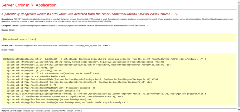

## Problem

A potentially dangerous `Request.Form` value was detected from the client under IE when a RadButton is present on the page.

Sample error message:

`A potentially dangerous Request.Form value was detected from the client (someRadButton="<SPAN class="rbIcon ..."). `

[

This happens when both:

- IE is running in `Compatibility Mode` (which is [not supported](https://www.telerik.com/aspnet-ajax/tech-sheets/browser-support))
- Any RadButton with `RenderMode="Lightweight"` is present on the page


## Description

The problem comes from the **IE7** behavior where the contents of a `<button>` tag are part of the POST query. When a form field contains special characters (like markup), ASP.NET throws this exception.

Other browsers do not put the contents of a `<button>` in the request, so the issue does not manifest with them.

You can reproduce it with the following simplistic markup:

````ASP.NET
<asp:Button Text="postback to get the error in IE Compatibility mode" ID="Button1" runat="server" />
<button name="testButton"><span>html in the button element</span></button>
````

RadButtons in their **Lightweight** RenderMode use a main `<button>` element and have HTML tags inside to provide their rich functionality. This is what triggers the error.

This includes the other types of Telerik buttons like RadRadioButton, RadPushButton and so on.

## Solution

There are two approaches to fixing this.

#### Option 1

Since [IE 7 is not supported](https://www.telerik.com/aspnet-ajax/tech-sheets/browser-support), the best solution is to ensure IE is running in Standards (Edge) mode. Here are a few things that can help in this regard:
- **remove** the site from the `Compatibility Mode` settings (including the check for showing Intranet sites in compatibiliy mode)
- add the [x-ua compatible meta tag or HTTP header](https://msdn.microsoft.com/en-us/library/ff955275%28v=vs.85%29.aspx) that tries to put IE in standards mode. 

For example:

````ASP.NET
<meta http-equiv="X-UA-Compatible" content="IE=edge">
````

For more details see the following KB article: 

[Different appearance or behavior in Internet Explorer on local and production servers]().

#### Option 2

Avoid the error by using the `Classic` **RenderMode** of the RadButton and remove other types of Telerik buttons because they do not have a Classic RenderMode. The Classic mode does not use a `<button>` tag.


