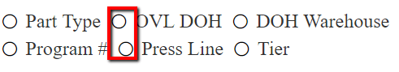

## Problem

You may experience an issue with misaligned list elements as in the picture below:  
  
  

This article shows how to deal with such a problem and fix it.  
  
## Solution

The radio buttons alignment can be controlled with the class below:  
  
````CSS
.RadRadioButtonList.rbHorizontalList .RadRadioButton {
    min-width: 120px;
    border: 1px solid red;
    text-align: left;
}
````


Update the value of the min-width property depending on the list text length.  

Don't forget to remove the border since it is just a helper that renders grid lines between the buttons.  
  

Here is the complete solution:  
  
````ASPX
<style>
    .RadRadioButtonList.rbHorizontalList .RadRadioButton {
        min-width: 120px;
        border: 1px solid red;
        text-align: left;
    }
</style>
<telerik:RadRadioButtonList runat="server" ID="RadRadioButtonList1" Direction="Horizontal" Width="360px" Columns="3" >
    <Items>
        <telerik:ButtonListItem Text="Part Type" Value="Part Type" />
        <telerik:ButtonListItem Text="OVL DOH" Value="OVL DOH" />
        <telerik:ButtonListItem Text="DOH Warehouse" Value="DOH Warehouse" />
        <telerik:ButtonListItem Text="Program #" Value="Program #" />
        <telerik:ButtonListItem Text="Press Line" Value="Press Line" />
        <telerik:ButtonListItem Text="Tier" Value="Tier" />
    </Items>
</telerik:RadRadioButtonList>
````

 