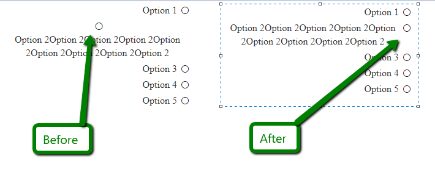

## Problem

When the RadioButtonListItem's text is longer than the listbox' width, the radio button icon is on a separate row.



## Solution

Setting the width of the item's text to be a few pixels less than its original 100% width fixes the issue:

````ASPX
<style>
    .RadRadioButtonList.rbVerticalList .rbRadioButton .rbText {
        width: calc(100% - 21px);
    }
</style>
<telerik:RadRadioButtonList runat="server" ID="RadCheckBoxList1" >
    <Items>
        <telerik:ButtonListItem Text="Option 1" />
        <telerik:ButtonListItem Text="Option 2Option 2Option 2Option 2Option 2Option 2Option 2Option 2Option 2" />
        <telerik:ButtonListItem Text="Option 3" />
        <telerik:ButtonListItem Text="Option 4" />
        <telerik:ButtonListItem Text="Option 5" />
    </Items>
</telerik:RadRadioButtonList>
````

 