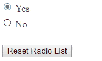

## How to

Deselect RadRadioButtonList with server or client-side code  
  

   
## Solution

 - **Client-side Solution**

 You can get reference to all radio list items via the *get\_items()* method and use the *set\_selected(false);* method to reset their state. Note that this will reset it only on the client-side and transferring this reset to the server is not a feature available in the control. You can hack the control into thinking nothing is selected by resetting its **\_selectedIndex** property to **-1** and making it **updateClientState()**.

 ````ASPX
<telerik:RadRadioButtonList ID="RadRadioButtonList1" runat="server" RepeatDirection="Horizontal">
    <Items>
        <telerik:ButtonListItem Text="Yes" Selected="true" Value="Yes"></telerik:ButtonListItem>
        <telerik:ButtonListItem Text="No" Value="No"></telerik:ButtonListItem>
    </Items>
</telerik:RadRadioButtonList>
<asp:Button Text="Reset Radio List" OnClientClick="resetRadioList(); return false;" runat="server" />
<script type="text/javascript">
    function resetRadioList() {
        var radioButtonList = $find("<%=RadRadioButtonList1.ClientID%>");
        //reset the appearane of the items
        var items = radioButtonList.get_items();
        for (var i = 0; i < items.length; i++) {
            items[i].set_selected(false);
        }
        //transfer the no-items-selected state to the server code
        radioButtonList._selectedIndex = -1;
        radioButtonList.updateClientState();
    }
</script> 
 ````

 - **Server-side Solution**

 To reset the state via the code-behind use the *Items* collection and *Selected* property of the component:  
  
 ````ASPX
<telerik:RadRadioButtonList ID="RadRadioButtonList1" runat="server" RepeatDirection="Horizontal">
    <Items>
        <telerik:ButtonListItem Text="Yes" Selected="true"  Value="Yes"></telerik:ButtonListItem>
        <telerik:ButtonListItem Text="No" Value="No"></telerik:ButtonListItem>
    </Items>
</telerik:RadRadioButtonList>
<asp:Button Text="Reset Radio List" OnClick="Reset_RadioList_Click" runat="server" />
 ````

````C#
protected void Reset_RadioList_Click(object sender, EventArgs e)
{
     for (int i = 0; i < RadRadioButtonList1.Items.Count; i++)
     {
        RadRadioButtonList1.Items[i].Selected = false;
     }
}
````
````VB
Protected Sub Reset_RadioList_Click(ByVal sender As Object, ByVal e As EventArgs)
    For i As Integer = 0 To RadRadioButtonList1.Items.Count - 1
        RadRadioButtonList1.Items(i).Selected = False
    Next
End Sub
````

  