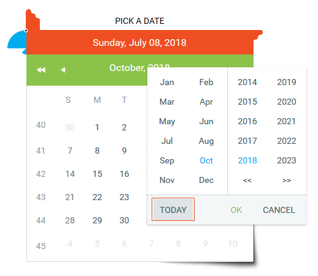

## Description  

By default the Today button of the fast navigation window of RadCalendar navigates to the corresponding month view, but does not select the date automatically. The user then may click one of the available date cells to actually make the selection.  
  


## Solution

In order to enable the Today button to make an actual date selection, you can make avail of the [EnableTodayButtonSelection](#monthyear-popup) property.  
  
````ASPX
<telerik:RadDatePicker ID="RadDatePicker1" runat="server">
    <Calendar runat="server">
        <FastNavigationSettings EnableTodayButtonSelection="true">
        </FastNavigationSettings>
    </Calendar>
</telerik:RadDatePicker>
````
 
