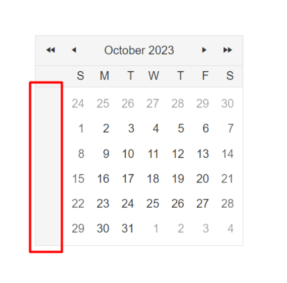

## Description

How can I set empty text values in the RadCalendar's week column?

## Solution

You can use either one of the below given approaches, one that is purely CSS and on that is purely JS.

Sample RadCalendar declaration:

```ASPX
<telerik:RadCalendar runat="server" ID="RadCalendar1" />
```

Removing the text via CSS:

```CSS
<style>
    .rcRow th:nth-child(1) {
        text-indent: -100000px;
    }
</style>
```

Removing the text via JS:

```JS
<script>
    function pageLoadHandler() {
        var row = $(".rcRow") // Get the row elements of the calendar
        var children // Declare the children variable which we'll use to store the child elements of each row

        for (var i = 0; i < row.length; i++) { // Since every week column has 6 numbers, the length will be 6, so we will iterate 6 times - from 0 to 5
            children = $(row[i]).children() // Iterate through all the rows and initialize their child elements to the children variable
            $(children[0]).text("") // Remove the text  of the first child element (each week number is the first child of the row element, which always has 0 as its index)
        }
    }
    Sys.Application.add_load(pageLoadHandler);
</script>
```

## End result

