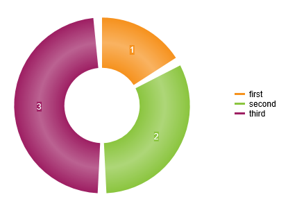

## Environment

<table>
	<tbody>
		<tr>
			<td>Product</td>
			<td>Telerik WebForms HtmlChart for ASP.NET AJAX</td>
		</tr>
	</tbody>
</table>

## DESCRIPTION

The Donut/Pie charts do not support the Gap property that is available for "bar", "column", "candlestick", "ohlc", "radarColumn" and "waterfall" series.

To achieve spacing between the series items, the easiest option is to set the Exploded property of all the series items to true. The downside of this is that the chart will no longer be a circle, as the segments will move out according to their value.//

To achieve uniform spacing, a workaround is to pad the data with dummy items that are:

- transparent
- invisible in the legend
- of a sufficiently small value (according to the data set) so that they provide the desired appearance
- provide a template for the labels and tooltips that will remove their content for the dummy items so they are not visible



## SOLUTIONS

````ASP.NET
<telerik:RadHtmlChart runat="server" ID="rhc1">
    <PlotArea>
        <Series>
            <telerik:DonutSeries>
                <SeriesItems>
                    <telerik:PieSeriesItem Name="first" Y="1" />
                    <telerik:PieSeriesItem Name="dummy" VisibleInLegend="false" BackgroundColor="Transparent" Y="0.1" />
                    <telerik:PieSeriesItem Name="second" Y="2" />
                    <telerik:PieSeriesItem Name="dummy" VisibleInLegend="false" BackgroundColor="Transparent" Y="0.1" />
                    <telerik:PieSeriesItem Name="third" Y="3" />
                    <telerik:PieSeriesItem Name="dummy" VisibleInLegend="false" BackgroundColor="Transparent" Y="0.1" />
                </SeriesItems>
                <LabelsAppearance>
                    <ClientTemplate>
                        #= removeDummies(category, value) #
                    </ClientTemplate>
                </LabelsAppearance>
                <TooltipsAppearance>
                    <ClientTemplate>
                        #= removeDummies(category, value) #
                    </ClientTemplate>
                </TooltipsAppearance>
            </telerik:DonutSeries>
        </Series>
    </PlotArea>
</telerik:RadHtmlChart>
````

````JavaScript
<script>
    function removeDummies(itemName, value) {
        if (itemName.indexOf("dummy") < 0) {
            return value;
        }
        return "";
    }
</script>
````
 
  
   