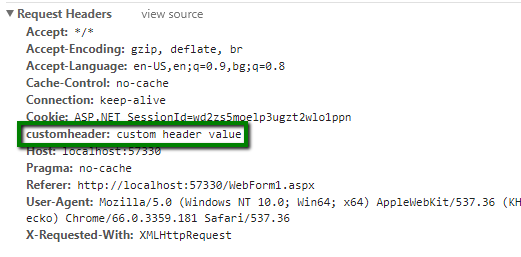

## Description

This article shows how you can add custom headers to the requests made from the ClientDataSource, for example, Authentication header.

## Solution



To manipulate the request we should add a handler for the *beforeSend* event of the underlying Kendo UI DataSource widget's transport properties. In order to do that we need to override the private *\_mapTransport* function of the RadClientDataSource control. Placing the following scripts below the ScriptManager allows you to set a header with key *'customheader'* and value *'custom header value'*.

````JavaScript
var $ = $ || $telerik.$;
var old_mapTransport = Telerik.Web.UI.RadClientDataSource.prototype._mapTransport;
Telerik.Web.UI.RadClientDataSource.prototype._mapTransport = function () {
    var transport = old_mapTransport.call(this);
    transport.read.beforeSend = beforeSendHandler;
    transport.create.beforeSend = beforeSendHandler;
    transport.update.beforeSend = beforeSendHandler;
    transport.destroy.beforeSend = beforeSendHandler;
    return transport;
}
function beforeSendHandler(xhr) {
    xhr.setRequestHeader('customheader', 'custom header value');
}
````

## Note

Setting the header to the request is not possible when the request data type is JSONP.

Here are some links related to the request headers and JSONP:

 - [https://stackoverflow.com/a/10546945](https://stackoverflow.com/a/10546945)
 - [https://stackoverflow.com/questions/3073287/set-headers-with-jquery-ajax-and-jsonp](https://stackoverflow.com/questions/3073287/set-headers-with-jquery-ajax-and-jsonp)
 - [https://stackoverflow.com/questions/3073336/is-it-possible-to-make-cross-domain-requests-in-javascript-and-set-custom-header](https://stackoverflow.com/questions/3073336/is-it-possible-to-make-cross-domain-requests-in-javascript-and-set-custom-header)
 - [https://stackoverflow.com/questions/3350778/modify-http-headers-for-a-jsonp-request](https://stackoverflow.com/questions/3350778/modify-http-headers-for-a-jsonp-request)
 - [https://stackoverflow.com/questions/7433556/jquery-jsonp-ajax-authentication-header-not-being-set](https://stackoverflow.com/questions/7433556/jquery-jsonp-ajax-authentication-header-not-being-set)
 - [https://github.com/jquery/jquery/issues/1781](https://github.com/jquery/jquery/issues/1781)


## See Also

 - [Using ClientDataSource With Web API](https://docs.telerik.com/devtools/aspnet-ajax/controls/clientdatasource/how-to/using-clientdatasource-with-web-api)
 - [How to set Authorization header for transport read?](https://www.telerik.com/forums/how-to-set-authorization-header-for-transport-read#Ds6e3JkOXEKOB24yFTggcg)


