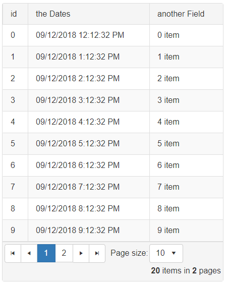
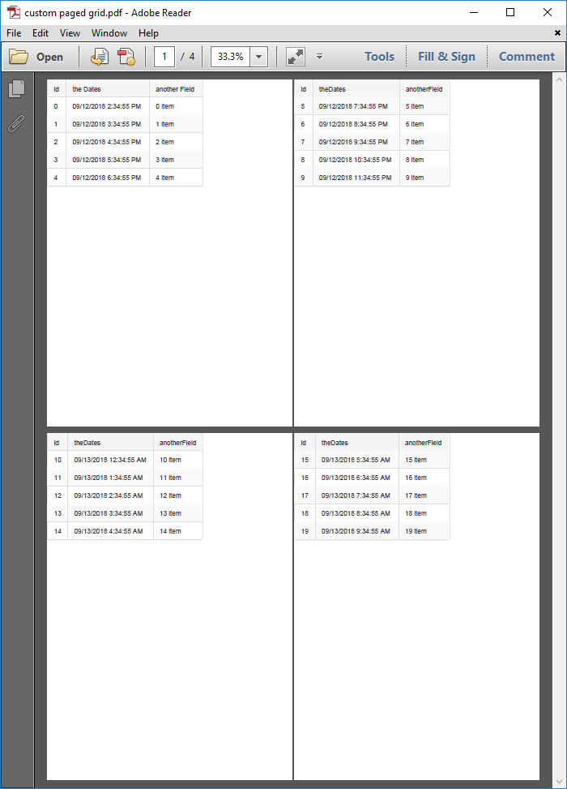

## Environment

<table>
	<tbody>
		<tr>
			<td>Product</td>
			<td>Telerik WebForms ClientExportManager for ASP.NET AJAX</td>
		</tr>
	</tbody>
</table>

## DESCRIPTION

When exporting to PDF by using [RadClientExportManager]() you may sometimes need to add hard page-breaks in the current grid so that a certain number of rows are displayed on different pages in the exported file. 

First picture shows an example of a Grid with 20 items across 2 pages, second picture show the result of the exported file when exporting all records across all pages and applying page-break.

 


## SOLUTION

To do this, you need to traverse the rows and add the [page break selector]() to the desired rows.

The attached sample project demonstrates one way to do this. It also shows how you can export all the Grid data across all pages to a PDF through the client-side export by disabling paging at the server level, which can be useful for generating small reports.

You could simply loop through the items and add the `pageBreak` classname to the rows. In case, however, you would like to display the Grid headers on each page, you can clone the header for each page.

**Export to PDF with page-break**

Here is an example of client-side method to apply page-break after specified amount of rows as well clones the Grid header.

````JavaScript
function addPageBreakSelectorsToGrid(itemsPerPage) {
    var grid = $find("<%=RadGrid1.ClientID%>");
    var items = grid.get_masterTableView().get_dataItems();
    for (var i = 0; i < items.length; i++) {
        if (i > 0 && i % itemsPerPage == 0) { // Add a page break every nth item, you can use the original page size here if you like
            var breakRow = '<tr class="pageBreak">';
            
            for (var j = 0; j < grid.get_masterTableView().get_columns().length; j++) { // Clone the header so the subsequent pages show a header to the consumer
                breakRow += '<td class="rgHeader">' + grid.get_masterTableView().get_columns()[j].get_uniqueName() + '</td>';
            }
            breakRow += '</tr>';
            $telerik.$(breakRow).insertAfter(items[i-1].get_element());
        }
    }
}
````

Create a function that will call the `exportPDF` method of the ClientExportManager.

````JavaScript
function callExport() {
    var exportManager = $find("<%=rcem1.ClientID%>");
    exportManager.exportPDF($telerik.$("#forExport"));
}
````

With a Button click, you can then apply page-break and export, like so:

````JavaScript
function buttonClickHandler() {
    addPageBreakSelectorsToGrid(5); // Apply page break with header after every 5th row
    callExport(); // Export to PDF
}
````

**Export with disabled Paging**

To disable paging for the Grid, a postback needs to be done. Since the ClientExportManager only operates on the client, you can send an [AJAX request](https://demos.telerik.com/aspnet-ajax/ajaxmanager/client-side-programming/client-side-api/defaultcs.aspx) to the server through the [RadAjaxManager]().

````JavaScript
// Used only for when paging will be disabled so all data will be rendered
// NOTE: this can deteriorate performance significantly, use such an approach only if you don't have a lot of data
function disablePagingAndExport(sender, args) {
    $find("<%=RadAjaxManager.GetCurrent(Page).ClientID%>").ajaxRequest("disablePaging");
}
````

Subscribe the AjaxManager to its AjaxRequest server-side event

````ASP.NET
<telerik:RadAjaxManager ID="RadAjaxManager1" runat="server" OnAjaxRequest="RadAjaxManager1_AjaxRequest" />
````

AjaxRequest  event handler

````C#
protected void RadAjaxManager1_AjaxRequest(object sender, AjaxRequestEventArgs e)
{
    if (e.Argument == "disablePaging")
    {
        RadGrid1.AllowPaging = false;
        RadGrid1.Rebind();
        ScriptManager.RegisterStartupScript(Page, Page.GetType(), "someKey", "Sys.Application.add_load(performExport);", true); // Register a startup script that will be executed once the page finished loading
    }
}
````

When the response is returned, the following method will be executed.

````JavaScript
function performExport() {
    Sys.Application.remove_load(performExport); // Unbind the method from the page load event.

    addPageBreakSelectorsToGrid(5); // Apply pagebreak on every 5th row
    callExport(); // Call the ExportPDF
}
````

The above code will disable Paging and export the Grid accordingly, but there is one more thing that needs to be done. Once the export has finished, return the paging so that the Grid will display all the data in one page. To achieve that, you can subscribe the RadClientExportManager to its [OnClientPdfExported]() client-side event.

````ASP.NET
<telerik:RadClientExportManager runat="server" ID="RadClientExportManager1" OnClientPdfExported="enablePaging" />
````

In the event handler, send an AjaxRequest to the server and enable the paging.

````JavaScript
function enablePaging() {
    $find("<%=RadAjaxManager.GetCurrent(Page).ClientID%>").ajaxRequest("enablePaging");
}
````

RadAjaxManager's AjaxRequest event handler:

````C#
protected void RadAjaxManager1_AjaxRequest(object sender, AjaxRequestEventArgs e)
{
    if (e.Argument == "enablePaging")
    {
        RadGrid1.AllowPaging = true;
        RadGrid1.Rebind();
    }
}
````

You can find attached [here](files/clientexportmanager-page-for-client-side-export.zip) a basic example. 
 
  
   
