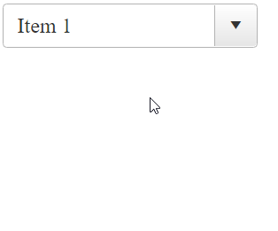

## How To

Add a clear button programmatically in **RadComboBox** input.



## Solution

* In the [OnClientLoad]() event of the **RadComboBox** we add a span element containing the "clear button" to the embedded input element.

* Hook the "click" event of the "clear button".

* In the onclick event listener clear the current selection of the **RadComboBox** and set the focus to the input element for performing new selection.

Sample declaration:

````ASPX
<telerik:RadComboBox ID="RadComboBox1" Skin="Default" AllowCustomText="true" EmptyMessage="Select an item" OnClientLoad="OnClientLoad" runat="server" RenderMode="Lightweight">
    <Items>
        <telerik:RadComboBoxItem Text="Item 1" />
        <telerik:RadComboBoxItem Text="Item 2" />
        <telerik:RadComboBoxItem Text="Item 3" />
        <telerik:RadComboBoxItem Text="Item 4" />
    </Items>
</telerik:RadComboBox>
````

````JavaScript
function OnClientLoad(sender, args) {
    var $clearButton = $telerik.$('<span class="combo-clear-btn"></span>')

    $clearButton.insertAfter($telerik.$(sender.get_inputDomElement()));

    $clearButton.click(function (ev) {
        $telerik.cancelRawEvent(ev);
        sender.clearSelection();
        sender.get_inputDomElement().focus();
    })
}
````

````CSS
.combo-clear-btn {
    position: relative;
    -webkit-user-select: none;
    -moz-user-select: none;
    -ms-user-select: none;
    user-select: none;
    position: absolute;
    right: 32px;
    top: 4px;
    z-index: 2;
    width: 30px;
    cursor: pointer;
    visibility: hidden;
    opacity: 0;
    transition: opacity .2s ease 0s,visibility 0s linear .2s;
    font-family: "WebComponentsIcons";
    text-align: center;
}

    .combo-clear-btn:before {
        display: block;
        content: "\e11b";
    }

.RadComboBox:hover .combo-clear-btn {
    display: block;
    visibility: visible;
    opacity: 1;
    transition: opacity .2s ease 0s,visibility 0s linear 0s;
}
````

## Notes

The RadComboBox does not provide a clear button by default and there is a Feature Request for it. Additionally, there are some other approaches for achieving similar behavior e.g. by using external button or a button in the HeaderTemplate:

 - https://feedback.telerik.com/aspnet-ajax/1401073-option-or-button-within-combo-box-to-clear-selection

 - https://www.telerik.com/forums/clear-button-on-radcombbox#4W7c67CGGUeUhozrCPsW2A 

 - https://docs.telerik.com/devtools/aspnet-ajax/controls/combobox/how-to/clear-radcombobox 

