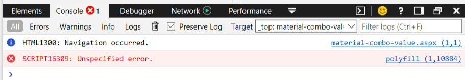
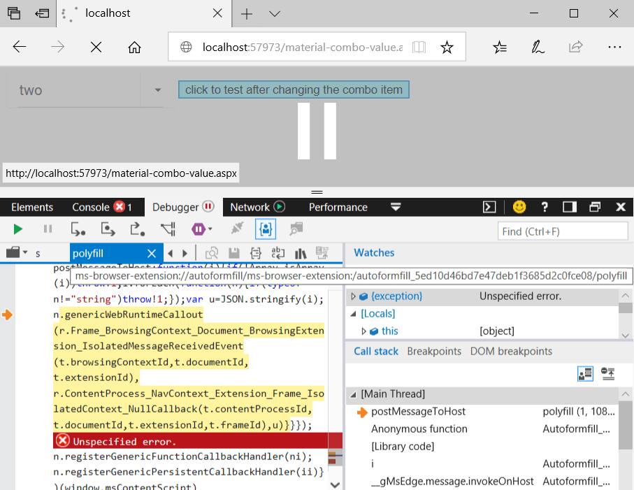
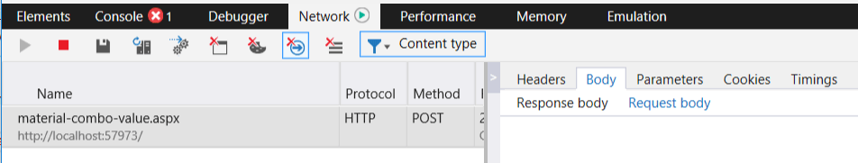
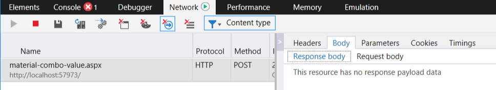

## Problem

When I choose any value in the combo box, after the postback it returns to show the first value instead of maintaining the user choice.

This happens under Edge, with Skin="Material" and when MarkFirstMatch="true".

When unloading the page, the autofill plugin from Edge throws errors:





The POST query request and response bodies are empty in the dev toolbar:





## Description

It seems that some plugins from Edge prevent values from being obtained properly from the combo box input. The actual problem stems from the fact that the value cannot be extracted and is empty in the POST query, and the text has a phantom "\n" newline character.

Disabling the autofill feature removes the error but the input values still cannot be properly obtained and the POST query does not contain the correct information (the dev toolbar still does not show data).

This issue does not manifest with other skins, and the main difference present in the Material skin is that it fetches fonts from the Google cloud. It is possible that this causes the issue.

## Solution

The **easiest solution** is to **change the skin** to any of the other skins.

You can, **alternatively**, **set AutoPostBack="true"** as this seems to preserve the selected item correctly. This changes the user experience more than changing the skin, however.

The code snippet below also shows a **third option** -  a **function override** that can be combined with correct values stored in the OnClientSelectedIndexChanged event. Code comments explain what is changed from the original code so you can apply them on later versions as well (since the code pasted here may evolve).

````ASPX
<telerik:RadComboBox ID="RadComboBox1" runat="server"
 
    MarkFirstMatch="true" RenderMode="Lightweight" Skin="Material"
     
    OnClientSelectedIndexChanged="OnClientSelectedIndexChanged">
    <Items>
        <telerik:RadComboBoxItem Text="one" Value="1" />
        <telerik:RadComboBoxItem Text="two" Value="2" />
        <telerik:RadComboBoxItem Text="three" Value="3" />
    </Items>
</telerik:RadComboBox>
<asp:Button Text="click to test after changing the combo item" ID="Button1" runat="server" />
<script>
    function shouldWorkaroundMaterialEdgeIssue(combo) {
        return Telerik.Web.Browser.edge && combo._skin == "Material" && combo.get_markFirstMatch();
    }
    function OnClientSelectedIndexChanged(sender, args) {
        if (shouldWorkaroundMaterialEdgeIssue(sender)) {
            sender.__currValue = sender.get_value();
            sender.__currText = sender.get_text().trim();
        }
    }
 
    if (Telerik.Web.Browser.edge) {//avoid overriding for other browsers that do not have the problem
        Telerik.Web.UI.RadComboBox.prototype.saveClientState = function () {
            var logEntriesArray = this._log._logEntries;
            var clientState = {
                logEntries: logEntriesArray,
                //original code:
                //value: this._value
                //text: this._text
                value: shouldWorkaroundMaterialEdgeIssue(this)? this.__currValue : this._value,
                text: shouldWorkaroundMaterialEdgeIssue(this) ? this.__currText : this._text,
                enabled: this._enabled,
                checkedIndices: this._checkedIndices,
                checkedItemsTextOverflows: this._checkedItemsTextOverflows
            };
 
            if (this._addEmptyMessageToClientState) {
                clientState.emptyMessage = this.get_emptyMessage();
                this._addEmptyMessageToClientState = false;
            }
            //added to get the variable
            var $J = $J = Sys.Serialization.JavaScriptSerializer;
            return $J.serialize(clientState);
        }
    }
</script>
````

 