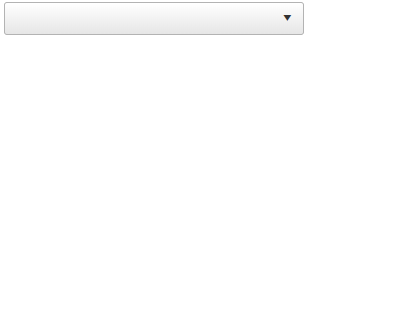

## Environment

<table>
	<tbody>
		<tr>
			<td>Product</td>
			<td>Telerik WebForms ComboBox for ASP.NET AJAX</td>
		</tr>
	</tbody>
</table>

## Description

The ComboBox **Filtering** and **MarkFirstMatch** functionalities are not supported when CheckBoxes are enabled. This example demonstrates a custom approach that enables filtering through a TextBox embedded in the ComboBox' Header Template.



## Solution

1. The RadComboBox is defined with CheckBoxes enabled and a custom HeaderTemplate containing a RadTextBox for filtering.

1. In the JavaScript section:

    - The original [`highlightAllMatches`](https://docs.telerik.com/devtools/aspnet-ajax/api/client/telerik.web.ui.radcombobox#highlightallmatches) function of the RadComboBox prototype is stored in originalFunction.
    - An **OnLoad** function is defined, which gets called when the RadTextBox in the header template is loaded. Inside this function, an event listener is added to the RadTextBox for the keyup event, triggering the custom highlightAllMatches  function whenever a key is released.
    - The [`OnClientDropDownClosing`]() function is defined to clear any custom markup applied during filtering and make all items visible again.

1. A custom **highlightAllMatches** function is defined for the RadComboBox prototype. This function sets the filter to "Contains", calls the original **highlightAllMatches** function (to apply highlighting), and then resets the filter to "None".

This implementation provides a way to filter items in the RadComboBox even when CheckBoxes are enabled, by leveraging a custom approach with a TextBox in the ComboBox's header.

````ASP.NET
<telerik:RadComboBox ID="RadComboBox1" runat="server" CheckBoxes="true" CheckedItemsTexts="DisplayAllInInput" Width="300px"
    DataTextField="Name" DataValueField="ID" OnClientDropDownClosing="OnClientDropDownClosing">
    <HeaderTemplate>
        <telerik:RadTextBox runat="server" ID="RadTextBox1" Width="100%" ClientEvents-OnLoad="OnLoad">
        </telerik:RadTextBox>
    </HeaderTemplate>
</telerik:RadComboBox>
````

````JS
var $T = Telerik.Web.UI;
var originalFunction = $T.RadComboBox.prototype.highlightAllMatches;
var textBox;

function OnLoad(sender, args) {
    var comboBox;

    Sys.Application.add_load(function () {
        textBox = sender;
        comboBox = $find("RadComboBox1");
    });

    $telerik.$(sender.get_element()).on("keyup", function (e) {
        comboBox.highlightAllMatches(sender.get_textBoxValue());
    })
}

function OnClientDropDownClosing(sender, args) {
    sender.get_items().forEach(function (item) {
        item.clearEmTags();
    });
    sender.setAllItemsVisible(true);
    textBox.clear();
}

$T.RadComboBox.prototype.highlightAllMatches = function (text) {
    this.set_filter($T.RadComboBoxFilter.Contains);
    originalFunction.call(this, text);
    this.set_filter($T.RadComboBoxFilter.None);
};
````

````C#
protected void Page_Load(object sender, EventArgs e)
{
    if (!IsPostBack)
    {
        RadComboBox1.DataSource = CreateItems();
        RadComboBox1.DataBind();
    }
}

protected List<Person> CreateItems()
{
    List<Person> data = new List<Person>();
    data.Add(new Person(1, "Anna"));
    data.Add(new Person(2, "Bob"));
    data.Add(new Person(3, "Colin"));
    data.Add(new Person(4, "Daniel"));
    data.Add(new Person(5, "Ellen"));

    return data;
}

public class Person
{
    public int ID { get; set; }
    public string Name { get; set; }

    public Person(int id, string name)
    {
        ID = id;
        Name = name;
    }
}
````


 