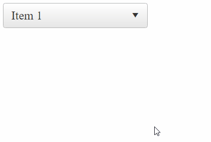

## How to

Change expand/collapse button of expanded RadComboBox to an Up Arrow



## Description

By default, the action button of RadComboBox is always a Down Arrow, no matter if the RadComboBox's dropdown is expanded or not.

By applying some custom CSS you can change the appearance and display an Up Arrow when the Combo is expanded so it indicates the dropdown closing direction.

>caption In Lightweight RenderMode

````ASPX
<style>
    .RadComboBox .rcbExpanded .rcbActionButton > span[id$=_Arrow]:before {
        content: "\e004"
    }

    /*Style specifically for Material Skin*/
    .RadComboBox_Material .rcbExpanded .rcbActionButton > span[id$=_Arrow]:before {
        content: "\e5c7"
    }
</style>

<telerik:RadComboBox ID="RadComboBox1" runat="server" RenderMode="Lightweight">
    <Items>
        <telerik:RadComboBoxItem Text="Item 1" />
        <telerik:RadComboBoxItem Text="Item 2" />
        <telerik:RadComboBoxItem Text="Item 3" />
        <telerik:RadComboBoxItem Text="Item 4" />
    </Items>
</telerik:RadComboBox>
````

>caption Classic RenderMode

The Classic RenderMode is a bit tricky as it uses background images. That means you would need to rotate the arrow element or use a custom background image for it. To apply the Down Arrow, you will need to add and remove a custom CSS class in `OnClientDropDownOpening` and `OnClientDropDownClosed` events:

````ASPX
<style>
    .RadComboBox.expanded .rcbArrowCell.rcbArrowCellRight {
        transform: scaleY(-1);
    }
</style>
<script>
    function OnClientDropDownOpening(sender, args) {
        $telerik.$(sender.get_element()).addClass("expanded");
    }
    function OnClientDropDownClosed(sender, args) {
        $telerik.$(sender.get_element()).removeClass("expanded");

    }
</script>
<telerik:RadComboBox ID="RadComboBox1" runat="server" RenderMode="Classic"
    OnClientDropDownOpening="OnClientDropDownOpening"
    OnClientDropDownClosed="OnClientDropDownClosed">
    <Items>
        <telerik:RadComboBoxItem Text="Item 1" />
        <telerik:RadComboBoxItem Text="Item 2" />
        <telerik:RadComboBoxItem Text="Item 3" />
        <telerik:RadComboBoxItem Text="Item 4" />
    </Items>
</telerik:RadComboBox>
````

