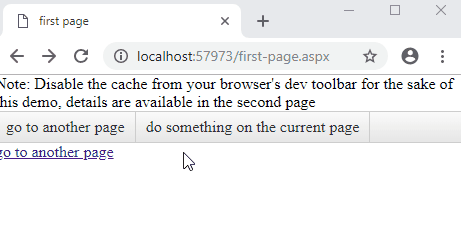

## Environment

<table>
	<tbody>
		<tr>
			<td>Product</td>
			<td>Telerik UI for ASP.NET AJAX</td>
		</tr>
	</tbody>
</table>

## Description

When you click a menu, link or a button that will take your user to another page, you would want them to know something is happening. Instead of a frozen or blank screen, you want them to see a friendly loading animation or message. Something like this:




The problem is that when moving from one page to the other, the first page gets unloaded from the browser, so you can no longer execute code in it, and some time will inevitably pass until meaningful content comes back to the browser from the second page.

SPAs and some web technologies have it easier (e.g., they only load content, and/or pre-loading is possible). In WebForms, such goodies don't exist and you need to take some measures to alleviate the jarring transition as much as possible. One approach to doing that is:

1. Hook to the earliest client-side event that you know will navigate the user away from the page. In the sample below, the [`OnClientItemClick`]() and the click on a hyperlink are used.
1. Show a loading sign immediately, before the current page starts unloading. In the codce below, a modal ***RadAjaxLoadingPanel*** is shown.
1. On the page that will get loaded (or, on all pages), make sure that the first bytes that arrive are the simplest possible CSS+HTML+JavaScript combination that can provide the same loading panel appearance as the one you use when unloading a page. The code below shows one way to mimic the RadAjaxLoadingPanel appearance.
1. Hook up the appropriate client-side events that indicate the page is now usable so you can hide the loading sign. In WebForms, that's [Sys.Application.Load](https://stackoverflow.com/questions/3630341/sys-application-add-load-vs-document-ready-vs-pageload). The sample also adds a handler for [window.onerror](https://developer.mozilla.org/en-US/docs/Web/API/Window/error_event) to capture issues and attempt to salvage some usability for the user in case things go south.

## Solution

This sample uses a fake performance hit to simulate long document parsing. It may block the UI thread on your end and thus - also block the image. If this happens and you don't see the image, try the code in a real page instead.

You can also throttle the network speed through the dev toolbar to increase the time it takes for the content to load so you have time to see the loading sign and to mimic a real connection lag.

**Frist page**

````ASP.NET
Note: Disable the cache from the browser dev toolbar for the sake of this demo, details are available in the second page
<telerik:RadAjaxLoadingPanel runat="server" ID="betweenPagesSign" Modal="true" Skin="Black"></telerik:RadAjaxLoadingPanel>
<telerik:RadMenu runat="server" ID="rm1" RenderMode="Lightweight" OnClientItemClicked="OnClientItemClicked">
    <Items>
        <telerik:RadMenuItem NavigateUrl="Default2.aspx" Text="go to another page"></telerik:RadMenuItem>
        <telerik:RadMenuItem Text="do something on the current page"></telerik:RadMenuItem>
    </Items>
</telerik:RadMenu>
<div class="otherLinks">
    <a href="second-page.aspx">go to another page</a>
</div>
````

````JavaScript
<script>
    function OnClientItemClicked(sender, args) {
        if (args.get_item().get_navigateUrl()) {
            showNextPageAnimation();
        }
    }

    function showNextPageAnimation() {
        $find("<%=betweenPagesSign.ClientID%>").show("<%=form1.ClientID%>");
    }

    // example how to hook this to other links that need to display loading animation
    // some controls (or templates) may also render with <a> elements and you should
    // make sure that you do not override/break their functionality
    $telerik.$(document).ready(function () {
        $telerik.$(".otherLinks").on("click", "a", showNextPageAnimation);
    });
</script>
````

**Second page**

````ASP.NET
<div class="loadingAnimation" id="initialLoadingAnimation" runat="server">
    <div class="animation"></div>
    <div class="color"></div>

    I am content from the second page.
</div>
````

````JavaScript
<script>
    // We place these functions in the first useful bits of the page to ensure they are available
    // and especially in case of errors some usability may be salvaged from the page
    function hideLoadingAnimation() {
        document.getElementById("<%=initialLoadingAnimation.ClientID%>").style.display = "none";
    }
    window.onerror = function (message, source, lineno, colno, error) {
        hideLoadingAnimation();
    }

    // deliberately slow the page by heavy DOM processing to showcase how things work
    // IMPORTANT: remove this before moving into production

    // Note: for this slowdown to have effect, disable the browser cache through the dev toolbar
    // otherwise, the MS AJAX scripts will be cached, and the Sys.Application.Load event will fire
    // very quickly, and you will not see the loading panel at all

    // Note 2: this DOM operation will effectively block the rendering thread 
    // so you won't see content coming up behind the loading image in this example
    Sys.Application.add_init(function () {
        var div = document.createElement("div");
        for (var i = 0; i < 10000; i++) {
            div.innerHTML += i;
        }
    });
    // End of deliberate slowdown

    // have the loading sign hide when the client-side page has fully initialized
    // this bit has to be after the script manager so the Sys and Sys.Application objects are available
    Sys.Application.add_load(hideLoadingAnimation);
</script>
````

````CSS
<style>
    /*
		mimic the style of a RadAjaxLoadingPanel, we can even reuse the Telerik loading image (the one for the Black skin is in this sample).
		In a real case, this can be minified of course.
		It is important that it loads quickly on the page, however, so it is best if it is not in a large stylesheet file
	*/
    html, body, form {
        height: 100%;
        margin: 0;
        padding: 0;
    }

    .loadingAnimation {
        position: fixed;
        top: 0;
        left: 0;
        z-index: 100000;
    }

    .loadingAnimation,
    .loadingAnimation .animation,
    .loadingAnimation .color {
        position: absolute;
        width: 100%;
        height: 100%;
    }

    .loadingAnimation .animation {
        background: url('loading.gif') center center no-repeat no-repeat;
        z-index: 2;
    }

    .loadingAnimation .color {
        opacity: 0.5;
        background-color: #080808;
    }
</style>
````

````C#
protected void Page_Load(object sender, EventArgs e)
{
    if (!Page.IsPostBack)
    {
        System.Threading.Thread.Sleep(2000); // Simulate long response time over the wire or because of a heavy page coming in
    }
    else
    {
        initialLoadingAnimation.Visible = false;
    }
}
````
  
 
  