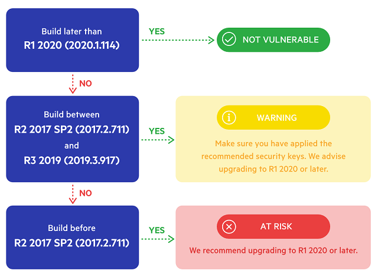

## Problem

Exploiting .NET JavaScriptSerializer Deserialization ([CVE-2019-18935](https://cve.mitre.org/cgi-bin/cvename.cgi?name=CVE-2019-18935)) issue through RadAsyncUpload can lead to executing malicious code on the server in the context of the w3wp.exe process.

## Prerequisites for an Attack

 - An attacker can break the RadAsyncUpload encryption (or have prior knowledge of your custom encryption keys) and stage a malicious request.

 - The type whitelisting feature of RadAsyncUpload is not enabled (see [AllowedCustomMetaDataTypes appSettings key](#allowedcustommetadatatypes)). 

## Solution

To make sure you are not vulnerable we recommend that you upgrade to R1 2020 or later as shown in the diagram below:

For more information, please check the table below and apply the recommendations to fully secure the version of Telerik.Web.UI.dll used in your projects:

| Telerik.Web.UI.dll versions | **An attacker is able to break the RadAsyncUpload encryption and stage a malicious request**      | **The type whitelisting feature of RadAsyncUpload is not enabled** | **Recommendation**                                                                 |
|--------------------------------------------------|-----------------------------------------------------------------------------------------------|----------------------------------------------------------------|--------------------------------------------------------------------------------|
| **Q1 2011 (2011.1.315) to R2 2017 SP1 (2017.2.621)** | Possible                                                                                      | This feature is not available                                  | [Upgrade](#upgrade-to-a-newer-version-of-telerik-ui-for-aspnet-ajax) to R3 2019 SP1 or later and apply the [recommended security settings](#recommended-settings).   |
| **R2 2017 SP2 (2017.2.711) to R3 2019 (2019.3.917)** | Not possible through RadAsyncUpload, unless the attacker has access to your encryption keys   | This feature is not available                                  |  [Upgrade](#upgrade-to-a-newer-version-of-telerik-ui-for-aspnet-ajax) to R3 2019 SP1 or later and apply the [recommended security settings](#recommended-settings).   |
| **R3 2019 SP1 (2019.3.1023)**                        | Not possible through RadAsyncUpload, unless the attacker has access to your encryption keys   | The feature is opt-in                                          | Apply the [recommended security settings](#recommended-settings).                                       |
| **R1 2020 (2020.1.114) and later**                   | Not possible through RadAsyncUpload, unless the attacker has access to your encryption keys   | The feature is enabled by default                              | Apply the [recommended security settings](#recommended-settings).                                       |

## How to Obtain R1 2020 or Later?

If you have an active license go the the [Downloads section](https://www.telerik.com/account/product-download?product=RCAJAX), look for version 2020.1.114 or later in the Version dropdown and download the Telerik_UI_for_ASP.NET_AJAX_2020_1_114_Dev_hotfix.zip archive. You can see how to update your project [here](#manual-upgrade). For any questions, you can contact us via the [support ticketing system](https://www.telerik.com/account/support-tickets/).

If you don't have an active license, you can reach out the Telerik support by opening a [General Feedback](https://www.telerik.com/account/support-tickets/customer-service) ticket.

## Notes

We would like to thank Markus Wulftange of [Code White GmbH](https://www.code-white.com/) and Paul Taylor ([@bao7uo](https://github.com/bao7uo)) for assisting with making the information public.

## External References

[CVE-2019-18935](https://cve.mitre.org/cgi-bin/cvename.cgi?name=CVE-2019-18935)

## See Also

* [RadAsyncUpload Security article]()
* [Unrestricted File Upload](https://www.telerik.com/support/kb/aspnet-ajax/upload-(async)/details/unrestricted-file-upload)
* [Cryptographic Weakness]()
* [Insecure Direct Object Reference](https://www.telerik.com/support/kb/aspnet-ajax/upload-(async)/details/insecure-direct-object-reference)
* [Blue Mockingbird Vulnerability Picks up Steam—Telerik Guidance](https://www.telerik.com/blogs/blue-mockingbird-vulnerability-telerik-guidance)
 

