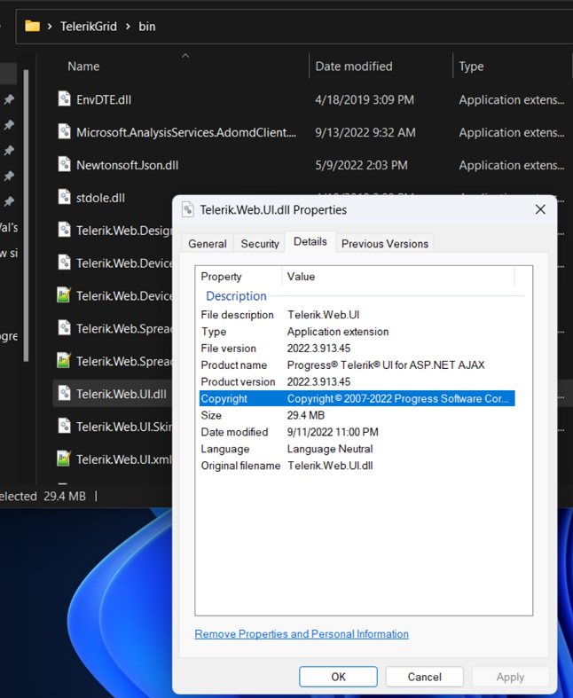

## Environment
<table>
	<tbody>
		<tr>
			<td>Product</td>
			<td>Progress® Telerik® UI for ASP.NET AJAX</td>
		</tr>
	</tbody>
</table>

## Description
The solution demonstrates two different approaches to check the version of the Telerik UI for ASP.NET AJAX controls used in an ASP.NET WebForms application or website.

## Solution
You can use two techniques to see which is the used version by your app:

* Open the bin folder of the app in Windows Explorer -> right-click on the assemblies -> Properties -> Details -> Product version:

* Load the page with the Telerik controls in the browser, go to View Source (Ctrl+U) -> Search for the following HTML comment tag string:

 `<!-- 20` and it will reveal the used version:

  