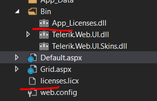

## Environment
<table>
	<tbody>
		<tr>
			<td>Product Version</td>
			<td>Telerik UI for ASP.NET AJAX</td>
		</tr>
		<tr>
			<td>Product</td>
			<td>Progress® Telerik® UI for ASP.NET AJAX</td>
		</tr>
	</tbody>
</table>

## Description
Check the Solution section to see how to fix the Could not transform licenses file into a binary resource error related to the licenses.licx file.

## Solution
Usually, when the licx files are created, there is a license file as well as a binary file for the licenses. If you have just one of them missing, this would cause an error. 

Try to remove both files and check how that would work for you.
* In a Web Site project type, one file (App_Licenses.dll) would be in the root, and the other (licenses.licx) in the bin folder:
  
  
* In a WebApplication project type, one of the files could be inside the Properties folder, next to the AssemblyInfo.cs:
  
  

You can find more information at this StackOverflow forum: [Could not transform licenses file into a binary resource](https://stackoverflow.com/questions/24240808/could-not-transform-licenses-file-into-a-binary-resource).

 