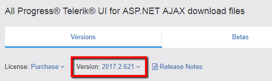
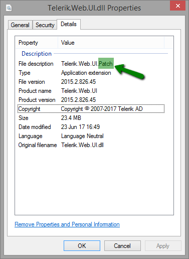

## Problem

A third party organization has identified a cryptographic weakness ([CVE-2017-9248](https://cve.mitre.org/cgi-bin/cvename.cgi?name=CVE-2017-9248)) in Telerik.Web.UI.dll that can be exploited to the disclosure of encryption keys (Telerik.Web.UI.DialogParametersEncryptionKey and/or the MachineKey).

## Description

Knowledge of these keys in web applications using Telerik UI for ASP.NET AJAX components can lead to:
 - cross-site-scripting (XSS) attacks

 - leak of MachineKey

 - compromise of the ASP.NET ViewState

 - arbitrary file uploads/downloads

## Solution

>caption Update from Jan 5, 2021

Due to the .NET JavaScriptSerializer Deserialization ([CVE-2019-18935](https://cve.mitre.org/cgi-bin/cvename.cgi?name=CVE-2019-18935)) vulnerability, we strongly recommend upgrading to R1 2020 (version 2020.1.114) or later since the patches provided for [CVE-2017-9248](https://cve.mitre.org/cgi-bin/cvename.cgi?name=CVE-2017-9248), [CVE-2017-1135](https://cve.mitre.org/cgi-bin/cvename.cgi?name=CVE-2017-11357), [CVE-2014-2217](https://cve.mitre.org/cgi-bin/cvename.cgi?name=2014-2217) and [CVE-2017-11317](https://cve.mitre.org/cgi-bin/cvename.cgi?name=CVE-2017-11317) do not prevent it.

Only the upgrade to R1 2020 (2020.1.114) or later can prevent the known vulnerabilities at the time of writing.

You can find more details and instructions at [Allows JavaScriptSerializer Deserialization]() and [Blue Mockingbird Vulnerability Picks up Steam—Telerik Guidance](https://www.telerik.com/blogs/blue-mockingbird-vulnerability-telerik-guidance).

Also check the FAQ section at the end of the [Security](#frequently-asked-questions) article.

<!--[if IE]>

<![endif]-->

    <input id="collapse-panel-checkbox" class="collapse-panel-toggle-checkbox" type="checkbox">
    <label for="collapse-panel-checkbox" class="collapse-panel-toggle-lable">Deprecated Solutions</label>
    

        

            

To ensure your application is not exposed to such a risk, there are three mitigation paths:

<ul>
    <li>
    
<a href="#full-patches">Use a patch</a> for versions between Q1 2013 (2013.1.220) and R2 2017 (2017.2.503)

    </li>
    <li>
    
<a href="#partial-patches">Use a patch</a> for some versions between Q1 2011 (2011.1.315) and Q3 2012 SP2 (2012.3.1308)

    </li>
    <li>
    
If you are on active maintenance,&nbsp;<a href="#upgrade-to-latest">upgrade to R2 2017 SP1 (2017.2.621) or later</a>.

    </li>
    <li>
    
<a href="#prevent-access">Prevent access to the Telerik Dialog Handler</a>

    </li>
</ul>

NOTE: The patches are <strong>not</strong> available on the Telerik NuGet feed.

NOTE: If you are targeting .NET 3.5, review the<a href="http://docs.telerik.com/devtools/aspnet-ajax/controls/fips-compatibility"> FIPS Compatibility article</a>&nbsp;, because the encryption issue it describes also pertains to these patches.

<h4>Use a patch for versions between Q1 2013 (2013.1.220) and R2 2017 (2017.2.503)</h4>

<strong>Download a patched version</strong> from your Telerik.com account <strong>after the 26th of June 2017</strong>:

<ol>
    <li>Go to your <a href="/account/product-download?product=RCAJAX" target="_blank">telerik.com account</a>.</li>
    <li>From the Version dropdown, select your release: 

</li>
    <li>Download the SecurityPatch_&lt;your_version&gt;.zip file.
    </li>
    <li>
    <a href="http://docs.telerik.com/devtools/aspnet-ajax/installation/upgrading-instructions/upgrading-a-trial-to-a-developer-license-or-to-a-newer-version#manual-upgrade">Replace the Telerik.Web.UI assembly in your application</a> with the one of the same version that you just downloaded.
    </li>
    <li>Generate <strong>new unique keys</strong>&nbsp;for&nbsp;<strong>Telerik.Web.UI.DialogParametersEncryptionKey&nbsp;</strong>and&nbsp;<strong>MachineKey&nbsp;</strong>in your&nbsp;<strong>web.config</strong>. You can <a href="http://docs.telerik.com/devtools/aspnet-ajax/knowledge-base/images/generate-keys-iis.png" title="" class="" target="">use the IIS MachineKey Validation Key generator to get them (make sure to avoid the ,IsolateApps portion)</a>.</li>
</ol>

The patched version shows "Telerik.Web.UI.Patch" in the File Description under Properties in Windows Explorer:

How to spot a patched version of Telerik.Web.UI.dll:

<strong>Source code</strong> for building a <strong>patched </strong>version and <a href="http://docs.telerik.com/devtools/aspnet-ajax/deployment/protecting-the-telerik-asp.net-ajax-assembly">protecting the Telerik.Web.UI assembly</a> is available after <strong>14 Jul 2017</strong>.

<h4>Use a patch for versions between Q1 2011 (2011.1.315) and Q3 2012 SP2 (2012.3.1308)</h4>

If you are on active maintenance,&nbsp;<strong>upgrade at least to Q1 2013 (2013.1.220)</strong> and follow the same approach for <a href="#full-patches">Using a patch for versions between Q1 2013 (2013.1.220) and R2 2017 (2017.2.503)</a>.

Due to technical feasibility, the following versions do <strong>not</strong> have patches for this issue:

<ul>
    <li>Q1 2011 SP2 (2011.1.519)</li>
    <li>Q2 2011 SP1 (2011.2.915)</li>
    <li>Q3 2011 SP1 (2011.3.1305)</li>
    <li>Q1 2012 SP1 (2012.1.411)</li>
    <li>Q2 2012 SP2 (2012.2.912)</li>
</ul>

If your version lists a SecurityPatch_&lt;your_version&gt;.zip file, you can follow the same approach for <a href="#full-patches">Using a patch for versions between Q1 2013 (2013.1.220) and R2 2017 (2017.2.503)</a>.

<h4>Upgrade to <strong>R2 2017 SP1</strong> (2017.2.621) or later.</h4>
<ol>
    <li>
    <a href="http://docs.telerik.com/devtools/aspnet-ajax/installation/upgrading-instructions/upgrading-a-trial-to-a-developer-license-or-to-a-newer-version#upgrade-to-a-newer-version-of-telerik-ui-for-aspnet-ajax">
    <strong>Upgrade</strong> your Telerik UI for ASP.NET AJAX version
    </a> to <strong>R2 2017 SP1</strong> (2017.2.621) or later.
    </li>
    <li>
    <strong>Generate new keys</strong> for&nbsp;<strong>Telerik.Web.UI.DialogParametersEncryptionKey </strong>and <strong>MachineKey </strong>in your <strong><a href="http://docs.telerik.com/devtools/aspnet-ajax/general-information/web-config-settings-overview#mandatory-additions-to-the-webconfig">web.config</a></strong>. You can <a href="http://docs.telerik.com/devtools/aspnet-ajax/knowledge-base/images/generate-keys-iis.png" title="" class="" target="">use the IIS MachineKey Validation Key generator to get them (make sure to avoid the ,IsolateApps portion)</a>.</li>
</ol>

<h4>Prevent access to the Telerik Dialog Handler</h4>

An <strong>alternative</strong> to a fix or a patch is to prevent access to the Telerik DialogHandler. Note that this will make it impossible to use Telerik built-in dialogs for RadEditor and RadSpell.

There are different ways to do that, for example:

<ul>
    <li>
    
Add a firewall rule that rejects traffic to the handler.

    </li>
    <li>
    
Add a URL redirect rule that returns an error page instead of the handler. Note that this will merely redirect the requests to a page of your choosing, usually with a 301 status code. Here is a basic example: 
     
    

    <pre class="prettyprint lang-undefined prettyprinted" style=""><svg version="1.1" id="Layer_1" xmlns="http://www.w3.org/2000/svg" xmlns:xlink="http://www.w3.org/1999/xlink" x="0px" y="0px" width="16px" height="16px" viewBox="0 0 16 16" enable-background="new 0 0 16 16" xml:space="preserve"><g><polygon points="3,2 6,2 6,3 8,3 6,1 2,1 2,12 5,12 5,11 3,11"></polygon><path d="M10,4H6v11h8V8L10,4z M7,14V5h3v3h3v6H7z"></path></g></svg><code>&lt;rewrite&gt;
    &lt;rules&gt;
        &lt;rule name="DisableDialogHandler" enabled="true" stopProcessing="true"&gt;
            &lt;match url="^Telerik.Web.UI.DialogHandler.*?$" /&gt;
            &lt;action type="Redirect" url="not-allowed.aspx" redirectType="Permanent" /&gt;
        &lt;/rule&gt;
    &lt;/rules&gt;
&lt;/rewrite&gt;</code></pre>
    </li>
    <li>
    
Remove the handler from the web.config:

   <pre class="prettyprint lang-undefined prettyprinted" style=""><svg version="1.1" id="Layer_1" xmlns="http://www.w3.org/2000/svg" xmlns:xlink="http://www.w3.org/1999/xlink" x="0px" y="0px" width="16px" height="16px" viewBox="0 0 16 16" enable-background="new 0 0 16 16" xml:space="preserve"><g><polygon points="3,2 6,2 6,3 8,3 6,1 2,1 2,12 5,12 5,11 3,11"></polygon><path d="M10,4H6v11h8V8L10,4z M7,14V5h3v3h3v6H7z"></path></g></svg><code>&lt;system.web&gt;
    &lt;httpHandlers&gt;
        &lt;!-- You may have either of the following lines, depending on the extension you use --&gt;
        &lt;!-- Remove this line --&gt;
        &lt;add path="Telerik.Web.UI.DialogHandler.aspx" type="Telerik.Web.UI.DialogHandler" verb="*" validate="false" /&gt;
        &lt;!-- Remove this line --&gt;
        &lt;add path="Telerik.Web.UI.DialogHandler.ashx" type="Telerik.Web.UI.DialogHandler" verb="*" validate="false" /&gt;
    &lt;/httpHandlers&gt;
&lt;/system.web&gt;
&lt;system.webServer&gt;
    &lt;handlers&gt;
        &lt;!-- Ensure you have this line --&gt;
        &lt;remove name="Telerik_Web_UI_DialogHandler_aspx" /&gt;
        &lt;!-- You may have either of the following lines, depending on the extension you use --&gt;
        &lt;!-- Remove this line --&gt;
        &lt;add name="Telerik_Web_UI_DialogHandler_aspx" path="Telerik.Web.UI.DialogHandler.aspx" type="Telerik.Web.UI.DialogHandler" verb="*" preCondition="integratedMode" /&gt;
        &lt;!-- Remove this line --&gt;
        &lt;add name="Telerik_Web_UI_DialogHandler_aspx" path="Telerik.Web.UI.DialogHandler.ashx" type="Telerik.Web.UI.DialogHandler" verb="*" preCondition="integratedMode" /&gt;
    &lt;/handlers&gt;
&lt;/system.webServer&gt;</code></pre>
    </li>
    <li>
    
For <strong>SharePoint </strong>sites, <strong>delete </strong>the <strong>Telerik.Web.UI.SpellCheckHandler.ashx </strong>and&nbsp;<strong>Telerik.Web.UI.DialogHandler.aspx&nbsp;</strong>files that correspond to these handlers. You can find them in the following folders:

    <ul>
        <li>
        
SharePoint 2010: C:\Program Files\Common Files\Microsoft Shared\Web Server Extensions\wpresources\RadEditorSharePoint\6.x.x.0__1f131a624888eeed\Resources

        </li>
        <li>
        
SharePoint 2013: C:\Program Files\Common Files\Microsoft Shared\Web Server Extensions\wpresources\RadEditorSharePoint\7.x.x.0__1f131a624888eeed\Resources

        </li>
        <li>
        
SharePoint 2016: C:\Program Files\Common Files\Microsoft Shared\Web Server Extensions\wpresources\RadEditorSharePoint\7.x.x.0__1f131a624888eeed\Resources

        </li>
    </ul>
    </li>
</ul>

You can test whether the handler is available by requesting the following URL under you application root: <strong>Telerik.Web.UI.DialogHandler.aspx?checkHandler=true</strong>

When the handler is not available, you will get an error similar to the following: 

            

        

    

## Notes

We would like to thank Erlend Leiknes, security consultant in Mnemonic AS, and Thanh Van Tien Nguyen, for responsibly disclosing this vulnerability to us and helping in its resolution.

## External References

[CVE-2017-9248](https://cve.mitre.org/cgi-bin/cvename.cgi?name=CVE-2017-9248)

## See Also

* [RadEditor Security article]()
* [Allows JavaScriptSerializer Deserialization]()
* [RadAsyncUpload Security article]()
* [Unrestricted File Upload](https://www.telerik.com/support/kb/aspnet-ajax/upload-(async)/details/unrestricted-file-upload)
* [Insecure Direct Object Reference](https://www.telerik.com/support/kb/aspnet-ajax/upload-(async)/details/insecure-direct-object-reference)
* [Blue Mockingbird Vulnerability Picks up Steam—Telerik Guidance blog post (CVE-2019-18935)](https://www.telerik.com/blogs/blue-mockingbird-vulnerability-telerik-guidance)
