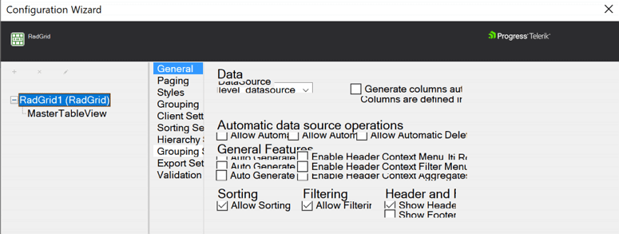
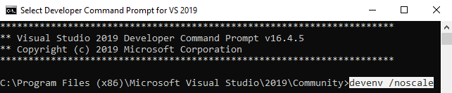

## Description

The WebForms Designer in Visual Studio doesn't have scaling support. Due to the increasing usage of High Dots Per Inch displays like 4K and UHD monitors, broken appearance of the Visual Studion Design Mode turns out to be a common issue. 

When scaling is enabled on a high-resolution setup, this can cause display issues with some forms in the Design, like:
- SmartTag button is too small and difficult to click 
- overlapping controls
- truncated table rows
- Configuration Wizard appearance issues like shown below:

## Solution

The solution suggested by Microsoft for fixing this issue in ***WinForms*** Designer has proven helpful for solving it with the Design mode of **WebForms** as well. You can check it out in the [Disable DPI-awareness in Visual Studio](https://docs.microsoft.com/en-us/visualstudio/designers/disable-dpi-awareness) article.

Here is a list of the possible solutions:

* Restart Visual Studio as a DPI-unaware process

	When you open a form in the Designer in Visual Studio on an HDPI monitor, Visual Studio displays a yellow informational bar at the top of the designer:

	

	You can restart Visual Studio as a DPI-unaware process by selecting the option on the yellow informational bar. This is the preferred way of resolving the problem.

    Alternatively, if the informational bar is not popping out or you simply prefer to manage settings from the command line, devenv.exe takes `/noscale` as a command-line parameter to run Visual Studion in 100% scaling mode:

    

	>note It's important to restart Visual Studio as a DPI-aware process when you're finished working in the Designer. When it's running as a DPI-unaware process, fonts can look blurry and you may see issues in other designers. If you close and reopen Visual Studio when it's running in DPI-unaware mode, it becomes DPI-aware again.
	
* Add a registry entry

	You can mark Visual Studio as DPI-unaware by modifying the registry. Open Registry Editor and add an entry to the HKEY_CURRENT_USER\SOFTWARE\Microsoft\Windows NT\CurrentVersion\AppCompatFlags\Layers subkey:

	Entry: Depending on whether you're using Visual Studio 2017 or 2019, use one of these values:

	 * C:\Program Files (x86)\Microsoft Visual Studio\2017\Community\Common7\IDE\devenv.exe
	 * C:\Program Files (x86)\Microsoft Visual Studio\2019\Community\Common7\IDE\devenv.exe

	>note If you're using the Professional or Enterprise edition of Visual Studio, replace Community with Professional or Enterprise in the entry. Also, replace the drive letter as necessary.

	**Type**: REG_SZ (String Value)

	**Value**: DPIUNAWARE

    

	>note Visual Studio remains in DPI-unaware mode until you remove the registry entry.

* Set your display scaling setting to 100%

	To set your display scaling to 100% in Windows 10, type display settings in the taskbar search box, and then select Change display settings. In the Settings window, set Change the size of text, apps, and other items to 100%:

    

	>note Setting your display scaling to 100% may be undesirable because it can make the user interface too small to be usable

>important Design mode is not determinative for the appearance of the application. For reliable results, testing the output for appearance issues should be done in a browser. With the help of the Browser's DevTools, you can inspect the Html structure and the applied styles and troubleshoot design issues conveniently. You can find some useful tips on how to use the DevTools for inspecting HTML in the [Improve Your Debugging Skills with Chrome DevTools blog post](https://www.telerik.com/blogs/improve-your-debugging-skills-with-chrome-devtools) blog post.

## See Also

*    [Design-time Troubleshooting]()

