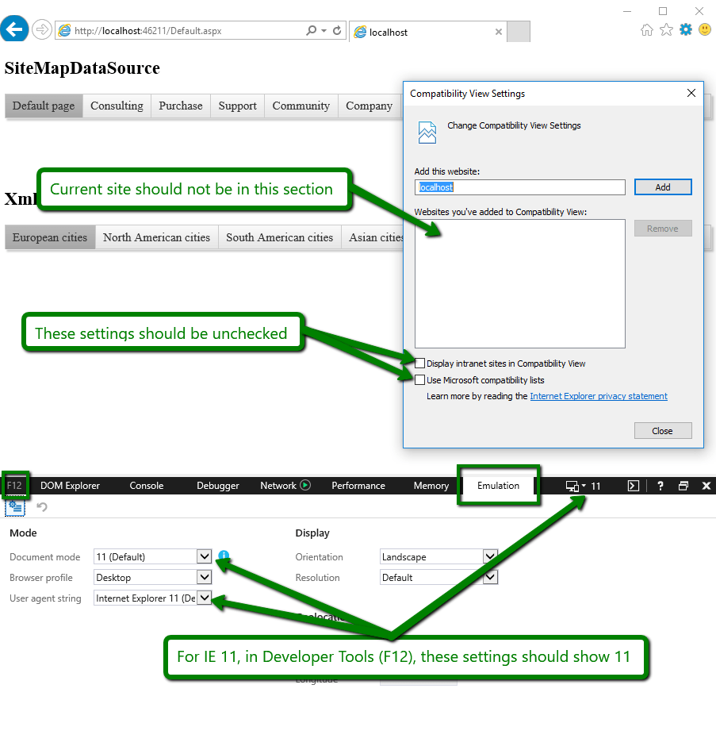
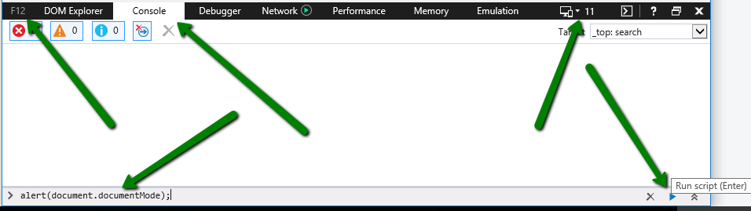

## Description

In Internet Explorer, Telerik ASP.NET AJAX controls may have different appearance or behavior in development (local) and production environments.

## Causes

In most cases, this unexpected behavior is caused by the fact that either the [Compatibility view mode](https://docs.microsoft.com/en-us/openspecs/ie_standards/ms-iedoco/e3f53c89-d2d1-4db3-828f-fcbfe861b609) or [Enterprise mode](https://docs.microsoft.com/en-us/openspecs/ie_standards/ms-iedoco/2b3f2d0b-65dd-43a4-8448-6b090f28ffd3) of the Internet Explorer browser are enabled. 

>caption Disable Compatibility Mode

To disable the Compatibility mode scroll below to [How to disable the Compatibility View mode](#how-to-disable-the-compatibility-view-mode) or check the [Disable the Compatibility View mode of Internet Explorer]() article.


The Compatibility view mode is not supported (see the [Browser Support](https://www.telerik.com/aspnet-ajax/tech-sheets/browser-support) page) because it triggers Internet Explorer 7 rendering. That is why you should have your IE browser run in Standards mode.

## How to check if the Compatibility mode is disabled

1. **Check the Compatibility mode settings** -> hit Alt -> expand Tools menu -> select Compatibility View Settings. They should be as in the screenshot below:

 

1. Check the [HTML DOM documentMode Property](https://www.w3schools.com/jsref/prop_doc_documentmode.asp). When the compatibility mode is enabled, the property value is 7 instead of 11.

 The documentMode property can be checked in the browser console (F12) by passing it as a parameter to the alert() or console.log() method as demonstrated in the screenshot below.

 ````
 alert(document.documentMode);
 ````

 


## How to disable the Compatibility View mode

There are several ways to achieve that:

 * from the **Compatibility View Settings** menu, **unselect** the "**Display intranet sites in Compatibility View**" checkbox

 * speak with your local administrators so they enforce this checkbox rule as a group policy

 * add an [X-UA Compatible meta tag](https://docs.microsoft.com/en-us/previous-versions/windows/internet-explorer/ie-developer/compatibility/jj676915(v=vs.85)) such as this one to your page:

 ````HTML
 <head id="Head1" runat="server">
    <title></title>
    <meta http-equiv="X-UA-Compatible" content="IE=edge" />
 ````

 You can also set it as an HTTP response header in the IIS settings as explained in Microsoft's article [How to add a custom HTTP response header to a Web site that is hosted by IIS](https://docs.microsoft.com/en-US/troubleshoot/iis/add-http-response-header-web-site).

 Another option to set the response header is through your web.config:

 ````
 <system.webServer>
    <httpProtocol>
      <customHeaders>
        <add name="X-UA-Compatible" value="IE=edge" />
      </customHeaders>
    </httpProtocol>
</system.webServer>
 ````

 Please keep in mind that if the Compatibility mode is enabled by a Group Policy setting, the X-UA Compatible meta tag is ignored.

## Disabling the Compatibility Mode did not fix the issue

Other possible causes of the incorrect behavior or appearance can be found in the [Incorrect or distorted appearance]() section of the Skins troubleshooting article.

## See Also

* [Disable the Compatibility View mode of Internet Explorer]()

* [Skins Troubleshooting]()


