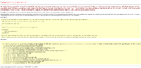

## Problem

Using the **async-await** pattern (setting the **Async** attribute of the **Page directive** to **true**) causes errors (example stack traces and error messages are available below).

## Decription

**The Telerik UI for ASP.NET AJAX controls do not support the async-await pattern for WebForms**. As complex server controls they rely heavily on the page lifecycle of the WebForm and the state of various global objects that is set by the standard flow of events in the form. Asynchronous tasks change this order and also require a different approach to writing code (namely, minimizing the use of global objects, which is impossible in WebForms).

## Sample Exceptions and Stack Traces

Here is an example of the error you will receive if you attempt to bind a grid to an async operation

Sample code:

````C#
protected async void RadGrid1_NeedDataSourceAsync(object sender, GridNeedDataSourceEventArgs e)
{
    DataTable data = await GetData();
    (sender as RadGrid).DataSource = data;
}
````


Error:

**An asynchronous operation cannot be started at this time. Asynchronous operations may only be started within an asynchronous handler or module or during certain events in the Page lifecycle. If this exception occurred while executing a Page, ensure that the Page is marked &lt;%@ Page Async="true" %&gt;. This exception may also indicate an attempt to call an "async void" method, which is generally unsupported within ASP.NET request processing. Instead, the asynchronous method should return a Task, and the caller should await it. **

  


Stack trace:

````
[InvalidOperationException: An asynchronous operation cannot be started at this time. Asynchronous operations may only be started within an asynchronous handler or module or during certain events in the Page lifecycle. If this exception occurred while executing a Page, ensure that the Page is marked <%@ Page Async="true" %>. This exception may also indicate an attempt to call an "async void" method, which is generally unsupported within ASP.NET request processing. Instead, the asynchronous method should return a Task, and the caller should await it.]
   System.Web.AspNetSynchronizationContext.OperationStarted() +3468985
   System.Runtime.CompilerServices.AsyncVoidMethodBuilder.Create() +45
   Default4.RadGrid1_NeedDataSourceAsync(Object sender, GridNeedDataSourceEventArgs e) +81
   Telerik.Web.UI.RadGrid.OnNeedDataSource(GridNeedDataSourceEventArgs e) +133
   Telerik.Web.UI.RadGrid.ObtainDataSource(GridRebindReason rebindReason, Boolean IsBoundUsingDataSourceId) +337
   Telerik.Web.UI.RadGrid.AutoDataBind(GridRebindReason rebindReason) +101
   Telerik.Web.UI.RadGrid.OnLoad(EventArgs e) +127
   System.Web.UI.Control.LoadRecursive() +59
   System.Web.UI.Control.LoadRecursive() +131
   System.Web.UI.<LoadRecursiveAsync>d__246.MoveNext() +549
   System.Runtime.CompilerServices.TaskAwaiter.ThrowForNonSuccess(Task task) +99
   System.Runtime.CompilerServices.TaskAwaiter.HandleNonSuccessAndDebuggerNotification(Task task) +58
   System.Web.Util.WithinCancellableCallbackTaskAwaiter.GetResult() +31
   System.Web.UI.<ProcessRequestMainAsync>d__523.MoveNext() +4680
````

Here are sample stack traces of other errors:

````
System.Web.HttpUnhandledException (0x80004005): Exception of type 'System.Web.HttpUnhandledException' was thrown. ---> System.Collections.Generic.KeyNotFoundException: The given key was not present in the dictionary.
  at System.Collections.Generic.Dictionary`2.get_Item(TKey key)
  at Telerik.Web.UI.RadButton.LoadClientState(Dictionary`2 clientState)
  at Telerik.Web.UI.RadButton.LoadPostData(String postDataKey, NameValueCollection postCollection)
  at Telerik.Web.UI.RadWebControl.System.Web.UI.IPostBackDataHandler.LoadPostData(String postDataKey, NameValueCollection postCollection)
  at System.Web.UI.Page.ProcessPostData(NameValueCollection postData, Boolean fBeforeLoad)
  at System.Web.UI.Page.ProcessRequestMain(Boolean includeStagesBeforeAsyncPoint, Boolean includeStagesAfterAsyncPoint)
  at System.Web.UI.Page.HandleError(Exception e)
  at System.Web.UI.Page.ProcessRequestMain(Boolean includeStagesBeforeAsyncPoint, Boolean includeStagesAfterAsyncPoint)
  at System.Web.UI.Page.ProcessRequest(Boolean includeStagesBeforeAsyncPoint, Boolean includeStagesAfterAsyncPoint)
  at System.Web.UI.Page.ProcessRequest()
  at System.Web.UI.Page.ProcessRequestWithNoAssert(HttpContext context)
  at System.Web.UI.Page.ProcessRequest(HttpContext context)
  at ASP.edms_projectexplorer_aspx.ProcessRequest(HttpContext context)
  at System.Web.HttpApplication.CallHandlerExecutionStep.System.Web.HttpApplication.IExecutionStep.Execute()
  at System.Web.HttpApplication.ExecuteStepImpl(IExecutionStep step)
  at System.Web.HttpApplication.ExecuteStep(IExecutionStep step, Boolean& completedSynchronously)
````

and

````
System.Web.HttpUnhandledException (0x80004005): Exception of type 'System.Web.HttpUnhandledException' was thrown. ---> System.Collections.Generic.KeyNotFoundException: The given key was not present in the dictionary.
   at System.Collections.Generic.Dictionary`2.get_Item(TKey key)
   at Telerik.Web.UI.RadButton.LoadClientState(Dictionary`2 clientState)
   at Telerik.Web.UI.RadButton.LoadPostData(String postDataKey, NameValueCollection postCollection)
   at Telerik.Web.UI.RadWebControl.System.Web.UI.IPostBackDataHandler.LoadPostData(String postDataKey, NameValueCollection postCollection)
   at System.Web.UI.Page.<LoadPostDataAsync>d__394.MoveNext()
--- End of stack trace from previous location where exception was thrown ---
   at System.Runtime.CompilerServices.TaskAwaiter.ThrowForNonSuccess(Task task)
   at System.Runtime.CompilerServices.TaskAwaiter.HandleNonSuccessAndDebuggerNotification(Task task)
   at System.Web.UI.Page.<ProcessPostDataAsync>d__393.MoveNext()
--- End of stack trace from previous location where exception was thrown ---
   at System.Runtime.CompilerServices.TaskAwaiter.ThrowForNonSuccess(Task task)
   at System.Runtime.CompilerServices.TaskAwaiter.HandleNonSuccessAndDebuggerNotification(Task task)
   at System.Web.Util.WithinCancellableCallbackTaskAwaitable.WithinCancellableCallbackTaskAwaiter.GetResult()
   at System.Web.UI.Page.<ProcessRequestMainAsync>d__523.MoveNext()
   at System.Web.UI.Page.HandleError(Exception e)
   at System.Web.UI.Page.<ProcessRequestMainAsync>d__523.MoveNext()
--- End of stack trace from previous location where exception was thrown ---
   at System.Runtime.CompilerServices.TaskAwaiter.ThrowForNonSuccess(Task task)
   at System.Runtime.CompilerServices.TaskAwaiter.HandleNonSuccessAndDebuggerNotification(Task task)
   at System.Web.Util.WithinCancellableCallbackTaskAwaitable.WithinCancellableCallbackTaskAwaiter.GetResult()
   at System.Web.UI.Page.<ProcessRequestAsync>d__515.MoveNext()
--- End of stack trace from previous location where exception was thrown ---
   at System.Runtime.CompilerServices.TaskAwaiter.ThrowForNonSuccess(Task task)
   at System.Runtime.CompilerServices.TaskAwaiter.HandleNonSuccessAndDebuggerNotification(Task task)
   at System.Web.UI.Page.<ProcessRequestAsync>d__554.MoveNext()
--- End of stack trace from previous location where exception was thrown ---
   at System.Runtime.CompilerServices.TaskAwaiter.ThrowForNonSuccess(Task task)
   at System.Runtime.CompilerServices.TaskAwaiter.HandleNonSuccessAndDebuggerNotification(Task task)
   at System.Web.TaskAsyncHelper.EndTask(IAsyncResult ar)
   at System.Web.UI.Page.AsyncPageEndProcessRequest(IAsyncResult result) 
   at System.Web.HttpApplication.CallHandlerExecutionStep.System.Web.HttpApplication.IExecutionStep.Execute()
   at System.Web.HttpApplication.ExecuteStepImpl(IExecutionStep step)
   at System.Web.HttpApplication.ExecuteStep(IExecutionStep step, Boolean& completedSynchronously)
````

 