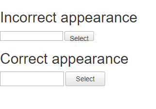

### Problem

Telerik controls may have wrong appearance when the Bootstrap library is loaded on the page.

### Description

The Bootstrap styles override the box-sizing property of the elements inside the Telerik controls which lead to appearance issues. The following style in the `bootstrap.css` file cause the issue:

```CSS
.RadAsyncUpload, .RadAsyncUpload * {
    -webkit-box-sizing: content-box;
    -moz-box-sizing: content-box;
    box-sizing: content-box;
}
```

For example, the RadAsyncUpload is displayed as follows when Bootstrap library is loaded on the page.  




### Solution

Overriding the box-sizing property and setting it to content-box can be applied per control, or globally for all Telerik controls.  
  
 Per control solution:

```CSS
.RadAsyncUpload, .RadAsyncUpload * {
    -webkit-box-sizing: content-box;
    -moz-box-sizing: content-box;
    box-sizing: content-box;
}
```

 Global solution for all Telerik controls:  
  
```CSS
/* https://www.w3schools.com/cssref/sel_attr_begin.asp */

[class^="Rad"], [class^="Rad"] * {
    -webkit-box-sizing: content-box;
    -moz-box-sizing: content-box;
    box-sizing: content-box;
}
```


