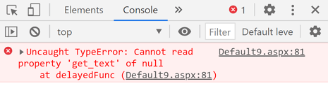
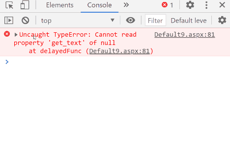
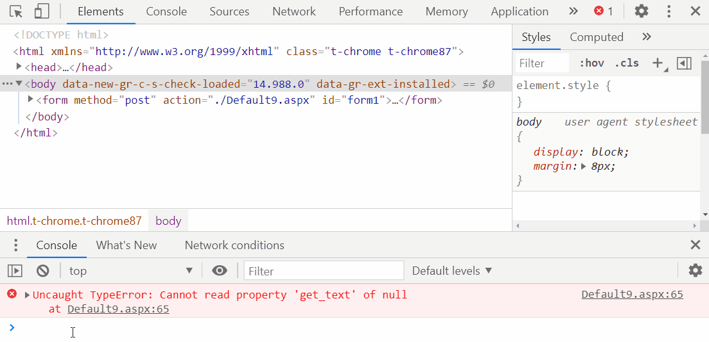
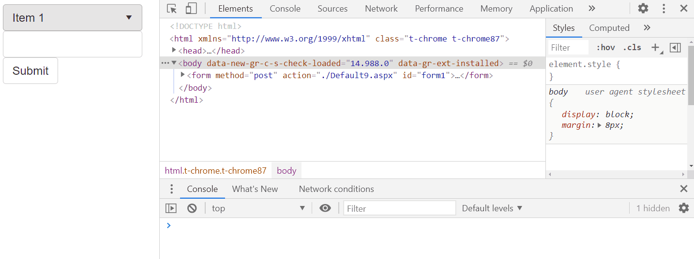

This article shows a few common steps for troubleshooting JavaScript errors in your project.

In the article:

 * [Show JavaScript console errors on the page](#show-javascript-console-errors-on-the-page)
 * [Common errors](#common-errors)
     * [Errors hidden by AJAX](#errors-hidden-by-ajax)
     * [Compatibility Mode in Internet Explorer](#compatibility-mode-in-internet-explorer)
    
 * [Use DevTools for troubleshooting](#use-devtools-for-troubleshooting)
     * [Troubleshooting JavaScript errors](#troubleshooting-javascript-errors)
     * [Troubleshooting Network requests](#troubleshooting-network-requests)

## Show JavaScript console errors on the page

JavaScript errors are logged in the Browser's Console. It is always a good practice to look for these errors since they can decrease the page's performance or even break the interaction and functionality of the application.

To ensure you are not missing any JavaScript errors, thrown while the DevTools is not open, you can handle the *'onerror'* event of the Window object to stress out that there is an error on the page. For example, you can alert with the error message:

````JavaScript
window.onerror = function (e) {
    alert(e);
}
````

This approach might not be a good idea for applications in a production environment. So you might prefer to call the alert method only when running the page in develop mode:

 * One way to avoid alerting the errors in production is to let the 'onerror' handler execute only when the request is from the local machine. You can use a RadCodeBlock to wrap the event listener and switch it on/off by setting its Visible property depending on the value in the [HttpRequest.IsLocal](https://docs.microsoft.com/en-us/dotnet/api/system.web.httprequest.islocal?view=netframework-4.8) property.

````ASPX
<telerik:RadCodeBlock ID="RadCodeBlock1" runat="server" OnLoad="RadCodeBlock1_Load">
    <script>
        window.onerror = function (e) {
            alert(e);
        }
    </script>
</telerik:RadCodeBlock>
````

Code-behind

````C#
protected void RadCodeBlock1_Load(object sender, EventArgs e)
{
    (sender as RadCodeBlock).Visible = Request.IsLocal;
}
````
````VB
Protected Sub RadCodeBlock1_Load(ByVal sender As Object, ByVal e As EventArgs)
    (TryCast(sender, RadCodeBlock)).Visible = Request.IsLocal
End Sub
````

 * Alternatively, you can check the *Request.Path* to distinguish the developer environment. You can also use server expressions to add or skip the declaration of the event listener, as shown below:

````ASPX
<telerik:RadCodeBlock runat="server">
    <% //destinguish the developer environment by checking the request path
        if (Request.Path.Contains(devEnvironmentSpecificString))
        { %>
    <script>
        window.onerror = function (e) {
            alert(e)
        }
    </script>
    <%} %>
</telerik:RadCodeBlock>
````

## Common errors

### Errors hidden by AJAX

AJAX may sometimes hide both server and client-side errors. Therefore, when developing your app, we highly recommend you to ensure that the functionality works without adding AJAX. Quite a helpful way of troubleshooting your project could be if you remove AJAX on the page (if present) and keep the DevTools(F12) Console open to see whether there are any script or server errors interfering. Make sure that the application works without AJAX.

Find more details about this issue and suggestions on how to disable AJAX temporarily on the page in the [Get more descriptive errors by disabling AJAX](https://www.telerik.com/support/kb/aspnet-ajax/ajaxmanager/details/get-more-descriptive-errors-by-disabling-ajax) article.

### Compatibility Mode in Internet Explorer

In Internet Explorer, Telerik ASP.NET AJAX controls may have different appearances or behavior in development (local) and production environments.

In most cases, this unexpected behavior is caused by the fact that either the [Compatibility View](https://docs.microsoft.com/en-us/openspecs/ie_standards/ms-iedoco/e3f53c89-d2d1-4db3-828f-fcbfe861b609?redirectedfrom=MSDN) mode or [Enterprise mode](https://docs.microsoft.com/en-us/openspecs/ie_standards/ms-iedoco/2b3f2d0b-65dd-43a4-8448-6b090f28ffd3?redirectedfrom=MSDN) of the Internet Explorer browser is enabled. 

The Compatibility view mode is not supported by the Telerik AJAX suite (see the [Browser Support](https://www.telerik.com/aspnet-ajax/tech-sheets/browser-support) page) because it triggers Internet Explorer 7 rendering. That is why you should have your IE browser run in Standard mode.

Check out the [Different appearance or behavior in Internet Explorer on local and production servers](https://www.telerik.com/support/kb/aspnet-ajax/details/different-appearance-in-internet-explorer-on-local-and-production-servers#disable-compatibility-mode) article which explains how to deal with this problem.

## Use DevTools for troubleshooting

### Troubleshooting JavaScript errors

Monitoring for JavaScript errors and checking their stack trace could decrease significantly the time for troubleshooting a case.

A few steps to follow:

 1. Open the DevTools Console tab to keep track of eventual JavaScript errors. It is good to keep it always open when developing or testing an application. 

 

 1. Check the stack trace of the error by simply clicking on the error message. 

 

 Reviewing the stack of called functions leading to the error may help a lot in finding the cause for the issue.

 1. Inspect the source code of any resource in the stack trace by clicking on its name. The respective code will be shown in the Source tab of the DevTools. Use the "Prettify" button to get the code in a readable format.

 

### Troubleshooting Network requests

Failing Network request or requests with cached outdated response content can also result in JavaScript errors.

In the Network panel of the DevTools you can check the parameters of the request to the server, or see what the content and the format of the response is. Check out how to [inspect network requests](https://www.telerik.com/blogs/improve-your-debugging-skills-with-chrome-devtools#inspect-network-requests) in the respective section of the [Improve Your Debugging Skills with Chrome DevTools](https://www.telerik.com/blogs/improve-your-debugging-skills-with-chrome-devtools) blog post.

#### Record a HAR file and share it with our Support officers

 When facing an issue with Telerik AJAX Controls and you are unable to troubleshoot it by yourself by trying the steps above, do not hesitate to contact our Support team.

 With some complex issues, the support team might obtain additional information about the network requests that are generated in your browser. In such cases sharing a HAR file or a log of network requests, while that issue is occurring, could help the support officer to get a better understanding of the problem and assist accordingly.

 >caption To export a HAR file in Chrome:
 
 The procedure for recording and exporting network requests is described in details in the [Network Analysis Reference](https://developers.google.com/web/tools/chrome-devtools/network/reference) provided by Google. Specifically in the [Record network requests](https://developers.google.com/web/tools/chrome-devtools/network/reference#record) and [Export requests data](https://developers.google.com/web/tools/chrome-devtools/network/reference#export) sections.

 Here is a sum up of the steps:

 * Open the DevTools and select the **Network** tab
 * Ensure the record button (red/grey circle in the upper left corner of the tab) is active (it should be red).
 * Check the **Preserve log** checkbox
 * Clear the network tab with the cross circle button.
 * Reproduce the issue while recording the requests.
 * Export the requests as HAR file by clicking on the "Export HAR File" button or right click on the list of requests and select "Save all as HAR with content"



You can also export HAR files by using other browsers like Edge, FireFox, IE. The procedure for exporting in these browsers is almost the same.

>caution
HAR files might contain sensitive data like cookies so you should be careful who you share them with and avoid making them public.
>

More about the best practices and tips for using Chrome DevTools for easier troubleshooting you can find in the [Improve Your Debugging Skills with Chrome DevTools](https://www.telerik.com/blogs/improve-your-debugging-skills-with-chrome-devtools) blog post and its continuation [Improve Your Debugging Skills with Chrome DevTools (Part 2)](https://www.telerik.com/blogs/improve-your-debugging-skills-with-chrome-devtools-(part-2))

One more option, you should consider, for sharing your network logs securely fast and convenient is by using the [Fiddler Jam](https://www.telerik.com/fiddler-jam) Tool by Telerik. 


