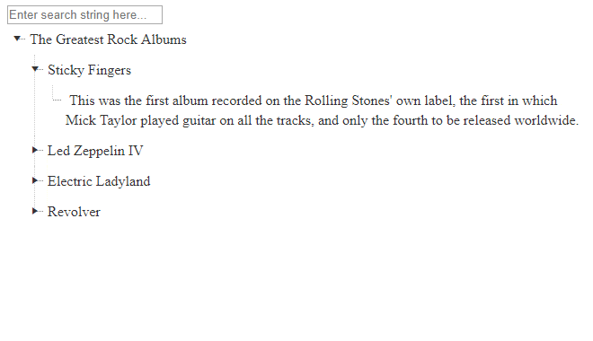

## How to

Highlight text in HTML elements with regular expressions.

## Solution

We can use RegEx to wrap the text with a &lt;span&gt; element that has the CSS class "highlight" for example. Then, we can style all elements with this class.

To make the highlighting easier, a custom CSS class can be added to the elements that contain the text that should be highlighted, for example "searchable". The following example expects the "searchable" elements to contain only text.

For this example, we will use the TreeView and we will highlight the matching text in the nodes.  
  
[

````CSS
.highlight {
    background: yellow;
}
.rtLI {
white-space:normal;
}
````

````JavaScript
function highlight(ev, inp) {
    var $ = $ || $telerik.$;
    var treeview = $find("<%= RadTreeView1.ClientID%>");
    var allnodes = treeview.get_allNodes()
    var searchText = inp.value;

    $(treeview.get_element()).find(".rtText, .searchable").each(function (ind, it) {
        it.innerHTML = stripHighlight(it.innerHTML)
        it.innerHTML = highlightText(searchText, it.innerHTML)
            
    })
}

function stripHighlight(originalHtml) {
    var strippedHtml;

    strippedHtml = originalHtml.replace(/(<span class="highlight">)/gi, "")
    strippedHtml = strippedHtml.replace(/(<\/span>)/gi, "")

    return strippedHtml;
}

//https://stackoverflow.com/questions/3446170/escape-string-for-use-in-javascript-regex
function escapeRegExp(str) {
    return str.replace(/[\-\[\]\/\{\}\(\)\*\+\?\.\\\^\$\|]/g, "\\$&");
}
function highlightText(text, originalHtml) {
    var newHtml;

    newHtml = originalHtml.replace(new RegExp(escapeRegExp(text), "gi"), function replace(match) {
        return '<span class="highlight">' + match + '</span>';
    })

    return newHtml;
}
````

````ASPX
<input type="text" id="search" placeholder="Enter search string here..." value="" onkeyup="highlight(event,this)" />

<telerik:RadTreeView runat="server" ID="RadTreeView1">
    <Nodes>
        <telerik:RadTreeNode Text="The Greatest Rock Albums" Expanded="true" CssClass="root-node">
            <Nodes>
                <telerik:RadTreeNode Text="Rolling Stones" Expanded="true">
                    <NodeTemplate>
                        <div class="node-album">
                            <span class="band searchable">
                                <%# DataBinder.Eval(Container, "Text") %>
                            </span><span class="album searchable">Sticky Fingers</span>
                        </div>
                    </NodeTemplate>
                    <Nodes>
                        <telerik:RadTreeNode Text="Sticky Fingers">
                            <NodeTemplate>
                                <div class="node-album-data">
                                    
                                    <span class="album searchable">
                                        <%# DataBinder.Eval(Container, "Text") %>
                                    </span><span class="details searchable">This was the first album recorded on the Rolling Stones'
                                    own label, the first in which Mick Taylor played guitar on all the tracks, and only
                                    the fourth to be released worldwide.</span>
                                </div>
                            </NodeTemplate>
                        </telerik:RadTreeNode>
                    </Nodes>
                </telerik:RadTreeNode>
                <telerik:RadTreeNode Text="Led Zeppelin">
                    <NodeTemplate>
                        <div class="node-album">
                            <span class="band searchable">
                                <%# DataBinder.Eval(Container, "Text") %>
                            </span><span class="album searchable">Led Zeppelin IV</span>
                        </div>
                    </NodeTemplate>
                    <Nodes>
                        <telerik:RadTreeNode Text="Led Zeppelin IV">
                            <NodeTemplate>
                                <div class="node-album-data">
                                    
                                    <span class="album searchable">
                                        <%# DataBinder.Eval(Container, "Text") %>
                                    </span><span class="details searchable">Led Zeppelin's fourth album actually has no title that
                                    can be pronounced or reproduced with alphanumeric characters, consisting instead
                                    of a series of hand drawn symbols.</span>
                                </div>
                            </NodeTemplate>
                        </telerik:RadTreeNode>
                    </Nodes>
                </telerik:RadTreeNode>
                <telerik:RadTreeNode Text="Jimi Hendrix">
                    <NodeTemplate>
                        <div class="node-album">
                            <span class="band searchable">
                                <%# DataBinder.Eval(Container, "Text") %>
                            </span><span class="album searchable">Electric Ladyland</span>
                        </div>
                    </NodeTemplate>
                    <Nodes>
                        <telerik:RadTreeNode Text="Electric Ladyland">
                            <NodeTemplate>
                                <div class="node-album-data">
                                    
                                    <span class="album searchable">
                                        <%# DataBinder.Eval(Container, "Text") %>
                                    </span><span class="details searchable">This was the legendary rock guitarist's only #1 album,
                                    and contains samples of his stylistic range, from blues to '50s rock to psychedelia.
                                    </span>
                                </div>
                            </NodeTemplate>
                        </telerik:RadTreeNode>
                    </Nodes>
                </telerik:RadTreeNode>
                <telerik:RadTreeNode Text="The Beatles">
                    <NodeTemplate>
                        <div class="node-album">
                            <span class="band searchable">
                                <%# DataBinder.Eval(Container, "Text") %>
                            </span><span class="album searchable">Revolver</span>
                        </div>
                    </NodeTemplate>
                    <Nodes>
                        <telerik:RadTreeNode Text="Revolver">
                            <NodeTemplate>
                                <div class="node-album-data">
                                    
                                    <span class="album searchable">
                                        <%# DataBinder.Eval(Container, "Text") %>
                                    </span><span class="details searchable">This was the 13th of the 20 albums released in the United
                                    States by The Beatles. It was released in August 1966, roughly in the middle of
                                    the band's ten-year life. </span>
                                </div>
                            </NodeTemplate>
                        </telerik:RadTreeNode>
                    </Nodes>
                </telerik:RadTreeNode>
            </Nodes>
        </telerik:RadTreeNode>
    </Nodes>
</telerik:RadTreeView>
````

>note The **stripHighlight** function can break other *&lt;span&gt;* elements if they are inside an element with class "*searchable*". Possible solutions for this are setting only text inside the "*searchable*" elements or using other elements or custom elements, &lt;highlight&gt; element for example.

