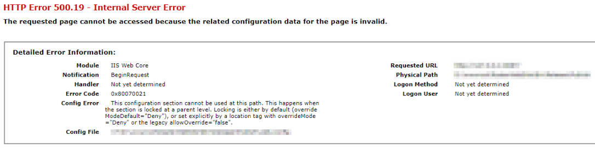
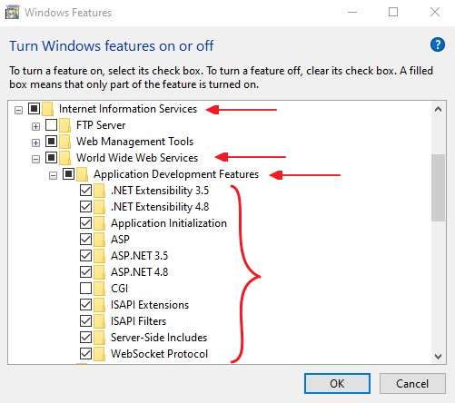
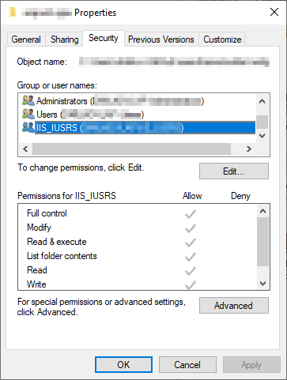
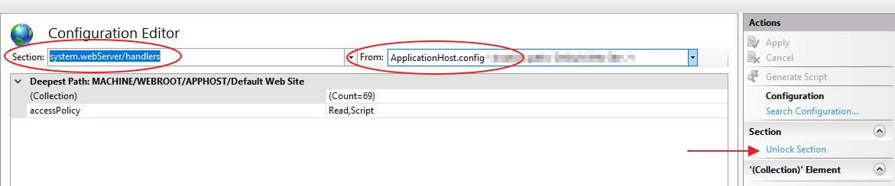

## Description

This article resolves a problem in which you receive the following error message:

 **HTTP Error 500.19** 

 **Config error**  This configuration section cannot be used at this path. This happens when the section is locked at a parent level. Locking is either by default (overrideModeDefault="Deny"), or set explicitly by a location tag with overrideMode="Deny" or the legacy allowOverride="false".

## Solution

The error message is saying that there is no access to the config file. The observed issue is usually just the effect of inability to read the file due to a lack of authorization.

To deal with the specified error, we recommend first to check if the proper Windows features for IIS are enabled:

 - Click "Start button".

 - In the search box, enter "Turn windows features on or off".

 - In the features window, Click: "Internet Information Services".

 - Click: "World Wide Web Services".

 - Click: "Application Development Features".

 - Enable all features except "CGI".

 - In the search box, enter "Turn windows features on or off".

  

After the above steps are successfully completed, restart IIS and try to load the project again.

>caption If this does not fix the issue, then check if the IIS_IUSRS is allowed read and write permissions:

 - Open IIS Manager.

 - Right clicked on that Website.

 - Edit Permissions.

 - Added user 'IIS_IUSRS' from Security tab.

 - Give full permissions to User 'IIS_IUSRS'.

  

>caption One more highly rated approach is to follow the below steps to unlock the handlers at the parent level:

 1. In the connections tree(in IIS), go to your server node and then to your website.

 1. For the website, in the right window you will see configuration editor under Management.

 1. Double click on the configuration editor.

 1. In the window that opens, on top you will find a drop down for sections. Choose "system.webServer/handlers" from the drop down.

 1. On the right side, there is another drop down. Choose "ApplicationHost.Config "

 1. On the right most pane, you will find "Unlock Section" under "Section" heading. Click on that.

 1. Once the handlers at the applicationHost is unlocked, your website should run fine.

  

In addition to the above, we suggest reviewing the following StackOverflow threads, where a more extensive discussion on the topic can be found:

 - https://stackoverflow.com/questions/9794985/config-error-this-configuration-section-cannot-be-used-at-this-path 

 - https://stackoverflow.com/questions/9794985/iis-this-configuration-section-cannot-be-used-at-this-path-configuration-lock

 - https://stackoverflow.com/a/35332431/911510 

 - https://knowledgebase.progress.com/articles/Article/Windows-Authentication-This-configuration-section-cannot-be-used-at-this-path 
