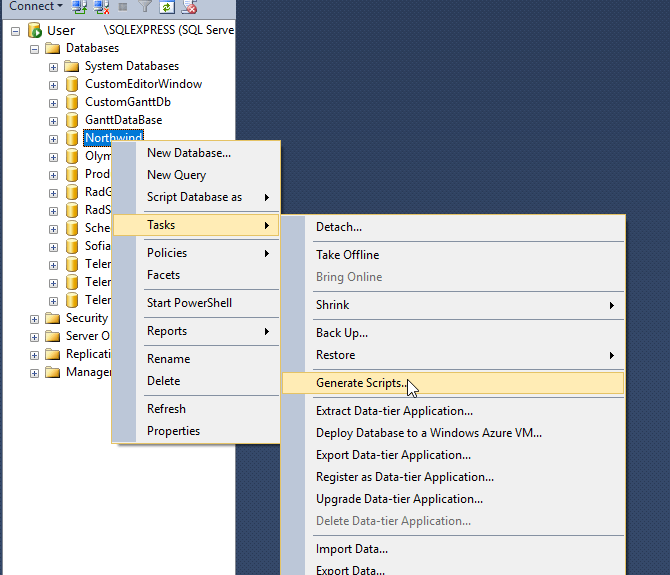
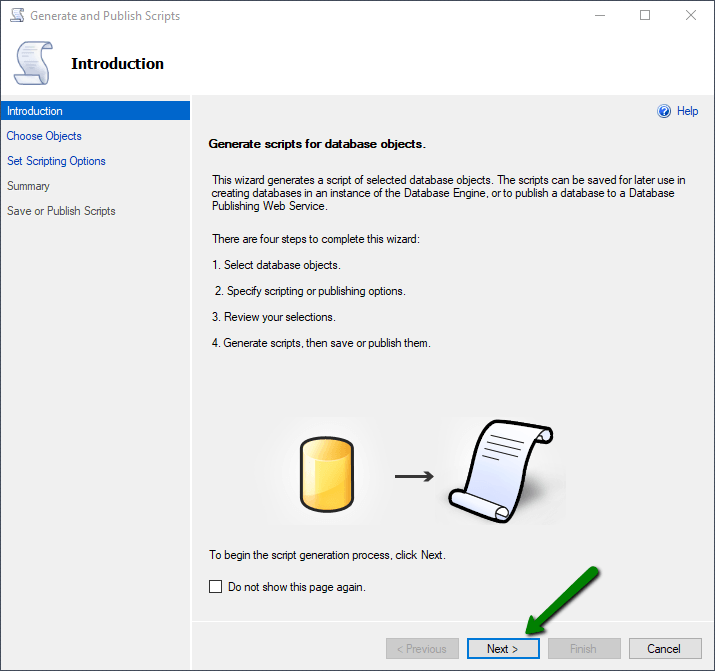
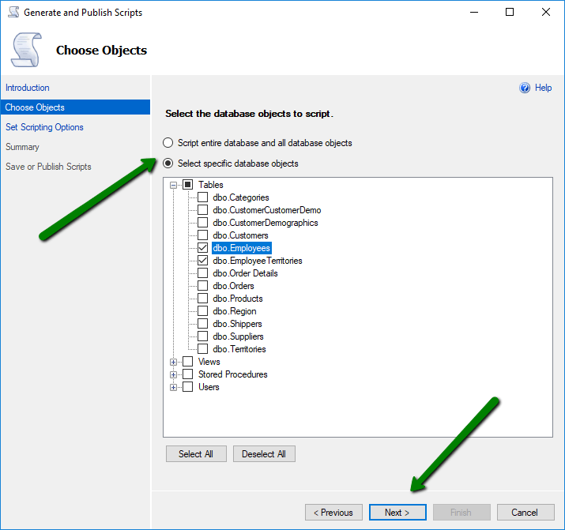
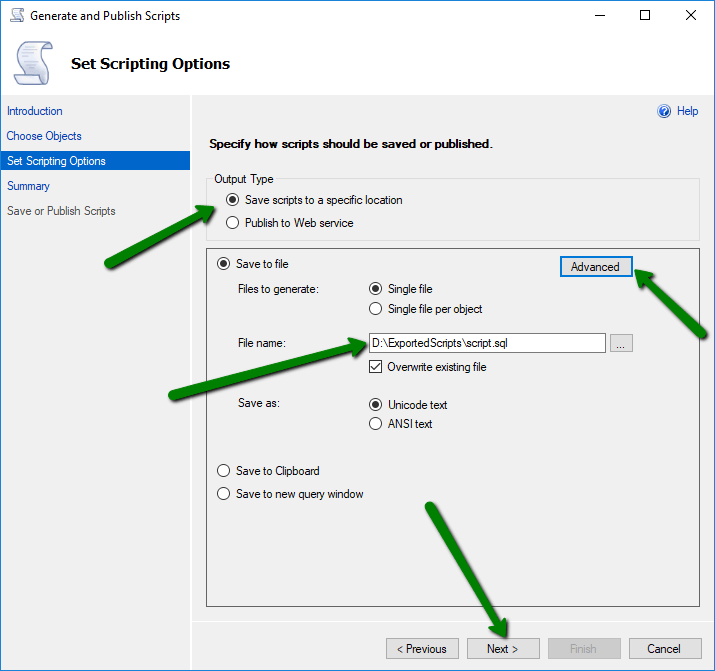
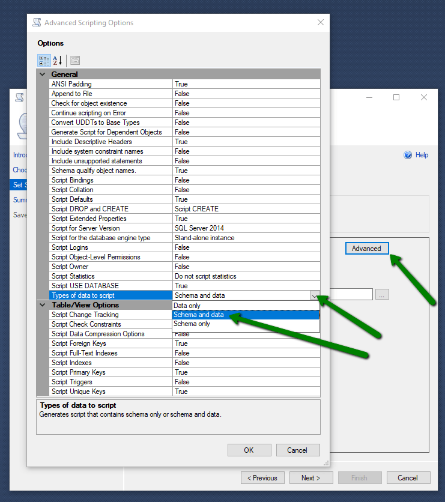
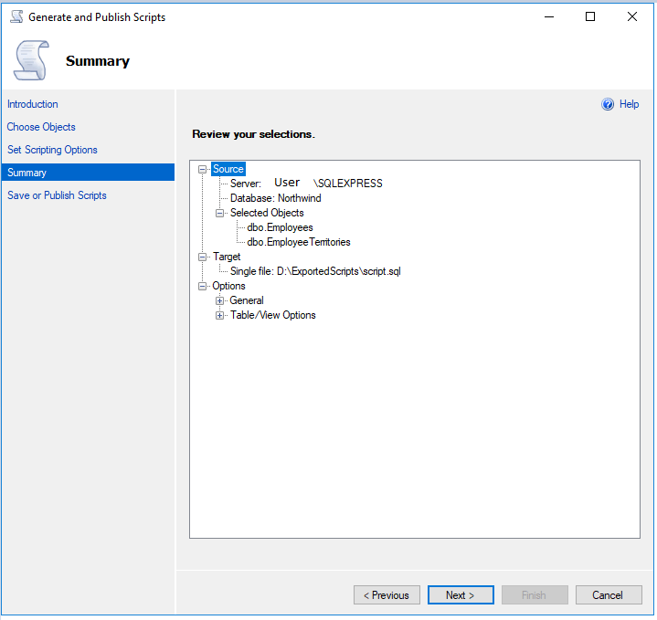
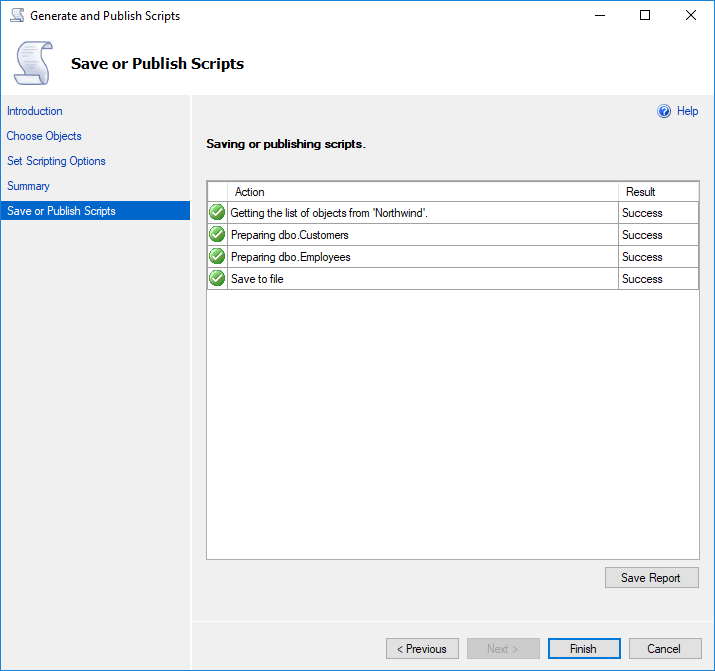
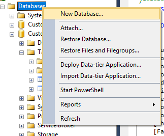
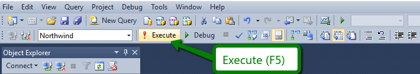
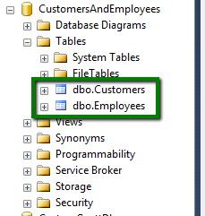

This article will show you how to export a Database to a \*.sql script and the how to import it from such kind of scripts.

## Export database to \*.sql script

 1. **Right-click** on the database that should be exported.

 1. "**Tasks**" -&gt; "**Generate Scripts...**" - A *Generate and Publish Scripts* popup should appear
 
  
  
 1. On the "*Introduction*" screen click the "**Next &gt;**" button - "*Choose Objects*" screen will appear
  
  

 1. On the "*Choose Objects*" screen you can choose whether to *export the whole database or only some of the tables*. Choose the desired objects and click "**Next &gt;**" - "*Set Scripting Options*" screen should appear
 
  
  
 1. On the "*Set Scripting Options*" you can choose whether to save or publish the script. Once you customize all the desired *save and advanced options*, click the "**Next &gt;**" button.
 
  
  
   - Clicking the "**Advanced**" button would allow you to customize the exported content.

    >note **Pro tip:** From the *Advanced Scripting Options*popup, you can set "**Types of data to script**" to "**Schema and data**". That would export the database schema along with the data.
   
    
    
 1. On the "*Summary*" screen the options you have previously selected and if you are satisfied with them, click the "**Next &gt;**" button.
 
  
  
 1. The database should be exported and you can find the generated \*.sql script in the location you have set in step 5.
 
  

## Import database from \*.sql script

 1. **Open** the \*.sql script with Microsoft SQL Server Management Studio
 
 1. Create a new database with the name of your choice via **right-clicking** the *Databases* folder and choosing "**New Database...**". Then you *choose the name for the database* and optionally further configure the database settings.
 
  
  
 1. In the \*.sql script, the first two rows should be something similar to

````SQL
USE [DatabaseName]
GO
````
 
 Here in the brackets, you can *use the name of the database* you would like to populate.

````SQL
USE [YourDatabaseName]
GO
````
 
 1. Click the "**! Execute**" button, or use the** F5** shortcut for it.
 
  
  
 1. After a successful execution of the Query, you should find your newly populated database.
 
  
  

## See Also

 - [How to: Generate a Script (SQL Server Management Studio)](https://docs.microsoft.com/en-us/previous-versions/sql/sql-server-2008-r2/ms178078%28v=sql.105%29)


