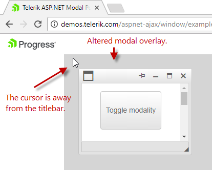
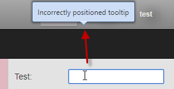
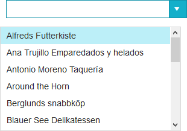
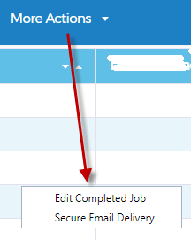
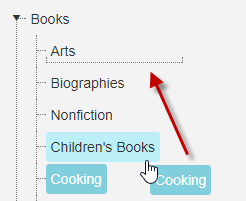

## Problem

RadWindow, RadTooltip, RadCombobox, RadToolbar and a dragged node from a RadTreeView are shown in the wrong location.  
  
In scenarios with special positioning on a parent element of the Telerik control *(absolute,* *fixed,* *relative* or *margin:auto*), you may experience appearance problems with incorrect positioning and side effects as explained below. This can include direct parents or even high-level elements like the &lt;body&gt; or &lt;form&gt;.

 - **RadWindow** is rendered  at unexpected location of the screen.   

    The gray modal overlay behind the window does not extend to the boundaries of the screen.  

    The top of the window is offset from the cursor when the dialog is moved across the page.  
    
    
 
 - **RadTooltip** appears at a wrong location if the parent container(s) or the form  has applied  "position:fixed|relative".
  
  
  
 - **RadCombobox** pop up appears away from the input control.
 
  
 
 - **RadToolbar's** dropdown popup appears further down the page, offset from the dropdown button.  
  
  

 - **RadTreeView** dotted line, which appears while rearranging or moving a node, could either appear in incorrect position or not appear at all.  
 
  


## Solution

All problems demonstrated above are due to special positioning of the body, form, or another parent element of the Telerik control.  
  
 Popup elements from the Telerik UI for ASP.NET AJAX suite are often rendered as direct children of the &lt;form&gt; or &lt;body&gt; element and such special positioning can offset them unexpectedly, even to the point where they are not in the visible viewport of the page.  
  
 What can be done **to solve this problem**, is to

1. check within the project for global and inline CSS rules such as *position:absolute, position:fixed, position:relative, margin:auto, top, left*

1. if they exist, do either of the following:
    - fully remove them.
    - OR, move the special positioning from the &lt;form|body|parent element&gt; to another element that is not a parent of the AJAX control.   
    For example put all the content/layout in a &lt;div&gt; inside the form:

````ASPX
<!DOCTYPE html>
<html xmlns="http://www.w3.org/1999/xhtml">
<head runat="server">
    <title></title>
    <style>
        html, body, form, .myScollContainer {
            margin: 0;
            padding: 0;
            height: 100%;
            overflow: hidden;
        }
  
        .myScollContainer {
            overflow: auto;
            /* add other rules as necessary, like position, margin, etc. */
        }
    </style>
</head>
<body>
    <form id="form1" runat="server">
        <div class="myScollContainer">
            <telerik:RadScriptManager runat="server" ID="rsm1" />
           everything else goes here
        </div>
    </form>
</body>
</html>
````

**Tip**: You can use the browser dev toolbar to inspect the rendered HTML in order to see where the Telerik control renders, what its parents are and what CSS is applied to them.  

## See Also
 
 - [Incorrect or Distorted Appearance](http://docs.telerik.com/devtools/aspnet-ajax/general-information/troubleshooting/skins-troubleshooting#incorrect-or-distorted-appearance)

