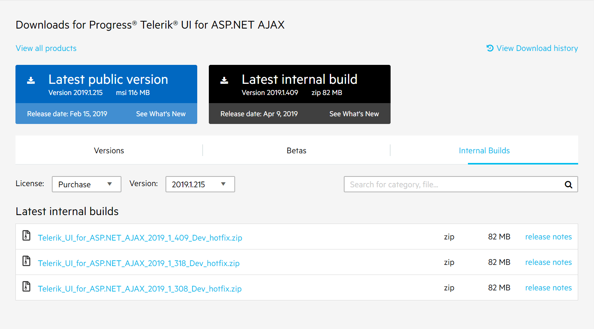

### What is LIB?
 The Latest Internal Build (LIB) or а nightly build is a distribution of the UI for ASP.NET AJAX assemblies, built against the latest development environment.  
  
 It contains all the newest bug fixes.

### What is the Purpose?
 The purpose of the LIB is to allow the users to test the latest bug fixes. So, if you have experienced any problem with the current official distributions there is a possibility that the issue has already been addressed in the latest internal build.  

### How to obtain the LIB?

Go to the Download section of UI for ASP.NET AJAX at [https://www.telerik.com/account/product-download?product=RCAJAX](https://www.telerik.com/account/product-download?product=RCAJAX) -> click on Internal Builds and look for the zip archive containing the LIB:  
  
`Telerik_UI_for_ASP.NET_AJAX_2021_x_xxx_Dev_hotfix.zip`  
 `Telerik_UI_for_ASP.NET_AJAX_2021_x_xxx_Trial_hotfix.zip`
 

### Is the LIB suitable for Production?

The Latest Internal Builds are intended to be used for development purposes only and they are not recommended for production purposes as these distributions have not gone through the complete QA process.

