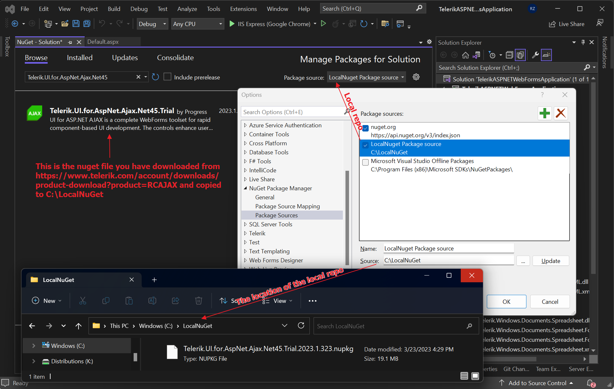
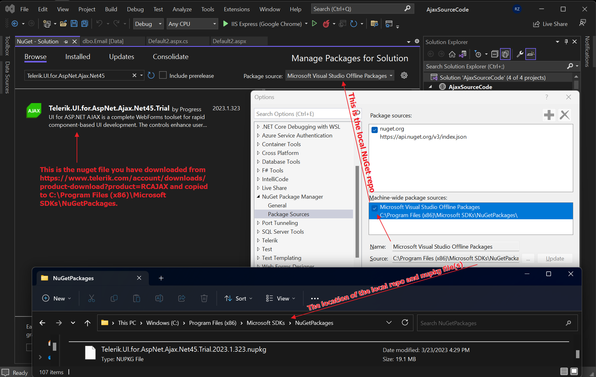

## Environment
<table>
	<tbody>
		<tr>
			<td>Product</td>
			<td>Progress® Telerik® UI for ASP.NET AJAX</td>
		</tr>
	</tbody>
</table>

## Description
The tutorial shows how to download the Telerik.UI.for.AspNet.Ajax.Net NuGet package from telerik.com and install it through a local NuGet folder using Visual Studio. This approach is useful when experiencing connectivity problems with the live Nuget feed (https://status.telerik.com/), network and policy limitations, and problems with the Nuget server credentials.

## Solution
Steps to install the Telerik.UI.for.AspNet.Ajax.Net45.202x.x.xxxx.nupkg package from a local NuGet storage:
* Log into https://www.telerik.com/account/product-download?product=RCAJAX and download the NuGet Package(s), e.g. Telerik.UI.for.AspNet.Ajax.Net45.2023.1.323.nupkg.
* Create a new storage folder on your machine, for example named LocalNuGet and copy the downloaded nuget package in it.
* Go to Visual Studio -> Tools -> Nuget Package Manager -> Manage NuGet Packages for Solution and click on the Setting (gear wheel icon) button to load the Options dialog.
* In the Options popup, click on the Plus "+" button, rename the Package Source textbox to the desired local storage name (e.g. LocalNuGet package source) and specify the path to the LocalNuGet folder inside the source textbox. Press OK to save the new local repo option.
* In the NuGet Packages for Solution window choose from the Package source dropdown either All or the LocalNuget Package source option. This will allow you to locate the nuget file in the local repo by searching for it "Telerik.UI.for.AspNet.Ajax.Net45" inside the Browse tab:

Another approach which works, but it is not recommended since it may get messy with the Microsoft files, is to copy the nuget file to the Microsoft Visual Studio Offline Packages storage located at C:\Program Files (x86)\Microsoft SDKs\NuGetPackages folder:

## See More
* [Install Telerik UI for ASP.NET AJAX using NuGet]()
* [Restoring NuGet Packages in Your CI Workflow]()
* [Troubleshooting NuGet Installation Issues]()
   
     