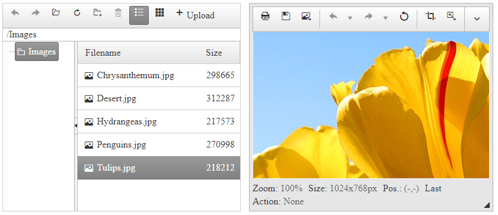

### HOW TO
 Load an image for editing in RadImageEditor when it is selected in RadFileExplorer's file list. The content of the ImageEditor is updated by performing an AJAX request through RadAjaxManager, passing the path of the highlighted image to RadImageEditor's `ContentUrl` property.  

  

### SOLUTION

1. Attach a handler to RadFileExplorer'`s OnClientItemSelected` event, triggered immediatelly after a filelist item is selected (make sure the allowed file types passed as `SearchPatterns` are only images).

````ASP.NET
<telerik:RadFileExplorer RenderMode="Lightweight" ID="RadFileExplorer1" runat="server"
    OnClientItemSelected="FileExplorer_OnClientItemSelected" OnClientLoad="fileExplorer_load">
    <Configuration SearchPatterns="*.jpg, *.jpeg, *.gif, *.png, *.bmp" />
</telerik:RadFileExplorer>
<script>
    var fileExplorer;
 
    function fileExplorer_load(sender, args) {
        fileExplorer = sender;
    }
 
    function FileExplorer_OnClientItemSelected(explorer, args) {
        var item = args.get_item(); //get reference of the selected item
        var path = item.get_path(); //get the path of the selected image
        if (!item.isDirectory()) {
            setTimeout(function () {
                getAjaxManager().ajaxRequest(path); //Invoke AJAX request to load the new image inside ImageEditor
            }, 0);
        }
    }
 
    function getAjaxManager() {
        return $find("<%= RadAjaxManager1.ClientID%>");
}
</script>
````


1. Attach a handler to the ImageEditor's `OnClientSaved` event in order to refresh the content of RadFileExplorer when an image is saved:

````ASP.NET
<telerik:RadImageEditor RenderMode="Lightweight" ID="RadImageEditor1" runat="server" Width="740px" Height="434px" OnClientSaved="ImageEditor_OnClientSaved" />
<script>
function ImageEditor_OnClientSaved(imgEditor, args) {
    fileExplorer.clearFolderCache(); //clear the folder cache to force RadFileExplorer repopulate the folders
    fileExplorer.refresh(args.get_fileName()); //refresh the explorer to display newly saved image
}
</script>
````

1. Configure RadAjaxManager to update RadImageEditor as AJAX update initiator and attach a handler to its `OnAjaxRequest` event:

````ASP.NET
<telerik:RadAjaxManager ID="RadAjaxManager1" runat="server" OnAjaxRequest="RadAjaxManager1_AjaxRequest">
    <AjaxSettings>
        <telerik:AjaxSetting AjaxControlID="RadAjaxManager1">
            <UpdatedControls>
                <telerik:AjaxUpdatedControl ControlID="RadImageEditor1" LoadingPanelID="RadAjaxLoadingPanel1"></telerik:AjaxUpdatedControl>
            </UpdatedControls>
        </telerik:AjaxSetting>
    </AjaxSettings>
</telerik:RadAjaxManager>
<telerik:RadAjaxLoadingPanel ID="RadAjaxLoadingPanel1" runat="server"></telerik:RadAjaxLoadingPanel>
````

1. Set the path received as an argument to RadAjaxManager's `OnAjaxRequest` event as `ImageUrl` to RadImageEditor (reseting the applied changes before that):

````C#
protected void RadAjaxManager1_AjaxRequest(object sender, AjaxRequestEventArgs e)
{
    RadImageEditor1.ResetChanges();
    RadImageEditor1.ImageUrl = e.Argument;
}
````
````VB
Protected Sub RadAjaxManager1_AjaxRequest(ByVal sender As Object, ByVal e As AjaxRequestEventArgs)
    RadImageEditor1.ResetChanges()
    RadImageEditor1.ImageUrl = e.Argument
End Sub
````


### SEE ALSO

You can find more details about the used client- and server-side API of the controls here:

- [RadFileExplorer Client-side API]()
- [RadFileExplorer OnClientItemSelected]()
- [RadImageEditor Server-side API]()
- [RadImageEditor OnClientSaved]()
- [RadAjaxManager Client-side API]()
- [RadAjaxManager OnAjaxRequest]()
- [RadImageEditor Custom Content Provider demo](https://demos.telerik.com/aspnet-ajax/imageeditor/examples/customcontentprovider/defaultcs.aspx)


