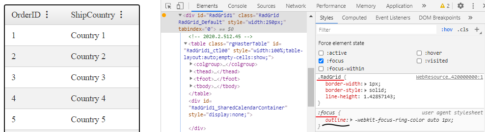

## Description

With the release of Chrome 83 and the Chromium-based Microsoft Edge were introduced some appearance changes. Some of these changes also can be seen while interacting with Telerik Web UI for ASP.NET AJAX Controls, see [Updates to Form Controls and Focus](https://blog.chromium.org/2020/03/updates-to-form-controls-and-focus.html).

The subject of the current article is how to remove the new "Focus Ring" (Black outline around the focused element) in Chromium-based browsers. Although that change is made for the purpose of more convenient navigation between the elements using a keyboard or switch device it can result in a violation of the consistent and aesthetic appearance of the page.


>note As an important accessibility feature, instead of removing the focus indicator, you may consider modifying it so that it fits better in the page design.
>

## Solution

The "Focus Ring" is represented by an outline style applied by the browser. To modify it you can apply CSS rules and override the styles set by the browsers.

>caption 1) Inspect HTML element to define a CSS selector which to be used for applying the new style. 

*Find how to inspect HTML elements and with their styles applied, and some more useful tips in the [Improve Your Debugging Skills with Chrome DevTools](https://www.telerik.com/blogs/improve-your-debugging-skills-with-chrome-devtools) blog post.*



>caption 2) Apply CSS to override the appearance:

````CSS
.RadGrid:focus{
    outline:none;
}
````

The example above shows how to remove the outline of a **RadGrid**.

>caption Here are a few more sample cases with Telerik AJAX Controls:

- "Show Context Menu" button of a **RadGrid** in *RenderMode = "Classic"*


````CSS
.RadGrid .rgOptions:focus{
    outline:none;
}
````

- **RadTextBox**


````CSS
.RadInput:focus,
.RadInput *:focus{
    outline:none;
}
````

  
