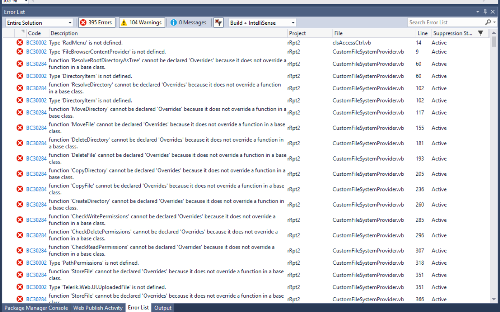
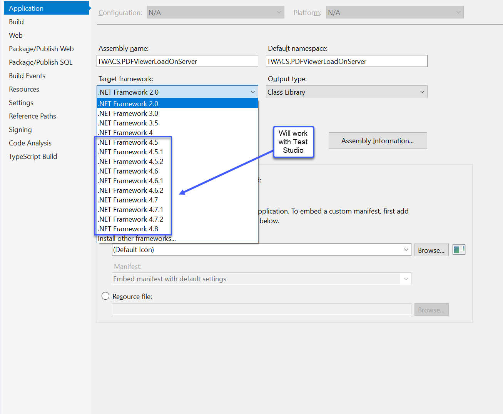

## Environment
<table>
	<tbody>
		<tr>
			<td>Product</td>
			<td>UI for ASP.NET AJAX</td>
		</tr>
		<tr>
			<td>Product</td>
			<td>Test Studio</td>
		</tr>
	</tbody>
</table>

## Description
If using Test Studio as a testing platform with an UI for ASP.NET AJAX project, and receiving the error that many of the Telerik.Web.UI references are undefined. See the following screenshot for a reference.

## Cause
A known cause of this is because Test Studio requires the .NET Framework 4.5+ version and the UI for ASP.NET AJAX assemblies target 4.0.

## Solution
Upgrade the Web Applicaiton's target framework to 4.5+. This can be achieved through the Project's Properties page.

Another solution is to follow the steps in the [How to Fix License FIle Related Errors](https://www.telerik.com/support/kb/aspnet-ajax/details/how-to-fix-license-file-related-errors) article.

## See Also
[Test Studio Requirements](https://docs.telerik.com/teststudio/system-requirements#framework)
[Testing with Test Studio](https://docs.telerik.com/devtools/aspnet-ajax/testing-with-test-studio/overview)
[How To Fix License File Related Error](https://www.telerik.com/support/kb/aspnet-ajax/details/how-to-fix-license-file-related-errors)
