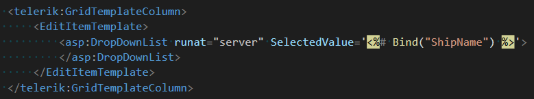
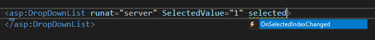
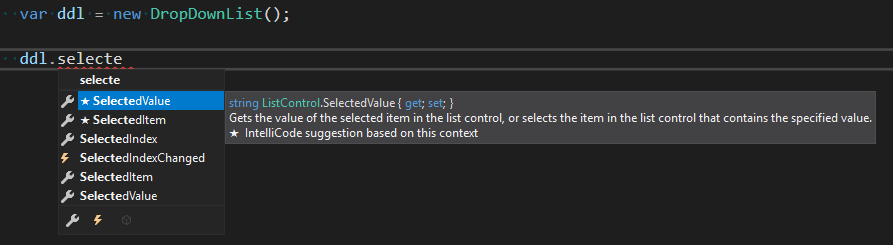
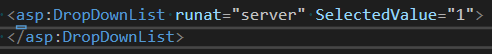
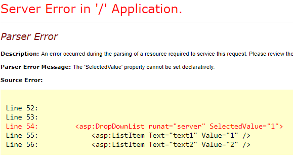

## Description

Instructions to bind SelectedValue, SelectedText, SelectedDate, Text properties of different controls when they are used in Templates.

In some scenarios we would like to bind the values of parent controls to selected value, text, date of Controls that are used their Templates. There are numerous examples and demos using properties such as SelectedValue of a DropDownList, SelectedData of a RadDatePicker, etc when they are in Templates.



There is a question, however, why these properties are not showing up in the Intellisense, and how to use them?




## Solution

The answer is, they are server properties only and cannot be accessed declaratively.



If they were declared in the markup they would generate an exception: The "Selectedvalue" property cannot be set declaratively.






Templates, on the other hand, can interpret these properties even if declared in the markup.

Here is a list of Controls and their Server properties that can be used to Bind() values to them

#### ASP DropDownList

````ASP.NET
<asp:DropDownList ID="DropDownList2" runat="server" SelectedValue='<%# Bind("ShipName") %>'>
</asp:DropDownList>
````

#### RadDropDownList

````ASP.NET
<telerik:RadDropDownList ID="RadDropDownList2" runat="server" SelectedText='<%# Bind("ShipName") %>'>
</telerik:RadDropDownList>
````

#### RadComboBox

````ASP.NET
<telerik:RadComboBox ID="RadComboBox1" runat="server" SelectedText='<%# Bind("ShipName") %>'>
</telerik:RadComboBox>
````

````ASP.NET
<telerik:RadComboBox ID="RadComboBox1" runat="server" SelectedValue='<%# Bind("ShipName") %>'>
</telerik:RadComboBox>
````

RadComboBox with Load On Demand

````ASP.NET
<telerik:RadComboBox ID="RadComboBox1" runat="server" Text='<%# Bind("ShipName") %>'>
</telerik:RadComboBox>
````

#### RadMultiColumnComboBox

Use the Value server-side property 

````ASP.NET
<telerik:RadMultiColumnComboBox runat="server" ID="RadMultiColumnComboBox1"
    OnDataBinding="RadMultiColumnComboBox1_DataBinding" 
    DataTextField ="ShipName"
    DataValueField="ShipName"
    Value='<%# Bind("ShipName") %>'>
</telerik:RadMultiColumnComboBox>
````

#### RadDatePicker, RadTimePicker, RadDateTimePicker

````ASP.NET
<telerik:RadDatePicker ID="RadDatePicker1" runat="server" DbSelectedDate='<%# Bind("ShipName") %>'>
</telerik:RadDatePicker>
````

````ASP.NET
<telerik:RadTimePicker ID="RadTimePicker1" runat="server" DbSelectedDate='<%# Bind("ShipName") %>'>
</telerik:RadTimePicker>
````

````ASP.NET
<telerik:RadDateTimePicker ID="RadDateTimePicker1" runat="server" DbSelectedDate='<%# Bind("ShipName") %>'>
</telerik:RadDateTimePicker>
````

