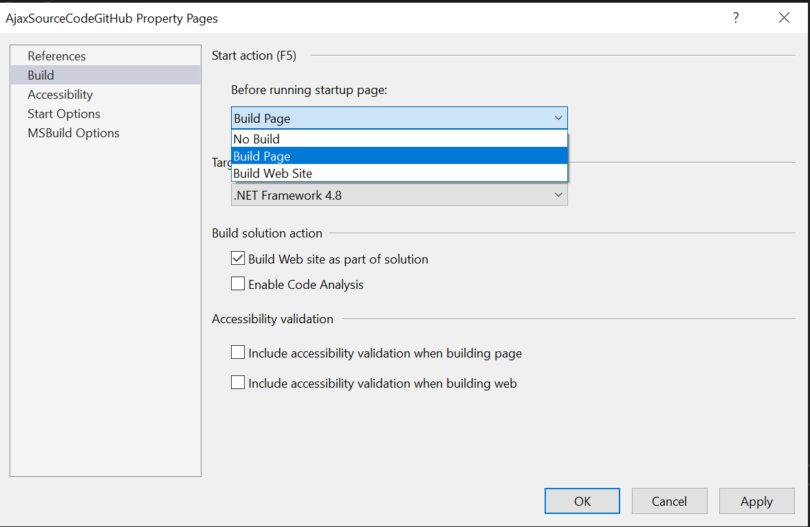

## Environment
<table>
	<tbody>
		<tr>
			<td>Product</td>
			<td>RadImageEditor for ASP.NET AJAX</td>
		</tr>
	</tbody>
</table>

## Description
If you're a developer working on the Telerik UI for ASP.NET AJAX offline demos website, you know that it can take a long time to build the whole website when debugging a demo. With over 1000 demos and thousands of files, the process can be quite slow. Fortunately, there is a solution to optimize the build process and speed up debugging by configuring Visual Studio to build only the startup page.

## Solution
Here's how to configure Visual Studio to build only a single page:

1. Open the Telerik UI for ASP.NET AJAX offline demos website project in Visual Studio.
2. Go to Properties Pages by pressing Shift+F4 or by right-clicking on the WebSite app in Solution Explorer and selecting "Property Pages" from the context menu.
3. In the Properties Pages dialog box, select the Build tab.
4. Under "Before running startup page" select "Build page."
5. Click Apply or directly OK to close the dialog
6. Select the page you want to debug in the Solution explorer window of VS, right-click and choose "Set As Start Page" context menu option.
7. Press F5 to build the only page you want to debug and go in debug more.

Now, when you debug a demo, Visual Studio will only build the startup page you selected, which can significantly speed up the build process. This feature is particularly useful for heavy websites like the Telerik UI for ASP.NET AJAX live demos website, which contain a large number of demos and files.

 
   