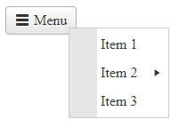

## Environment
<table>
	<tbody>
		<tr>
			<td>Product</td>
			<td>RadContextMenu for ASP.NET AJAX</td>
		</tr>
	</tbody>
</table>


## Description

Q: How to open ContextMenu on button click?


## Solution

Demo screenshot:




Button and ContextMenu markup

````ASP.NET
<style>
    .menu-icon:before {
        content: "\e030"; /* Adds a glyph using the Unicode character number */
    }
</style>

<telerik:RadButton ID="RadButton1" runat="server" AutoPostBack="false" CssClass="k-i-menu" Text="Menu" OnClientClicked="OnClientClicked">
    <Icon PrimaryIconCssClass="menu-icon" />
</telerik:RadButton>

<telerik:RadContextMenu ID="RadContextMenu1" runat="server">
    <Items>
        <telerik:RadMenuItem Text="Item 1"></telerik:RadMenuItem>
        <telerik:RadMenuItem Text="Item 2">
            <Items>
                <telerik:RadMenuItem Text="Item 1.1"></telerik:RadMenuItem>
                <telerik:RadMenuItem Text="Item 2.1"></telerik:RadMenuItem>
                <telerik:RadMenuItem Text="Item 3.1"></telerik:RadMenuItem>
            </Items>
        </telerik:RadMenuItem>
        <telerik:RadMenuItem Text="Item 3"></telerik:RadMenuItem>
    </Items>
</telerik:RadContextMenu>
````


Button's JavaScript click event handler

````javascript
function OnClientClicked(sender, args) {
    var menu = $find('<%= RadContextMenu1.ClientID %>');

    var evt = args.get_domEvent();
    if (evt.target.tagName == "INPUT" || evt.target.tagName == "A") {
        return;
    }

    menu.show(evt);

    evt.cancelBubble = true;
    evt.returnValue = false;

    if (evt.stopPropagation) {
        evt.stopPropagation();
        evt.preventDefault();
    }
}
````

