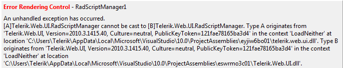

## Environment

<table>
	<tbody>
		<tr>
			<td>Product</td>
			<td>Progress® Telerik® UI for ASP.NET AJAX</td>
		</tr>
	</tbody>
</table>

## Description

The design-time displays an error when rendering a control that an [A][control type] cannot be cast to [B][control type].

## Error Message

`An unhandled exception has occurred.[A][control type] cannot be cast to [B][control type]. Type A originates from 'Telerik.Web.UI, Version=[Version], Culture=neutral,PublicKeyToken=121fae78165ba3d4' in the context 'LoadNeither' at location '[location1]'. Type B originates from 'Telerik.Web.UI,Version=[Version], Culture=neutral, PublicKeyToken=121fae78165ba3d4' in the context 'LoadNeither' at location '[location2]'.`

## Cause

The reason for getting such an exception is that you are using the Trial and the Dev variations of the Telerik controls assembly of the same version in a single instance of Visual Studio. The .NET Framework cannot distinguish the Dev assembly from the Trial one. Once one assembly is loaded in the `AppDomain` of Visual Studio, it cannot be unloaded until the IDE gets closed.

## Steps to Reproduce

A typical scenario includes the following steps:

1. Start Visual Studio.

1. Open a project referencing the Trial variation of the `Telerik.Web.UI` assembly.

1. Load a page with Telerik controls in design mode.

1. Close the project without closing Visual Studio.

1. Open a project referencing the Dev variation of the `Telerik.Web.UI` assembly, versioned as the Trial one, in the same instance of Visual Studio.

1. Load a page with Telerik controls in design mode.

## Solution

Restart Visual Studio between the reload of one of the two projects.

It is good practice to use the Dev variation of the `Telerik.Web.UI` assembly in all your projects once purchased. This will ensure that you avoid the design time error described above and that you won't get undesired Trial messages when running your project.
