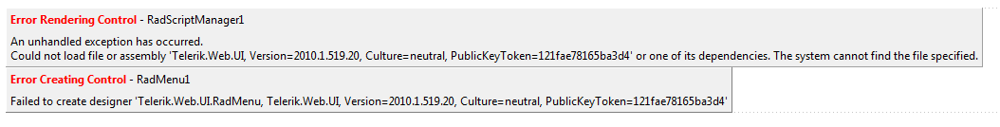

## Environment

<table>
	<tbody>
		<tr>
			<td>Product</td>
			<td>Progress® Telerik® UI for ASP.NET AJAX</td>
		</tr>
	</tbody>
</table>

## Description

You may not be able to upgrade to Visual Studio 2008 SP1 and you may get an exception after upgrading to Telerik UI for ASP.NET AJAX Q1 2009 or later.

## Error Messages

* `Error Creating Control` (Telerik control)

* `Failed to create designer...`

>caption Two ways this error gets represented to the end user

## Cause

As of Q1 2009 (Version 2009.1.311), the new `Telerik.Web.Design.dll` assembly gets installed in the GAC. The design-time code is now separated from the web control implementation code with the purpose for a better separation of concerns and less assembly references for the main `Telerik.Web.UI.dll` assembly. The design time capabilities of Telerik UI for ASP.NET AJAX could not be extended without bloating the main control assembly.

The reason for this change to take place on a later stage is that Visual Studio 2008 had a problem with loading GAC-ed design-time assemblies of control libraries deployed in the `Bin` folder of a website. However, the problem doesn't show in Visual Studio 2005, and this bug was fixed in Visual Studio 2008 SP1. This problem doesn't exist in Visual Studio 2010 RC and Visual Studio 2012.

## Solution

The following instructions are not applicable if you used the Telerik UI for ASP.NET AJAX installer to set up Telerik controls on your machine and you have Visual Studio 2005, Visual Studio 2008 SP1, Visual Studio 2010, and/or Visual Studio 2012. The design-time works properly out of the box with that setup.

Note that the `Telerik.Web.Design` assembly contains the Visual Studio designers of the controls. You don't need to add a reference to it into your project.

To solve this issue and apart from the obvious upgrade to Visual Studio 2008 SP1, use any of the following approaches:

* `Bin`-deploy the design-time assembly:

	This solution will work only if you have not installed Telerik UI for ASP.NET AJAX by using the provided setup program. Assemblies installed by a setup program cannot be removed from GAC until the program is uninstalled. Therefore, this approach is suitable when using only the dll-s from a `zip`, either a hotfix or the latest internal build.

	1. Remove `Telerik.Web.Design.dll` from the GAC. This will fail if you have installed ASP.NET AJAX controls with the installer.

	1. Copy `Telerik.Web.Design.dll` to the `Bin` subfolder of your project. Ensure that the version of the `Telerik.Web.Design` assembly is the same as the version of the `Telerik.Web.UI` assembly.

		Do not add a reference to the `Telerik.Web.Design` assembly but perform a simple Windows Explorer-copy.

	1. Restart Visual Studio.

	Note that the [Visual Studio Extensions for Telerik UI for ASP.NET AJAX help handle this approach]().

* GAC-deploy the control library assembly:

	1. [Add `Telerik.Web.UI.dll` in the GAC]().

	1. Remove `Telerik.Web.UI.dll` from your `Bin` folder.

	1. Make sure you have the following line in your `web.config` file (XML):

			<add assembly="Telerik.Web.UI, Version=2009.1.311.35, Culture=neutral, PublicKeyToken=121FAE78165BA3D4"/>

	1. Restart Visual Studio.

* Copy `Telerik.Web.UI.dll` to `c:\Program Files\Microsoft Visual Studio 9.0\Common7\IDE\PublicAssemblies` and restart Visual Studio.

	Note that using this approach to copy the `Telerik.Web.UI` assembly to the `[VisualStudioInstallationFolder]\Common7\IDE\PublicAssemblies` folder could itself cause the problem described above. If you open a project, using a different version of the `Telerik.Web.UI` assembly from the one in the `PublicAssemblies` folder, the IDE could display an `InvalidCast` error message. It is suggested that you ensure the version of the `Telerik.Web.UI` assembly used by your project and its version in the `PublicAssemblies` folder are the same before loading the IDE. This instance of the error usually happens when upgrading Telerik UI for ASP.NET AJAX.
