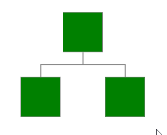

## DESCRIPTION

In this sample you can see how to change the shape’s Visual Template dynamically (e.g. on a shape click).   
  
 You can test the result of the implementation shown below applied to the Kendo Diagram widget here: [http://dojo.telerik.com/UJizAfOr/3](http://dojo.telerik.com/UJizAfOr/3)
  

## SOLUTION

For this purpose, you will need to:

1. Implement two visual templates for the shape(s) – one, set initially and another that will be used for the change (*my\_circle()* and *my\_rect()*).  

````JavaScript
<script>
function my_circle(options) {
    var ns = kendo.dataviz.diagram;
    var group = new ns.Group({ autoSize: true });
 
    var circle = new ns.Circle({ radius: options.width / 2, fill: { color: options.fill.color } });
    group.append(circle);
    return group;
}
function my_rect(options) {
    var ns = kendo.dataviz.diagram;
    var group = new ns.Group({ autoSize: true });
 
    var rect = new ns.Rectangle({ height: options.height, width: options.width, fill: options.fill });
    group.append(rect);
    return group;
}
</script>
````

2. Attach a handler to the Diagram’s client-side OnClick event (and change the Visual Template of the clicked shape by [redrawing](https://docs.telerik.com/kendo-ui/api/javascript/dataviz/diagram/shape/methods/redraw)the [shape](https://docs.telerik.com/kendo-ui/api/javascript/dataviz/diagram/shape)with the new options:  


````ASP.NET
<telerik:RadDiagram ID="diagram1" runat="server">
    <LayoutSettings Enabled="true"></LayoutSettings>
    <ClientEvents OnClick="OnShapeClick" />
    ...
</telerik:RadDiagram>
<script>
function OnShapeClick(args) {
    var shape = args.item;
 
    if (shape instanceof kendo.dataviz.diagram.Shape) {
        shape.redraw({ visual: my_circle });
        shape.redrawVisual();
    }
}
</script>
````

You can download the sample project files from [here](files/diagram-shape-visual-change.zip).


### SEE ALSO

[RadDiagram Client-side Events]()

[RadDiagram Visual Templates]()

[kendo.dataviz.diagram.Shape](https://docs.telerik.com/kendo-ui/api/javascript/dataviz/diagram/shape)

[Kendo Dataviz shape.redraw()](https://docs.telerik.com/kendo-ui/api/javascript/dataviz/diagram/shape/methods/redraw)


